```mermaid
graph LR
    CLI_Orchestration_Layer["CLI & Orchestration Layer"]
    AWS_Data_Ingestion_Graph_Construction["AWS Data Ingestion & Graph Construction"]
    Graph_Core_Persistence["Graph Core & Persistence"]
    Policy_Simulation_Authorization_Engine["Policy Simulation & Authorization Engine"]
    Graph_Query_Analysis_Interface["Graph Query & Analysis Interface"]
    Risk_Analysis_Reporting["Risk Analysis & Reporting"]
    Graph_Visualization_Export["Graph Visualization Export"]
    CLI_Orchestration_Layer -- "initiates data collection" --> AWS_Data_Ingestion_Graph_Construction
    CLI_Orchestration_Layer -- "triggers graph loading/saving" --> Graph_Core_Persistence
    CLI_Orchestration_Layer -- "submits queries" --> Graph_Query_Analysis_Interface
    CLI_Orchestration_Layer -- "requests risk assessments" --> Risk_Analysis_Reporting
    AWS_Data_Ingestion_Graph_Construction -- "stores graph data" --> Graph_Core_Persistence
    Graph_Core_Persistence -- "provides graph data" --> Graph_Query_Analysis_Interface
    Graph_Core_Persistence -- "provides graph data" --> Risk_Analysis_Reporting
    Graph_Query_Analysis_Interface -- "requests policy evaluation" --> Policy_Simulation_Authorization_Engine
    Risk_Analysis_Reporting -- "utilizes policy simulation" --> Policy_Simulation_Authorization_Engine
    Graph_Query_Analysis_Interface -- "sends query results" --> Graph_Visualization_Export
    Risk_Analysis_Reporting -- "sends risk paths" --> Graph_Visualization_Export
    click CLI_Orchestration_Layer href "https://github.com/CodeBoarding/GeneratedOnBoardings/blob/main/PMapper/CLI_Orchestration_Layer.md" "Details"
    click AWS_Data_Ingestion_Graph_Construction href "https://github.com/CodeBoarding/GeneratedOnBoardings/blob/main/PMapper/AWS_Data_Ingestion_Graph_Construction.md" "Details"
    click Graph_Core_Persistence href "https://github.com/CodeBoarding/GeneratedOnBoardings/blob/main/PMapper/Graph_Core_Persistence.md" "Details"
    click Policy_Simulation_Authorization_Engine href "https://github.com/CodeBoarding/GeneratedOnBoardings/blob/main/PMapper/Policy_Simulation_Authorization_Engine.md" "Details"
    click Graph_Query_Analysis_Interface href "https://github.com/CodeBoarding/GeneratedOnBoardings/blob/main/PMapper/Graph_Query_Analysis_Interface.md" "Details"
    click Risk_Analysis_Reporting href "https://github.com/CodeBoarding/GeneratedOnBoardings/blob/main/PMapper/Risk_Analysis_Reporting.md" "Details"
```

## Details

The principalmapper project is structured around a core set of components designed to ingest AWS IAM and resource data, construct a comprehensive graph representation, and enable powerful analysis and visualization capabilities. The CLI & Orchestration Layer serves as the primary entry point, managing user interactions and orchestrating workflows across the system. It initiates data collection via the AWS Data Ingestion & Graph Construction component, which populates the Graph Core & Persistence layer with structured IAM data. This core graph data is then leveraged by the Graph Query & Analysis Interface for interactive querying and by the Risk Analysis & Reporting component for identifying security vulnerabilities. Both analysis components rely on the Policy Simulation & Authorization Engine to evaluate IAM policies and determine access permissions. Finally, the Graph Visualization Export component facilitates the external visualization of the IAM graph and analysis findings, enabling users to gain visual insights into their AWS environment's security posture.

### CLI & Orchestration Layer [[Expand]](./CLI_Orchestration_Layer.md)
The primary user interface, responsible for parsing command-line arguments, managing the interactive shell, and orchestrating the execution flow across other core components. It acts as the central control point for user-initiated operations.

**Related Classes/Methods**:

- <a href="https://github.com/nccgroup/PMapper/blob/master/pmapper.py" target="_blank" rel="noopener noreferrer">`pmapper`</a>
- <a href="https://github.com/nccgroup/PMapper/blob/master/principalmapper/__main__.py" target="_blank" rel="noopener noreferrer">`principalmapper.__main__`</a>
- <a href="https://github.com/nccgroup/PMapper/blob/master/principalmapper/analysis/cli.py" target="_blank" rel="noopener noreferrer">`principalmapper.analysis.cli`</a>
- <a href="https://github.com/nccgroup/PMapper/blob/master/principalmapper/graphing/graph_cli.py" target="_blank" rel="noopener noreferrer">`principalmapper.graphing.graph_cli`</a>
- <a href="https://github.com/nccgroup/PMapper/blob/master/principalmapper/graphing/orgs_cli.py" target="_blank" rel="noopener noreferrer">`principalmapper.graphing.orgs_cli`</a>
- <a href="https://github.com/nccgroup/PMapper/blob/master/principalmapper/querying/repl.py" target="_blank" rel="noopener noreferrer">`principalmapper.querying.repl`</a>

### AWS Data Ingestion & Graph Construction [[Expand]](./AWS_Data_Ingestion_Graph_Construction.md)
Collects raw AWS IAM and resource configuration data from various AWS services (IAM, EC2, Lambda, Organizations, etc.) and transforms it into a structured graph representation. This component is crucial for building the foundational data model.

**Related Classes/Methods**:

- <a href="https://github.com/nccgroup/PMapper/blob/master/principalmapper/graphing/gathering.py" target="_blank" rel="noopener noreferrer">`principalmapper.graphing.gathering`</a>
- <a href="https://github.com/nccgroup/PMapper/blob/master/principalmapper/graphing/iam_edges.py" target="_blank" rel="noopener noreferrer">`principalmapper.graphing.iam_edges`</a>
- <a href="https://github.com/nccgroup/PMapper/blob/master/principalmapper/graphing/ec2_edges.py" target="_blank" rel="noopener noreferrer">`principalmapper.graphing.ec2_edges`</a>
- <a href="https://github.com/nccgroup/PMapper/blob/master/principalmapper/graphing/lambda_edges.py" target="_blank" rel="noopener noreferrer">`principalmapper.graphing.lambda_edges`</a>
- <a href="https://github.com/nccgroup/PMapper/blob/master/principalmapper/graphing/cross_account_edges.py" target="_blank" rel="noopener noreferrer">`principalmapper.graphing.cross_account_edges`</a>
- <a href="https://github.com/nccgroup/PMapper/blob/master/principalmapper/graphing/autoscaling_edges.py" target="_blank" rel="noopener noreferrer">`principalmapper.graphing.autoscaling_edges`</a>
- <a href="https://github.com/nccgroup/PMapper/blob/master/principalmapper/graphing/cloudformation_edges.py" target="_blank" rel="noopener noreferrer">`principalmapper.graphing.cloudformation_edges`</a>
- <a href="https://github.com/nccgroup/PMapper/blob/master/principalmapper/graphing/codebuild_edges.py" target="_blank" rel="noopener noreferrer">`principalmapper.graphing.codebuild_edges`</a>
- <a href="https://github.com/nccgroup/PMapper/blob/master/principalmapper/graphing/sagemaker_edges.py" target="_blank" rel="noopener noreferrer">`principalmapper.graphing.sagemaker_edges`</a>
- <a href="https://github.com/nccgroup/PMapper/blob/master/principalmapper/graphing/ssm_edges.py" target="_blank" rel="noopener noreferrer">`principalmapper.graphing.ssm_edges`</a>
- <a href="https://github.com/nccgroup/PMapper/blob/master/principalmapper/graphing/sts_edges.py" target="_blank" rel="noopener noreferrer">`principalmapper.graphing.sts_edges`</a>
- <a href="https://github.com/nccgroup/PMapper/blob/master/principalmapper/common/org_trees.py" target="_blank" rel="noopener noreferrer">`principalmapper.common.org_trees`</a>

### Graph Core & Persistence [[Expand]](./Graph_Core_Persistence.md)
Manages the in-memory representation of the IAM graph and handles its persistence (loading from and saving to various storage formats). It provides the fundamental data structures and operations for graph manipulation.

**Related Classes/Methods**:

- <a href="https://github.com/nccgroup/PMapper/blob/master/principalmapper/common/graphs.py" target="_blank" rel="noopener noreferrer">`principalmapper.common.graphs`</a>
- <a href="https://github.com/nccgroup/PMapper/blob/master/principalmapper/graphing/graph_actions.py" target="_blank" rel="noopener noreferrer">`principalmapper.graphing.graph_actions`</a>
- <a href="https://github.com/nccgroup/PMapper/blob/master/principalmapper/util/storage.py" target="_blank" rel="noopener noreferrer">`principalmapper.util.storage`</a>
- <a href="https://github.com/nccgroup/PMapper/blob/master/principalmapper/common/nodes.py" target="_blank" rel="noopener noreferrer">`principalmapper.common.nodes`</a>
- <a href="https://github.com/nccgroup/PMapper/blob/master/principalmapper/common/edges.py" target="_blank" rel="noopener noreferrer">`principalmapper.common.edges`</a>

### Policy Simulation & Authorization Engine [[Expand]](./Policy_Simulation_Authorization_Engine.md)
The core logic for simulating AWS IAM policy evaluation. It determines authorization decisions based on principals, actions, resources, and conditions, providing the foundational capability for security analysis.

**Related Classes/Methods**:

- <a href="https://github.com/nccgroup/PMapper/blob/master/principalmapper/querying/local_policy_simulation.py" target="_blank" rel="noopener noreferrer">`principalmapper.querying.local_policy_simulation`</a>
- <a href="https://github.com/nccgroup/PMapper/blob/master/principalmapper/common/policies.py" target="_blank" rel="noopener noreferrer">`principalmapper.common.policies`</a>

### Graph Query & Analysis Interface [[Expand]](./Graph_Query_Analysis_Interface.md)
Provides a structured interface for querying the IAM graph and performing authorization checks. It translates user queries or internal analysis requests into graph traversals and leverages the Policy Simulation Engine for authorization decisions.

**Related Classes/Methods**:

- <a href="https://github.com/nccgroup/PMapper/blob/master/principalmapper/querying/query_actions.py" target="_blank" rel="noopener noreferrer">`principalmapper.querying.query_actions`</a>
- <a href="https://github.com/nccgroup/PMapper/blob/master/principalmapper/querying/query_interface.py" target="_blank" rel="noopener noreferrer">`principalmapper.querying.query_interface`</a>
- <a href="https://github.com/nccgroup/PMapper/blob/master/principalmapper/querying/query_utils.py" target="_blank" rel="noopener noreferrer">`principalmapper.querying.query_utils`</a>
- <a href="https://github.com/nccgroup/PMapper/blob/master/principalmapper/querying/presets" target="_blank" rel="noopener noreferrer">`principalmapper.querying.presets`</a>
- <a href="https://github.com/nccgroup/PMapper/blob/master/principalmapper/querying/query_orgs.py" target="_blank" rel="noopener noreferrer">`principalmapper.querying.query_orgs`</a>

### Risk Analysis & Reporting [[Expand]](./Risk_Analysis_Reporting.md)
Identifies common AWS IAM security risks and misconfigurations within the graph. It leverages the graph structure and policy simulation capabilities to detect vulnerabilities and generates structured findings and reports.

**Related Classes/Methods**:

- <a href="https://github.com/nccgroup/PMapper/blob/master/principalmapper/analysis/find_risks.py" target="_blank" rel="noopener noreferrer">`principalmapper.analysis.find_risks`</a>
- <a href="https://github.com/nccgroup/PMapper/blob/master/principalmapper/analysis/finding.py" target="_blank" rel="noopener noreferrer">`principalmapper.analysis.finding`</a>
- <a href="https://github.com/nccgroup/PMapper/blob/master/principalmapper/analysis/report.py" target="_blank" rel="noopener noreferrer">`principalmapper.analysis.report`</a>

### Graph Visualization Export
Converts the internal graph representation or specific query results into external formats (e.g., GraphML) suitable for visualization tools. This component enables users to visually inspect the IAM graph and analysis findings.

**Related Classes/Methods**:

- <a href="https://github.com/nccgroup/PMapper/blob/master/principalmapper/visualizing/graphml_writer.py" target="_blank" rel="noopener noreferrer">`principalmapper.visualizing.graphml_writer`</a>
- <a href="https://github.com/nccgroup/PMapper/blob/master/principalmapper/visualizing/cli.py" target="_blank" rel="noopener noreferrer">`principalmapper.visualizing.visualize_graph`</a>

### [FAQ](https://github.com/CodeBoarding/GeneratedOnBoardings/tree/main?tab=readme-ov-file#faq)