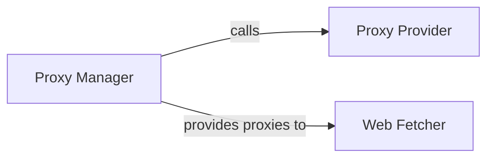

## Details

The `spider` project's core functionality for web scraping relies on a well-defined subsystem for managing and utilizing proxies. The `Proxy Manager` acts as the central orchestrator, overseeing the lifecycle of proxies and ensuring their availability. It delegates the task of acquiring and initially validating proxies to the `Proxy Provider`. Once managed, these proxies are then supplied by the `Proxy Manager` to the `Web Fetcher`, which is responsible for executing web requests. This clear separation of concerns ensures efficient proxy handling and robust web content retrieval, forming a critical pathway for anonymous and effective data collection.

### Proxy Manager [[Expand]](./Proxy_Manager.md)
This component is the orchestrator of the proxy management process. Its core responsibilities include initiating proxy-related tasks, actively managing the lifecycle of a pool of proxy servers (e.g., checking their validity, rotating them to ensure freshness and anonymity), and coordinating with the `Proxy Provider` to acquire new or validated proxies. Crucially, it serves as the interface for other components, providing a reliable supply of managed proxies to the `Web Fetcher` to ensure anonymity and bypass restrictions during web scraping operations.

**Related Classes/Methods**:

- <a href="https://github.com/xianhu/PSpider/blob/master/spider/instances/inst_proxies.py#L15-L25" target="_blank" rel="noopener noreferrer">`spider.instances.inst_proxies.working`:15-25</a>

### Proxy Provider
This component is a specialized utility within the `Proxy Manager` subsystem, solely responsible for the actual retrieval and initial validation of proxies. It handles fetching proxies from various configured sources, such as an internal pool, a database, or potentially an external proxy service. Its primary role is to ensure that a continuous supply of raw or initially validated proxies is available when requested by the `Proxy Manager`.

**Related Classes/Methods**:

- <a href="https://github.com/xianhu/PSpider/blob/master/spider/instances/inst_proxies.py#L27-L31" target="_blank" rel="noopener noreferrer">`spider.instances.inst_proxies.proxies_get`:27-31</a>

### Web Fetcher [[Expand]](./Web_Fetcher.md)
This component is responsible for executing web requests and retrieving content from target URLs. It leverages the proxies supplied by the `Proxy Manager` to perform anonymous and resilient data fetching, bypassing potential restrictions. Its primary function is to handle the actual HTTP communication, ensuring that web pages are successfully retrieved for subsequent processing.

**Related Classes/Methods**:

- <a href="https://github.com/xianhu/PSpider/blob/master/spider/instances/inst_fetch.py" target="_blank" rel="noopener noreferrer">`spider.instances.inst_fetch`</a>

### [FAQ](https://github.com/CodeBoarding/GeneratedOnBoardings/tree/main?tab=readme-ov-file#faq)