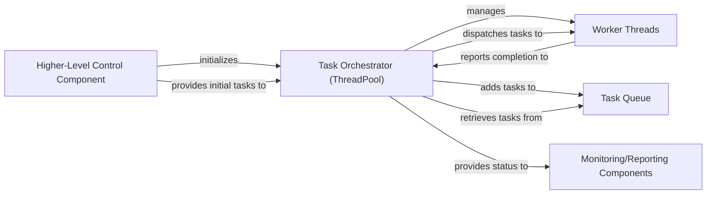

## Details

This analysis focuses on the Task Orchestrator (ThreadPool) subsystem, which is the core concurrency manager within the PSpider framework. It aligns with the "Multi-threaded/Concurrent Processing" architectural pattern, emphasizing efficient task execution and resource management.

### Task Orchestrator (ThreadPool) [[Expand]](./Task_Orchestrator_ThreadPool_.md)
The central coordinator managing task queues, dispatching tasks to workers, and processing results to generate subsequent tasks. It is responsible for the lifecycle of tasks, from submission to completion, ensuring efficient concurrent execution.

**Related Classes/Methods**:

- <a href="https://github.com/xianhu/PSpider/blob/master/spider/concurrent/threads_pool.py#L150-L166" target="_blank" rel="noopener noreferrer">`add_a_task`:150-166</a>
- <a href="https://github.com/xianhu/PSpider/blob/master/spider/concurrent/threads_pool.py#L168-L188" target="_blank" rel="noopener noreferrer">`get_a_task`:168-188</a>
- <a href="https://github.com/xianhu/PSpider/blob/master/spider/concurrent/threads_pool.py#L190-L205" target="_blank" rel="noopener noreferrer">`finish_a_task`:190-205</a>
- <a href="https://github.com/xianhu/PSpider/blob/master/spider/concurrent/threads_pool.py#L132-L139" target="_blank" rel="noopener noreferrer">`update_number_dict`:132-139</a>
- <a href="https://github.com/xianhu/PSpider/blob/master/spider/concurrent/threads_pool.py#L126-L130" target="_blank" rel="noopener noreferrer">`get_number_dict`:126-130</a>
- <a href="https://github.com/xianhu/PSpider/blob/master/spider/concurrent/threads_pool.py#L60-L65" target="_blank" rel="noopener noreferrer">`set_start_task`:60-65</a>
- <a href="https://github.com/xianhu/PSpider/blob/master/spider/concurrent/threads_pool.py#L67-L96" target="_blank" rel="noopener noreferrer">`start_working`:67-96</a>

### Task Queue
An internal queue mechanism used by the Task Orchestrator to hold tasks awaiting execution and potentially results awaiting processing. It decouples task producers from consumers.

**Related Classes/Methods**:

- <a href="https://github.com/xianhu/PSpider/blob/master/spider/concurrent/threads_pool.py#L150-L166" target="_blank" rel="noopener noreferrer">`add_a_task`:150-166</a>
- <a href="https://github.com/xianhu/PSpider/blob/master/spider/concurrent/threads_pool.py#L168-L188" target="_blank" rel="noopener noreferrer">`get_a_task`:168-188</a>

### Worker Threads
Individual threads managed by the Task Orchestrator, responsible for executing specific tasks (e.g., fetching, parsing, saving) dispatched from the Task Queue.

**Related Classes/Methods**:

- <a href="https://github.com/xianhu/PSpider/blob/master/spider/concurrent/threads_pool.py#L67-L96" target="_blank" rel="noopener noreferrer">`start_working`:67-96</a>

### Monitoring/Reporting Components
Components responsible for consuming and displaying the operational status, progress, and metrics provided by the Task Orchestrator, offering insights into the spider's performance.

**Related Classes/Methods**:

- <a href="https://github.com/xianhu/PSpider/blob/master/spider/concurrent/threads_pool.py#L126-L130" target="_blank" rel="noopener noreferrer">`get_number_dict`:126-130</a>

### Higher-Level Control Component
A component external to the immediate thread pool, responsible for initializing the Task Orchestrator, configuring its parameters, and providing the initial set of tasks to begin the crawling process.

**Related Classes/Methods**:

- <a href="https://github.com/xianhu/PSpider/blob/master/spider/concurrent/threads_pool.py#L60-L65" target="_blank" rel="noopener noreferrer">`set_start_task`:60-65</a>
- <a href="https://github.com/xianhu/PSpider/blob/master/spider/concurrent/threads_pool.py#L67-L96" target="_blank" rel="noopener noreferrer">`start_working`:67-96</a>

### [FAQ](https://github.com/CodeBoarding/GeneratedOnBoardings/tree/main?tab=readme-ov-file#faq)