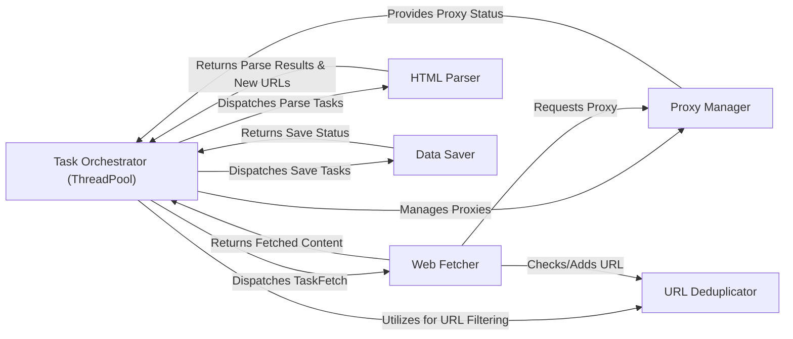

## Details

The PSpider project operates as a concurrent web crawling system, orchestrated by a central `Task Orchestrator (ThreadPool)`. This orchestrator manages the lifecycle of crawling tasks, dispatching them to specialized components like the `Web Fetcher` for content retrieval, the `HTML Parser` for data extraction and URL discovery, and the `Data Saver` for persistence. The system leverages a `Proxy Manager` for robust fetching and a `URL Deduplicator` to ensure efficient and non-redundant processing of URLs. Data flows primarily from the orchestrator to the task-specific components and back, with new URLs discovered during parsing feeding back into the orchestration loop.

### Task Orchestrator (ThreadPool) [[Expand]](./Task_Orchestrator_ThreadPool_.md)
The central coordinator managing task queues, dispatching tasks to workers, and processing results to generate subsequent tasks.

**Related Classes/Methods**:

- <a href="https://github.com/xianhu/PSpider/blob/master/spider/concurrent/threads_pool.py" target="_blank" rel="noopener noreferrer">`Task Orchestrator (ThreadPool)`</a>

### Web Fetcher [[Expand]](./Web_Fetcher.md)
Responsible for making HTTP requests, retrieving raw web page content, and handling initial network interactions.

**Related Classes/Methods**:

- <a href="https://github.com/xianhu/PSpider/blob/master/spider/instances/inst_fetch.py" target="_blank" rel="noopener noreferrer">`Web Fetcher`</a>

### HTML Parser
Extracts structured data and identifies new URLs from the raw HTML content.

**Related Classes/Methods**:

- <a href="https://github.com/xianhu/PSpider/blob/master/spider/instances/inst_parse.py" target="_blank" rel="noopener noreferrer">`HTML Parser`</a>

### Data Saver
Persists the extracted structured data to a designated storage medium.

**Related Classes/Methods**:

- <a href="https://github.com/xianhu/PSpider/blob/master/spider/instances/inst_save.py" target="_blank" rel="noopener noreferrer">`Data Saver`</a>

### Proxy Manager [[Expand]](./Proxy_Manager.md)
Manages a pool of proxy servers, providing them to the Web Fetcher to ensure anonymity and bypass restrictions.

**Related Classes/Methods**:

- <a href="https://github.com/xianhu/PSpider/blob/master/spider/instances/inst_proxies.py" target="_blank" rel="noopener noreferrer">`Proxy Manager`</a>

### URL Deduplicator
Prevents redundant processing by tracking already visited or queued URLs.

**Related Classes/Methods**:

- <a href="https://github.com/xianhu/PSpider/blob/master/spider/utilities/cfilter.py" target="_blank" rel="noopener noreferrer">`URL Deduplicator`</a>

### [FAQ](https://github.com/CodeBoarding/GeneratedOnBoardings/tree/main?tab=readme-ov-file#faq)