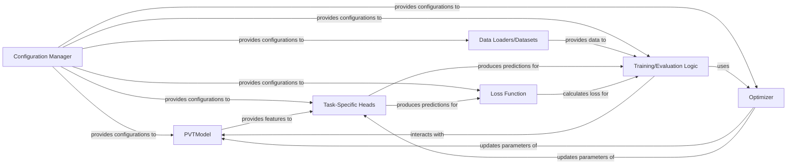

## Details

The {project_name} system is structured around a core PVTModel that performs feature extraction, adaptable to various computer vision tasks through Task-Specific Heads. The entire deep learning pipeline is governed by a Configuration Manager, which centralizes all settings for reproducibility and experimentation. Data Loaders/Datasets are responsible for efficiently preparing and augmenting data for both training and evaluation. The Training/Evaluation Logic orchestrates the learning process, utilizing an Optimizer to update model parameters based on the output of the Loss Function. This modular design allows for flexible configuration and extension across different classification, detection, and segmentation tasks.

### Configuration Manager [[Expand]](./Configuration_Manager.md)
Centralized management of all model, training, and dataset configurations. This component ensures reproducibility and easy experimentation by defining parameters in a structured and accessible manner. It is responsible for loading, parsing, and providing access to configuration settings for different tasks (classification, detection, segmentation) and overall project parameters. It acts as the single source of truth for all configurable aspects of the deep learning pipeline.

**Related Classes/Methods**:

- <a href="https://github.com/whai362/PVT/blob/v2/classification/engine.py#L19-L67" target="_blank" rel="noopener noreferrer">``:19-67</a>
- <a href="https://github.com/whai362/PVT/blob/v2/classification/engine.py#L19-L67" target="_blank" rel="noopener noreferrer">``:19-67</a>
- <a href="https://github.com/whai362/PVT/blob/v2/classification/engine.py#L19-L67" target="_blank" rel="noopener noreferrer">``:19-67</a>

### PVTModel
The core Pyramid Vision Transformer (PVT) architecture component, responsible for the backbone feature extraction. It processes input data to generate rich feature representations.

**Related Classes/Methods**:

- <a href="https://github.com/whai362/PVT/blob/v2/classification/pvt.py#L130-L241" target="_blank" rel="noopener noreferrer">`classification.pvt.PyramidVisionTransformer`:130-241</a>
- <a href="https://github.com/whai362/PVT/blob/v2/classification/engine.py#L19-L67" target="_blank" rel="noopener noreferrer">``:19-67</a>

### Task-Specific Heads [[Expand]](./Task_Specific_Heads.md)
Components responsible for adapting the PVT model's extracted features to specific computer vision tasks (e.g., classification, object detection, semantic segmentation) and producing task-specific outputs.

**Related Classes/Methods**:

- <a href="https://github.com/whai362/PVT/blob/v2/" target="_blank" rel="noopener noreferrer">`classification.pvt.PyramidVisionTransformer.head`</a>

### Data Loaders/Datasets
Components responsible for handling data input, including loading, preprocessing, augmentation, and batching of datasets for training and evaluation.

**Related Classes/Methods**:

- <a href="https://github.com/whai362/PVT/blob/v2/classification/datasets.py#L57-L82" target="_blank" rel="noopener noreferrer">`classification.datasets.build_dataset`:57-82</a>
- <a href="https://github.com/whai362/PVT/blob/v2/classification/datasets.py#L85-L116" target="_blank" rel="noopener noreferrer">`classification.datasets.build_transform`:85-116</a>
- <a href="https://github.com/whai362/PVT/blob/v2/classification/datasets.py#L14-L52" target="_blank" rel="noopener noreferrer">`classification.datasets.INatDataset`:14-52</a>
- <a href="https://github.com/whai362/PVT/blob/v2/classification/engine.py#L19-L67" target="_blank" rel="noopener noreferrer">``:19-67</a>

### Training/Evaluation Logic
Component encapsulating the main training loop, validation, and evaluation procedures, orchestrating the flow of data through the model and optimizing its parameters.

**Related Classes/Methods**:

- <a href="https://github.com/whai362/PVT/blob/v2/classification/engine.py#L19-L67" target="_blank" rel="noopener noreferrer">`classification.engine.train_one_epoch`:19-67</a>
- <a href="https://github.com/whai362/PVT/blob/v2/classification/engine.py#L70-L100" target="_blank" rel="noopener noreferrer">`classification.engine.evaluate`:70-100</a>
- <a href="https://github.com/whai362/PVT/blob/v2/classification/engine.py#L19-L67" target="_blank" rel="noopener noreferrer">``:19-67</a>

### Optimizer
Component responsible for implementing the optimization algorithm (e.g., Adam, SGD) used to update model weights during training based on the calculated gradients. This component typically utilizes `torch.optim` classes.

**Related Classes/Methods**:

- <a href="https://github.com/whai362/PVT/blob/v2/" target="_blank" rel="noopener noreferrer">`torch.optim.Optimizer`</a>

### Loss Function
Component responsible for calculating the discrepancy between the model's predictions and the ground truth, guiding the optimization process.

**Related Classes/Methods**:

- <a href="https://github.com/whai362/PVT/blob/v2/classification/losses.py#L10-L64" target="_blank" rel="noopener noreferrer">`classification.losses.DistillationLoss`:10-64</a>
- <a href="https://github.com/whai362/PVT/blob/v2/classification/engine.py#L19-L67" target="_blank" rel="noopener noreferrer">``:19-67</a>

### [FAQ](https://github.com/CodeBoarding/GeneratedOnBoardings/tree/main?tab=readme-ov-file#faq)