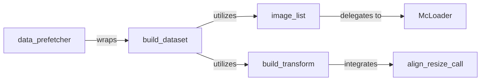

## Details

The Data Pipeline subsystem encompasses modules responsible for loading, transforming, and preparing image data for deep learning models.

### build_dataset
The primary orchestrator for creating a complete dataset object, integrating raw data sources with the necessary transformation pipelines. It defines how data samples are structured and accessed.

**Related Classes/Methods**:

- <a href="https://github.com/whai362/PVT/blob/v2/classification/datasets.py#L57-L82" target="_blank" rel="noopener noreferrer">`build_dataset`:57-82</a>

### build_transform
Responsible for defining and applying a sequence of image transformations (e.g., resizing, normalization, augmentation, cropping) that prepare raw images for model input.

**Related Classes/Methods**:

- <a href="https://github.com/whai362/PVT/blob/v2/classification/datasets.py#L85-L116" target="_blank" rel="noopener noreferrer">`build_transform`:85-116</a>

### McLoader
A specialized, high-performance loader designed for retrieving raw image data, likely from a memory cache or high-speed storage, optimizing I/O operations.

**Related Classes/Methods**:

- <a href="https://github.com/whai362/PVT/blob/v2/classification/mcloader/mcloader.py#L14-L36" target="_blank" rel="noopener noreferrer">`McLoader`:14-36</a>

### image_list
Manages references to image files (e.g., paths, IDs) and coordinates their loading, often by delegating to `McLoader`. It acts as an intermediary between the dataset and the raw data source.

**Related Classes/Methods**:

- <a href="https://github.com/whai362/PVT/blob/v2/classification/mcloader/image_list.py" target="_blank" rel="noopener noreferrer">`image_list`</a>

### data_prefetcher
Optimizes data loading by prefetching batches to the GPU, ensuring that the model's training or inference process is not bottlenecked by data I/O.

**Related Classes/Methods**:

- <a href="https://github.com/whai362/PVT/blob/v2/classification/mcloader/data_prefetcher.py" target="_blank" rel="noopener noreferrer">`data_prefetcher`</a>

### align_resize_call
A specific transformation component that applies image alignment and resizing operations, which are particularly crucial for preparing data for segmentation models.

**Related Classes/Methods**:

- <a href="https://github.com/whai362/PVT/blob/v2/segmentation/align_resize.py" target="_blank" rel="noopener noreferrer">`align_resize_call`</a>

### [FAQ](https://github.com/CodeBoarding/GeneratedOnBoardings/tree/main?tab=readme-ov-file#faq)