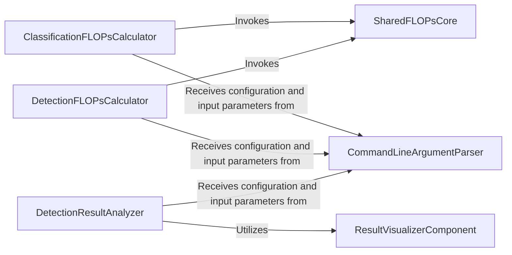

## Details

This subsystem is designed for the comprehensive evaluation and analysis of deep learning models, encompassing both classification and object detection domains. It features a CommandLineArgumentParser for flexible configuration, feeding parameters to specialized ClassificationFLOPsCalculator and DetectionFLOPsCalculator components that leverage a SharedFLOPsCore for efficient computational cost estimation. For object detection, a dedicated DetectionResultAnalyzer performs quantitative evaluation and collaborates with a ResultVisualizerComponent to provide insightful visual interpretations of model performance. This modular design ensures clear separation of concerns and reusability across different model evaluation tasks.

### ClassificationFLOPsCalculator
Computes the computational cost (FLOPs) specifically for classification models. It provides a dedicated interface for resource estimation in the classification domain. This component is crucial for understanding the efficiency of classification models.

**Related Classes/Methods**:

- <a href="https://github.com/whai362/PVT/blob/v2/classification/get_flops.py#L65-L92" target="_blank" rel="noopener noreferrer">`main`:65-92</a>
- <a href="https://github.com/whai362/PVT/blob/v2/classification/get_flops.py#L35-L62" target="_blank" rel="noopener noreferrer">`get_flops`:35-62</a>

### DetectionFLOPsCalculator
Computes the computational cost (FLOPs) specifically for object detection models. It offers a dedicated interface for resource estimation in the detection domain. Similar to its classification counterpart, this component is vital for assessing detection model efficiency.

**Related Classes/Methods**:

- <a href="https://github.com/whai362/PVT/blob/v2/classification/get_flops.py#L65-L92" target="_blank" rel="noopener noreferrer">`main`:65-92</a>
- <a href="https://github.com/whai362/PVT/blob/v2/classification/get_flops.py#L35-L62" target="_blank" rel="noopener noreferrer">`get_flops`:35-62</a>

### DetectionResultAnalyzer
Performs quantitative evaluation (e.g., mAP, accuracy) and manages qualitative visualization of results obtained from detection models. This is the core component for interpreting the performance of detection models.

**Related Classes/Methods**:

- <a href="https://github.com/whai362/PVT/blob/v2/detection/analyze_results.py#L89-L134" target="_blank" rel="noopener noreferrer">`evaluate_and_show`:89-134</a>
- <a href="https://github.com/whai362/PVT/blob/v2/detection/analyze_results.py#L63-L87" target="_blank" rel="noopener noreferrer">`_save_image_gts_results`:63-87</a>

### SharedFLOPsCore
Encapsulates the common algorithms and logic for calculating FLOPs, which are utilized by both classification and detection FLOPs calculators. This component promotes code reuse and consistency across different model types, embodying modularity.

**Related Classes/Methods**:

- <a href="https://github.com/whai362/PVT/blob/v2/classification/get_flops.py#L31-L32" target="_blank" rel="noopener noreferrer">`li_sra_flops`:31-32</a>
- <a href="https://github.com/whai362/PVT/blob/v2/classification/get_flops.py#L27-L28" target="_blank" rel="noopener noreferrer">`sra_flops`:27-28</a>

### CommandLineArgumentParser
Provides a standardized mechanism for parsing command-line arguments across the different evaluation scripts, enabling flexible configuration and execution. This component is fundamental for external interaction and configurability of the evaluation pipeline.

**Related Classes/Methods**:

- <a href="https://github.com/whai362/PVT/blob/v2/classification/get_flops.py#L14-L24" target="_blank" rel="noopener noreferrer">`parse_args`:14-24</a>

### ResultVisualizerComponent
Manages the rendering and display of visual outputs for detection results, such as bounding boxes, confidence scores, and ground truth comparisons. This component is essential for qualitative analysis and debugging of detection models.

**Related Classes/Methods**:

- <a href="https://github.com/whai362/PVT/blob/v2/detection/analyze_results.py#L48-L134" target="_blank" rel="noopener noreferrer">`ResultVisualizer`:48-134</a>

### [FAQ](https://github.com/CodeBoarding/GeneratedOnBoardings/tree/main?tab=readme-ov-file#faq)