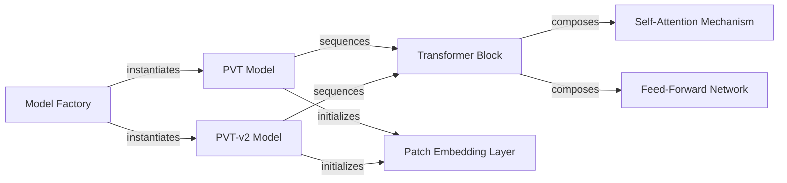

## Details

The Pyramid Vision Transformer (PVT) and its enhanced version, PVT-v2, are deep learning architectures designed for image classification. The core of these models lies in their ability to process images by dividing them into patches and then applying transformer-based operations. The architecture is modular, allowing for clear separation of concerns between initial patch embedding, the iterative processing within transformer blocks, and the overall model orchestration. Utility functions are provided to simplify the instantiation of pre-configured models.

### PVT Model
The primary orchestrator and entry point for the original Pyramid Vision Transformer (PVT) architecture. It constructs the multi-stage backbone by sequencing Patch Embedding Layer and Transformer Block components.

**Related Classes/Methods**:

- <a href="https://github.com/whai362/PVT/blob/v2/classification/pvt.py#L130-L241" target="_blank" rel="noopener noreferrer">`PyramidVisionTransformer`:130-241</a>

### PVT-v2 Model
The primary orchestrator and entry point for the enhanced Pyramid Vision Transformer v2 (PVT-v2) architecture. It incorporates improvements like OverlapPatchEmbed and DWConv within its Transformer Block structure.

**Related Classes/Methods**:

- <a href="https://github.com/whai362/PVT/blob/v2/classification/pvt_v2.py#L215-L301" target="_blank" rel="noopener noreferrer">`PyramidVisionTransformerV2`:215-301</a>

### Transformer Block
The fundamental building block of both PVT and PVT-v2 models, encapsulating the core self-attention and feed-forward operations.

**Related Classes/Methods**: _None_

### Self-Attention Mechanism
Implements the multi-head self-attention mechanism, a core component within each Transformer Block, allowing the model to weigh the importance of different parts of the input.

**Related Classes/Methods**:

- <a href="https://github.com/whai362/PVT/blob/v2/classification/pvt.py#L34-L76" target="_blank" rel="noopener noreferrer">`Attention`:34-76</a>

### Feed-Forward Network
Implements the Multi-layer Perceptron (MLP), also known as the feed-forward network, within each Transformer Block, providing non-linear transformations.

**Related Classes/Methods**: _None_

### Patch Embedding Layer
Handles the initial transformation of input images into a sequence of embedded patches, preparing them for processing by the transformer blocks. OverlapPatchEmbed is a specialized version for PVT-v2.

**Related Classes/Methods**:

- <a href="https://github.com/whai362/PVT/blob/v2/classification/pvt.py#L102-L127" target="_blank" rel="noopener noreferrer">`PatchEmbed`:102-127</a>
- <a href="https://github.com/whai362/PVT/blob/v2/classification/pvt_v2.py#L169-L212" target="_blank" rel="noopener noreferrer">`OverlapPatchEmbed`:169-212</a>

### Model Factory
Utility functions (e.g., pvt_tiny, pvt_v2_b0) that provide pre-configured instances of the main PVT/PVT-v2 models, simplifying model instantiation with common configurations.

**Related Classes/Methods**:

- <a href="https://github.com/whai362/PVT/blob/v2/classification/pvt.py#L255-L263" target="_blank" rel="noopener noreferrer">`pvt_tiny`:255-263</a>
- <a href="https://github.com/whai362/PVT/blob/v2/classification/pvt_v2.py#L329-L337" target="_blank" rel="noopener noreferrer">`pvt_v2_b0`:329-337</a>

### [FAQ](https://github.com/CodeBoarding/GeneratedOnBoardings/tree/main?tab=readme-ov-file#faq)