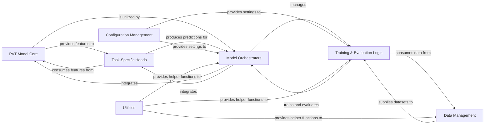

## Details

This architecture focuses on a modular design for computer vision tasks using Pyramid Vision Transformers (PVT). The core idea is to separate the feature extraction (PVT Model Core) from the task-specific prediction heads, allowing for flexible adaptation to various applications like classification, object detection, and semantic segmentation. The system orchestrates data flow from management components through training and evaluation, all configurable via a dedicated management system.

### PVT Model Core [[Expand]](./PVT_Model_Core.md)
The foundational component responsible for extracting hierarchical visual features from input data. It serves as the backbone for various computer vision tasks by processing images through multiple stages of attention and spatial reduction.

**Related Classes/Methods**:

- <a href="https://github.com/whai362/PVT/blob/v2/classification/pvt.py#L130-L241" target="_blank" rel="noopener noreferrer">`classification.pvt.PyramidVisionTransformer`:130-241</a>
- <a href="https://github.com/whai362/PVT/blob/v2/classification/pvt_v2.py#L215-L301" target="_blank" rel="noopener noreferrer">`classification.pvt_v2.PyramidVisionTransformer`:215-301</a>

### Task-Specific Heads [[Expand]](./Task_Specific_Heads.md)
Interchangeable output layers or modules tailored for specific computer vision tasks (e.g., classification, object detection, semantic segmentation). They consume features from the PVT Model Core and produce task-specific predictions.

**Related Classes/Methods**:

- <a href="https://github.com/whai362/PVT/blob/v2/classification/pvt.py#L130-L241" target="_blank" rel="noopener noreferrer">`classification.pvt.TaskSpecificHeadModule`:130-241</a>
- <a href="https://github.com/whai362/PVT/blob/v2/classification/pvt_v2.py#L215-L301" target="_blank" rel="noopener noreferrer">`classification.pvt_v2.TaskSpecificHeadModule`:215-301</a>
- <a href="https://github.com/whai362/PVT/blob/v2/detection/pvt.py#L129-L221" target="_blank" rel="noopener noreferrer">`detection.pvt.TaskSpecificHeadModule`:129-221</a>
- <a href="https://github.com/whai362/PVT/blob/v2/detection/pvt_v2.py#L217-L313" target="_blank" rel="noopener noreferrer">`detection.pvt_v2.TaskSpecificHeadModule`:217-313</a>
- <a href="https://github.com/whai362/PVT/blob/v2/segmentation/pvt.py#L129-L221" target="_blank" rel="noopener noreferrer">`segmentation.pvt.TaskSpecificHeadModule`:129-221</a>

### Model Orchestrators
Manages the overall forward pass of the complete model, integrating the PVT Model Core for feature extraction and attaching the appropriate Task-Specific Heads to generate final predictions. This component also handles the overall training and evaluation workflow.

**Related Classes/Methods**:

- <a href="https://github.com/whai362/PVT/blob/v2/classification/main.py" target="_blank" rel="noopener noreferrer">`classification/main.py`</a>
- <a href="https://github.com/whai362/PVT/blob/v2/classification/engine.py" target="_blank" rel="noopener noreferrer">`classification/engine.py`</a>

### Data Management
Responsible for loading, preprocessing, augmenting, and managing datasets for training, validation, and testing of the models. It ensures data is correctly formatted and accessible for the training and evaluation processes.

**Related Classes/Methods**:

- <a href="https://github.com/whai362/PVT/blob/v2/classification/datasets.py" target="_blank" rel="noopener noreferrer">`classification/datasets.py`</a>
- <a href="https://github.com/whai362/PVT/blob/v2/classification/mcloader/imagenet.py#L4-L8" target="_blank" rel="noopener noreferrer">`classification.mcloader.imagenet.ImageNet`:4-8</a>

### Training & Evaluation Logic
Encapsulates the training loops, optimization strategies, loss calculations, and performance evaluation metrics for the models. It interacts with the Data Management component to retrieve data and with the Model Orchestrators to perform forward and backward passes.

**Related Classes/Methods**:

- <a href="https://github.com/whai362/PVT/blob/v2/classification/engine.py" target="_blank" rel="noopener noreferrer">`classification/engine.py`</a>
- <a href="https://github.com/whai362/PVT/blob/v2/classification/main.py" target="_blank" rel="noopener noreferrer">`classification/main.py`</a>

### Configuration Management
Handles the loading, parsing, and management of configuration parameters, hyperparameters, and model settings. It provides essential settings to other components, particularly for model initialization and training.

**Related Classes/Methods**:

- <a href="https://github.com/whai362/PVT/blob/v2/classification/configs/pvt/pvt_tiny.py" target="_blank" rel="noopener noreferrer">`classification/configs/pvt/pvt_tiny.py`</a>
- <a href="https://github.com/whai362/PVT/blob/v2/classification/main.py" target="_blank" rel="noopener noreferrer">`classification/main.py`</a>

### Utilities
Provides a collection of general-purpose helper functions, common algorithms, and reusable modules that support various components across the project, such as distributed training setup and general-purpose tools.

**Related Classes/Methods**:

- <a href="https://github.com/whai362/PVT/blob/v2/classification/utils.py" target="_blank" rel="noopener noreferrer">`classification/utils.py`</a>

### [FAQ](https://github.com/CodeBoarding/GeneratedOnBoardings/tree/main?tab=readme-ov-file#faq)