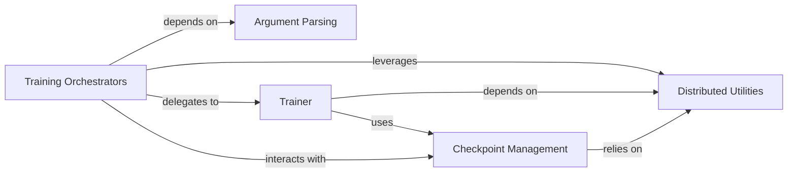

## Details

The `Training & Experiment Orchestrator` subsystem is crucial for managing the entire lifecycle of deep learning models within the project. It encompasses the setup, execution, and persistence of training and inference experiments.

### Training Orchestrators
These are the primary entry points for initiating and managing the overall lifecycle of training runs for specific deep learning tasks (e.g., classification, detection, segmentation). They set up the environment, parse arguments, and kick off the main training process.

**Related Classes/Methods**:

- <a href="https://github.com/whai362/PVT/blob/v2/classification/run_with_submitit.py" target="_blank" rel="noopener noreferrer">`classification.run_with_submitit`</a>
- <a href="https://github.com/whai362/PVT/blob/v2/detection/train.py" target="_blank" rel="noopener noreferrer">`detection.train`</a>
- <a href="https://github.com/whai362/PVT/blob/v2/segmentation/train.py" target="_blank" rel="noopener noreferrer">`segmentation.train`</a>
- <a href="https://github.com/whai362/PVT/blob/v2/classification/main.py" target="_blank" rel="noopener noreferrer">`classification.main`</a>

### Trainer
Encapsulates the core training and inference loop logic. It handles the iteration over data, performs model forward and backward passes, calculates loss, and executes optimization steps.

**Related Classes/Methods**:

- <a href="https://github.com/whai362/PVT/blob/v2/classification/run_with_submitit.py" target="_blank" rel="noopener noreferrer">`classification.run_with_submitit.Trainer`</a>
- <a href="https://github.com/whai362/PVT/blob/v2/classification/engine.py#L19-L67" target="_blank" rel="noopener noreferrer">`classification.engine.train_one_epoch`:19-67</a>
- <a href="https://github.com/whai362/PVT/blob/v2/classification/engine.py#L70-L100" target="_blank" rel="noopener noreferrer">`classification.engine.evaluate`:70-100</a>

### Argument Parsing
Manages the parsing of command-line arguments to configure various aspects of the training run, including model parameters, dataset paths, training hyperparameters, and distributed settings.

**Related Classes/Methods**:

- <a href="https://github.com/whai362/PVT/blob/v2/classification/run_with_submitit.py" target="_blank" rel="noopener noreferrer">`classification.run_with_submitit`</a>
- <a href="https://github.com/whai362/PVT/blob/v2/detection/train.py" target="_blank" rel="noopener noreferrer">`detection.train`</a>

### Distributed Utilities
Provides foundational services for setting up and managing distributed training environments, including process initialization, synchronization primitives, and collective operations.

**Related Classes/Methods**:

- <a href="https://github.com/whai362/PVT/blob/v2/classification/utils.py" target="_blank" rel="noopener noreferrer">`classification.utils`</a>

### Checkpoint Management
Handles the saving and loading of model weights, optimizer states, and other training progress checkpoints. This is crucial for resuming training, fault tolerance, and deploying trained models.

**Related Classes/Methods**:

- <a href="https://github.com/whai362/PVT/blob/v2/classification/run_with_submitit.py#L59-L69" target="_blank" rel="noopener noreferrer">`classification.run_with_submitit.checkpoint`:59-69</a>

### [FAQ](https://github.com/CodeBoarding/GeneratedOnBoardings/tree/main?tab=readme-ov-file#faq)