```mermaid
graph LR
    Data_Pipeline["Data Pipeline"]
    PVT_Model_Core["PVT Model Core"]
    Task_Specific_Heads["Task-Specific Heads"]
    Training_Experiment_Orchestrator["Training & Experiment Orchestrator"]
    Model_Evaluation_Analysis["Model Evaluation & Analysis"]
    Configuration_Manager["Configuration Manager"]
    Configuration_Manager -- "defines parameters for" --> Data_Pipeline
    Configuration_Manager -- "specifies parameters for" --> PVT_Model_Core
    Configuration_Manager -- "defines parameters for" --> Task_Specific_Heads
    Configuration_Manager -- "dictates settings for" --> Training_Experiment_Orchestrator
    Data_Pipeline -- "provides data to" --> Training_Experiment_Orchestrator
    Data_Pipeline -- "supplies data for" --> Model_Evaluation_Analysis
    Training_Experiment_Orchestrator -- "updates" --> PVT_Model_Core
    Training_Experiment_Orchestrator -- "updates" --> Task_Specific_Heads
    PVT_Model_Core -- "outputs features to" --> Task_Specific_Heads
    Task_Specific_Heads -- "produces predictions for" --> Training_Experiment_Orchestrator
    Training_Experiment_Orchestrator -- "triggers evaluation by" --> Model_Evaluation_Analysis
    Model_Evaluation_Analysis -- "analyzes" --> PVT_Model_Core
    Model_Evaluation_Analysis -- "analyzes" --> Task_Specific_Heads
    click Data_Pipeline href "https://github.com/CodeBoarding/GeneratedOnBoardings/blob/main/PVT/Data_Pipeline.md" "Details"
    click PVT_Model_Core href "https://github.com/CodeBoarding/GeneratedOnBoardings/blob/main/PVT/PVT_Model_Core.md" "Details"
    click Task_Specific_Heads href "https://github.com/CodeBoarding/GeneratedOnBoardings/blob/main/PVT/Task_Specific_Heads.md" "Details"
    click Training_Experiment_Orchestrator href "https://github.com/CodeBoarding/GeneratedOnBoardings/blob/main/PVT/Training_Experiment_Orchestrator.md" "Details"
    click Model_Evaluation_Analysis href "https://github.com/CodeBoarding/GeneratedOnBoardings/blob/main/PVT/Model_Evaluation_Analysis.md" "Details"
    click Configuration_Manager href "https://github.com/CodeBoarding/GeneratedOnBoardings/blob/main/PVT/Configuration_Manager.md" "Details"
```

## Details

The `PVT` project implements a robust deep learning architecture centered around the Pyramid Vision Transformer (PVT) for diverse computer vision tasks. The system is structured into six key components: a `Data Pipeline` for efficient data preparation, a `PVT Model Core` providing the foundational feature extraction, and `Task-Specific Heads` that adapt the core features for classification, detection, or segmentation. The `Training & Experiment Orchestrator` manages the entire model lifecycle, from distributed training to checkpointing, while the `Model Evaluation & Analysis` component rigorously assesses performance. All operational parameters are centrally managed by the `Configuration Manager`, ensuring reproducibility and streamlined experimentation. This modular design promotes clear data flow and component interaction, making it suitable for scalable development and deployment.

### Data Pipeline [[Expand]](./Data_Pipeline.md)
Manages the entire data lifecycle, from loading raw image datasets to applying necessary transformations (e.g., resizing, normalization, augmentation) and batching. It ensures data is efficiently prepared for model consumption across various tasks (classification, detection, segmentation).

**Related Classes/Methods**:

- <a href="https://github.com/whai362/PVT/blob/v2/classification/datasets.py" target="_blank" rel="noopener noreferrer">`classification/datasets.py`</a>
- <a href="https://github.com/whai362/PVT/blob/v2/classification/mcloader/" target="_blank" rel="noopener noreferrer">`classification/mcloader/`</a>
- <a href="https://github.com/whai362/PVT/blob/v2/segmentation/align_resize.py" target="_blank" rel="noopener noreferrer">`segmentation/align_resize.py`</a>

### PVT Model Core [[Expand]](./PVT_Model_Core.md)
Encapsulates the core Pyramid Vision Transformer (PVT and PVT-v2) architectures. This component is responsible for extracting robust, multi-scale features from input images, forming the foundational backbone for various downstream tasks.

**Related Classes/Methods**:

- <a href="https://github.com/whai362/PVT/blob/v2/classification/pvt.py#L130-L241" target="_blank" rel="noopener noreferrer">`classification.pvt.py`:130-241</a>
- <a href="https://github.com/whai362/PVT/blob/v2/classification/pvt_v2.py#L215-L301" target="_blank" rel="noopener noreferrer">`classification.pvt_v2.py`:215-301</a>
- <a href="https://github.com/whai362/PVT/blob/v2/detection/pvt.py#L129-L221" target="_blank" rel="noopener noreferrer">`detection.pvt.py`:129-221</a>
- <a href="https://github.com/whai362/PVT/blob/v2/detection/pvt_v2.py#L217-L313" target="_blank" rel="noopener noreferrer">`detection.pvt_v2.py`:217-313</a>
- <a href="https://github.com/whai362/PVT/blob/v2/segmentation/pvt.py#L129-L221" target="_blank" rel="noopener noreferrer">`segmentation.pvt.py`:129-221</a>

### Task-Specific Heads [[Expand]](./Task_Specific_Heads.md)
Represents the interchangeable output layers or modules tailored for specific computer vision tasks (classification, object detection, semantic segmentation). These modules consume features from the PVT Model Core and produce task-specific predictions.

**Related Classes/Methods**:

- <a href="https://github.com/whai362/PVT/blob/v2/classification/pvt.py#L130-L241" target="_blank" rel="noopener noreferrer">`classification.pvt.py`:130-241</a>
- <a href="https://github.com/whai362/PVT/blob/v2/classification/pvt_v2.py#L215-L301" target="_blank" rel="noopener noreferrer">`classification.pvt_v2.py`:215-301</a>
- <a href="https://github.com/whai362/PVT/blob/v2/detection/pvt.py#L129-L221" target="_blank" rel="noopener noreferrer">`detection.pvt.py`:129-221</a>
- <a href="https://github.com/whai362/PVT/blob/v2/detection/pvt_v2.py#L217-L313" target="_blank" rel="noopener noreferrer">`detection.pvt_v2.py`:217-313</a>
- <a href="https://github.com/whai362/PVT/blob/v2/segmentation/pvt.py#L129-L221" target="_blank" rel="noopener noreferrer">`segmentation.pvt.py`:129-221</a>

### Training & Experiment Orchestrator [[Expand]](./Training_Experiment_Orchestrator.md)
Coordinates the entire model lifecycle, including distributed training setup, argument parsing, and the main training/inference loop. It manages model optimization, logging, checkpointing, and overall experiment flow.

**Related Classes/Methods**:

- <a href="https://github.com/whai362/PVT/blob/v2/classification/main.py" target="_blank" rel="noopener noreferrer">`classification/main.py`</a>
- <a href="https://github.com/whai362/PVT/blob/v2/classification/run_with_submitit.py" target="_blank" rel="noopener noreferrer">`classification/run_with_submitit.py`</a>
- <a href="https://github.com/whai362/PVT/blob/v2/classification/engine.py" target="_blank" rel="noopener noreferrer">`classification/engine.py`</a>
- <a href="https://github.com/whai362/PVT/blob/v2/detection/train.py" target="_blank" rel="noopener noreferrer">`detection/train.py`</a>
- <a href="https://github.com/whai362/PVT/blob/v2/segmentation/train.py" target="_blank" rel="noopener noreferrer">`segmentation/train.py`</a>

### Model Evaluation & Analysis [[Expand]](./Model_Evaluation_Analysis.md)
Handles the quantitative and qualitative evaluation of model performance, calculates relevant metrics (e.g., FLOPs, mAP, accuracy), and provides tools for analyzing results and model complexity.

**Related Classes/Methods**:

- <a href="https://github.com/whai362/PVT/blob/v2/classification/get_flops.py" target="_blank" rel="noopener noreferrer">`classification/get_flops.py`</a>
- <a href="https://github.com/whai362/PVT/blob/v2/detection/get_flops.py" target="_blank" rel="noopener noreferrer">`detection/get_flops.py`</a>
- <a href="https://github.com/whai362/PVT/blob/v2/detection/analyze_results.py" target="_blank" rel="noopener noreferrer">`detection/analyze_results.py`</a>

### Configuration Manager [[Expand]](./Configuration_Manager.md)
Centralized management of all model, training, and dataset configurations. This component ensures reproducibility and easy experimentation by defining parameters in a structured and accessible manner.

**Related Classes/Methods**:

- <a href="https://github.com/whai362/PVT/blob/v2/classification/configs/" target="_blank" rel="noopener noreferrer">`classification/configs/`</a>
- <a href="https://github.com/whai362/PVT/blob/v2/detection/configs/" target="_blank" rel="noopener noreferrer">`detection/configs/`</a>
- <a href="https://github.com/whai362/PVT/blob/v2/segmentation/configs/" target="_blank" rel="noopener noreferrer">`segmentation/configs/`</a>

### [FAQ](https://github.com/CodeBoarding/GeneratedOnBoardings/tree/main?tab=readme-ov-file#faq)