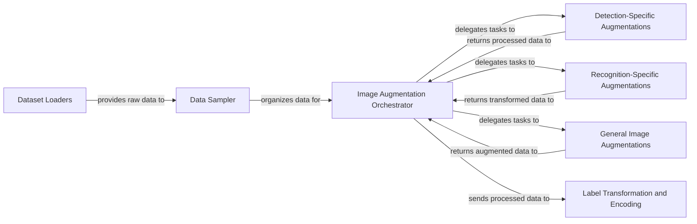

## Details

The feedback indicates an incorrect source reference for `QName:ppocr.data.imaug.text_image_aug.warp_mls`. The `getSourceCode` tool confirmed it's a file/package reference, and `readFile` revealed the correct path is `ppocr/data/imaug/text_image_aug/warp_mls.py`. This correction improves the accuracy of the "Recognition-Specific Augmentations" component's related classes/methods.

### Dataset Loaders
Responsible for abstracting data sources and loading raw image-annotation pairs from various formats (e.g., simple files, LMDB, PubTabNet). This component is fundamental as it provides the initial raw data input to the entire data pipeline.

**Related Classes/Methods**:

- <a href="https://github.com/PaddlePaddle/PaddleOCR/blob/main/ppocr/data/simple_dataset.py#L25-L156" target="_blank" rel="noopener noreferrer">`ppocr.data.simple_dataset.SimpleDataset`:25-156</a>
- <a href="https://github.com/PaddlePaddle/PaddleOCR/blob/main/ppocr/data/lmdb_dataset.py" target="_blank" rel="noopener noreferrer">`ppocr.data.lmdb_dataset`</a>
- <a href="https://github.com/PaddlePaddle/PaddleOCR/blob/main/ppocr/data/pubtab_dataset.py" target="_blank" rel="noopener noreferrer">`ppocr.data.pubtab_dataset`</a>

### Data Sampler
Manages the strategy for batching and sampling data, particularly important for optimizing training efficiency and implementing techniques like multi-scale training. It ensures data is presented in manageable chunks for downstream processing.

**Related Classes/Methods**:

- <a href="https://github.com/PaddlePaddle/PaddleOCR/blob/main/ppocr/data/multi_scale_sampler.py#L9-L171" target="_blank" rel="noopener noreferrer">`ppocr.data.multi_scale_sampler.MultiScaleSampler`:9-171</a>

### Image Augmentation Orchestrator
Acts as the central coordinator for applying a sequence of image preprocessing and augmentation operations. It orchestrates the flow of data through various augmentation modules, ensuring the correct transformations are applied based on the configuration. This is a core component for data robustness.

**Related Classes/Methods**:

- <a href="https://github.com/PaddlePaddle/PaddleOCR/blob/main/ppocr/data/imaug/operators.py" target="_blank" rel="noopener noreferrer">`ppocr.data.imaug.operators.Operators`</a>

### Detection-Specific Augmentations
Provides specialized image transformations and target generation methods tailored specifically for text detection tasks (e.g., generating border maps, shrink maps, PSE ground truths). This component encapsulates task-specific data preparation logic.

**Related Classes/Methods**:

- <a href="https://github.com/PaddlePaddle/PaddleOCR/blob/main/ppocr/data/imaug/ct_process.py" target="_blank" rel="noopener noreferrer">`ppocr.data.imaug.ct_process`</a>
- <a href="https://github.com/PaddlePaddle/PaddleOCR/blob/main/ppocr/data/imaug/east_process.py" target="_blank" rel="noopener noreferrer">`ppocr.data.imaug.east_process`</a>
- <a href="https://github.com/PaddlePaddle/PaddleOCR/blob/main/ppocr/data/imaug/pg_process.py" target="_blank" rel="noopener noreferrer">`ppocr.data.imaug.pg_process`</a>
- <a href="https://github.com/PaddlePaddle/PaddleOCR/blob/main/ppocr/data/imaug/sast_process.py" target="_blank" rel="noopener noreferrer">`ppocr.data.imaug.sast_process`</a>
- <a href="https://github.com/PaddlePaddle/PaddleOCR/blob/main/ppocr/data/imaug/make_border_map.py" target="_blank" rel="noopener noreferrer">`ppocr.data.imaug.make_border_map`</a>
- <a href="https://github.com/PaddlePaddle/PaddleOCR/blob/main/ppocr/data/imaug/make_shrink_map.py" target="_blank" rel="noopener noreferrer">`ppocr.data.imaug.make_shrink_map`</a>
- <a href="https://github.com/PaddlePaddle/PaddleOCR/blob/main/ppocr/data/imaug/make_pse_gt.py" target="_blank" rel="noopener noreferrer">`ppocr.data.imaug.make_pse_gt`</a>
- <a href="https://github.com/PaddlePaddle/PaddleOCR/blob/main/ppocr/data/imaug/drrg_targets.py" target="_blank" rel="noopener noreferrer">`ppocr.data.imaug.drrg_targets`</a>
- <a href="https://github.com/PaddlePaddle/PaddleOCR/blob/main/ppocr/data/imaug/fce_targets.py" target="_blank" rel="noopener noreferrer">`ppocr.data.imaug.fce_targets`</a>

### Recognition-Specific Augmentations
Offers specialized image transformations designed for text recognition tasks (e.g., ABINet, FCE, LaTeX OCR augmentations). This component ensures that recognition models receive appropriately augmented data for improved generalization.

**Related Classes/Methods**:

- <a href="https://github.com/PaddlePaddle/PaddleOCR/blob/main/ppocr/data/imaug/abinet_aug.py" target="_blank" rel="noopener noreferrer">`ppocr.data.imaug.abinet_aug`</a>
- <a href="https://github.com/PaddlePaddle/PaddleOCR/blob/main/ppocr/data/imaug/fce_aug.py" target="_blank" rel="noopener noreferrer">`ppocr.data.imaug.fce_aug`</a>
- <a href="https://github.com/PaddlePaddle/PaddleOCR/blob/main/ppocr/data/imaug/latex_ocr_aug.py" target="_blank" rel="noopener noreferrer">`ppocr.data.imaug.latex_ocr_aug`</a>
- <a href="https://github.com/PaddlePaddle/PaddleOCR/blob/main/ppocr/data/imaug/rec_img_aug.py" target="_blank" rel="noopener noreferrer">`ppocr.data.imaug.rec_img_aug`</a>
- <a href="https://github.com/PaddlePaddle/PaddleOCR/blob/main/ppocr/data/imaug/ssl_img_aug.py" target="_blank" rel="noopener noreferrer">`ppocr.data.imaug.ssl_img_aug`</a>
- <a href="https://github.com/PaddlePaddle/PaddleOCR/blob/main/ppocr/data/imaug/unimernet_aug.py" target="_blank" rel="noopener noreferrer">`ppocr.data.imaug.unimernet_aug`</a>
- <a href="https://github.com/PaddlePaddle/PaddleOCR/blob/main/ppocr/data/imaug/text_image_aug/warp_mls.py" target="_blank" rel="noopener noreferrer">`ppocr.data.imaug.text_image_aug.warp_mls`</a>

### General Image Augmentations
Contains common, task-agnostic image augmentation techniques (e.g., copy-paste, RandAugment, random cropping) that can be applied across different OCR sub-tasks. This promotes reusability and a comprehensive set of augmentation options.

**Related Classes/Methods**:

- <a href="https://github.com/PaddlePaddle/PaddleOCR/blob/main/ppocr/data/imaug/copy_paste.py" target="_blank" rel="noopener noreferrer">`ppocr.data.imaug.copy_paste`</a>
- <a href="https://github.com/PaddlePaddle/PaddleOCR/blob/main/ppocr/data/imaug/iaa_augment.py" target="_blank" rel="noopener noreferrer">`ppocr.data.imaug.iaa_augment`</a>
- <a href="https://github.com/PaddlePaddle/PaddleOCR/blob/main/ppocr/data/imaug/randaugment.py" target="_blank" rel="noopener noreferrer">`ppocr.data.imaug.randaugment`</a>
- <a href="https://github.com/PaddlePaddle/PaddleOCR/blob/main/ppocr/data/imaug/random_crop_data.py" target="_blank" rel="noopener noreferrer">`ppocr.data.imaug.random_crop_data`</a>

### Label Transformation and Encoding
Converts raw annotations (e.g., text labels, table structures, VQA tokens) into numerical formats and encodings that are directly consumable by machine learning models. This is a crucial final step in data preparation, ensuring labels are in the correct format for model training.

**Related Classes/Methods**:

- <a href="https://github.com/PaddlePaddle/PaddleOCR/blob/main/ppocr/data/imaug/label_ops.py" target="_blank" rel="noopener noreferrer">`ppocr.data.imaug.label_ops`</a>
- <a href="https://github.com/PaddlePaddle/PaddleOCR/blob/main/ppocr/data/imaug/table_ops.py" target="_blank" rel="noopener noreferrer">`ppocr.data.imaug.table_ops`</a>
- <a href="https://github.com/PaddlePaddle/PaddleOCR/blob/main/ppocr/data/imaug/vqa/token/vqa_token_chunk.py" target="_blank" rel="noopener noreferrer">`ppocr.data.imaug.vqa.token.vqa_token_chunk`</a>
- <a href="https://github.com/PaddlePaddle/PaddleOCR/blob/main/ppocr/data/imaug/vqa/token/vqa_token_relation.py" target="_blank" rel="noopener noreferrer">`ppocr.data.imaug.vqa.token.vqa_token_relation`</a>

### [FAQ](https://github.com/CodeBoarding/GeneratedOnBoardings/tree/main?tab=readme-ov-file#faq)