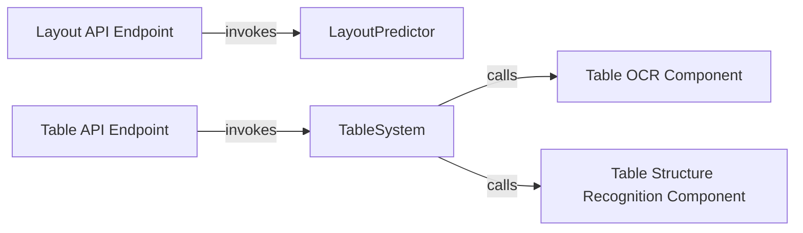

## Details

The Document Structure Analysis Pipeline subsystem in PaddleOCR focuses on understanding the visual and logical organization of documents, including general document layout analysis and specialized table structure recognition.

### LayoutPredictor
Acts as the core inference engine for document layout analysis. It identifies and categorizes different content regions (e.g., paragraphs, images, tables, figures) within a document, providing a high-level understanding of its visual organization. This component embodies the "Layout Analysis Module."

**Related Classes/Methods**:

- <a href="https://github.com/PaddlePaddle/PaddleOCR/blob/main/ppstructure/layout/predict_layout.py#L38-L114" target="_blank" rel="noopener noreferrer">`ppstructure.layout.predict_layout.LayoutPredictor`:38-114</a>

### TableSystem
Serves as the orchestrator for the end-to-end table structure analysis pipeline. It integrates various sub-components (OCR, structure recognition) to extract and understand tabular data from documents. This component represents the "Table Recognition Module."

**Related Classes/Methods**:

- <a href="https://github.com/PaddlePaddle/PaddleOCR/blob/main/ppstructure/table/predict_table.py#L58-L147" target="_blank" rel="noopener noreferrer">`ppstructure.table.predict_table.TableSystem`:58-147</a>

### Table OCR Component
A specialized OCR component within the table analysis pipeline. Its role is to accurately extract text content from detected table regions, providing the textual input necessary for structural interpretation. This is a specialized "Text Recognition Module" for tables.

**Related Classes/Methods**:

- <a href="https://github.com/PaddlePaddle/PaddleOCR/blob/main/ppstructure/table/predict_table.py#L121-L147" target="_blank" rel="noopener noreferrer">`ppstructure.table.predict_table._ocr`:121-147</a>

### Table Structure Recognition Component
Focuses on recognizing the structural components of tables, such as rows, columns, and cell boundaries, based on visual cues and the OCR results. It interprets the visual layout to form a structured representation of the table. This is a core part of the "Table Recognition Module."

**Related Classes/Methods**:

- <a href="https://github.com/PaddlePaddle/PaddleOCR/blob/main/ppstructure/table/predict_table.py#L117-L119" target="_blank" rel="noopener noreferrer">`ppstructure.table.predict_table._structure`:117-119</a>

### Layout API Endpoint
Provides an external API endpoint for the document layout analysis. It allows other applications or services to submit images and receive structured layout predictions, acting as the "API/Service Layer" for layout analysis.

**Related Classes/Methods**:

- <a href="https://github.com/PaddlePaddle/PaddleOCR/blob/main/deploy/hubserving/structure_layout/module.py#L96-L131" target="_blank" rel="noopener noreferrer">`deploy.hubserving.structure_layout.module.predict`:96-131</a>

### Table API Endpoint
Offers an external API endpoint for the table structure analysis pipeline. It enables external systems to send images and receive structured table data, serving as the "API/Service Layer" for table recognition.

**Related Classes/Methods**:

- <a href="https://github.com/PaddlePaddle/PaddleOCR/blob/main/deploy/hubserving/structure_table/module.py#L98-L131" target="_blank" rel="noopener noreferrer">`deploy.hubserving.structure_table.module.predict`:98-131</a>

### [FAQ](https://github.com/CodeBoarding/GeneratedOnBoardings/tree/main?tab=readme-ov-file#faq)