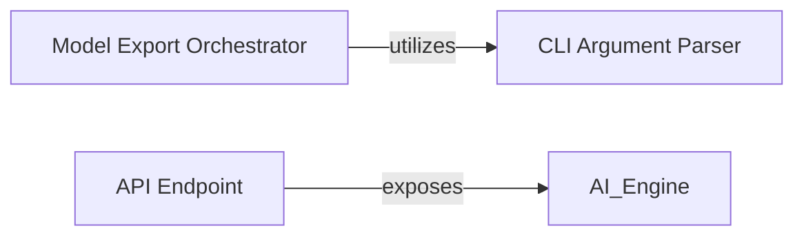

## Details

The PaddleOCR system provides distinct interfaces for user interaction and external service integration. The `CLI Argument Parser` serves as the foundational component for defining all command-line interactions, enabling users to specify operations and parameters. Building upon this, the `Model Export Orchestrator` specifically handles the command-line driven process of exporting models, utilizing the arguments defined by the `CLI Argument Parser` to manage the conversion and optimization of models. Concurrently, the `API Endpoint` offers a programmatic interface, primarily for the PaddleHub service, allowing external applications to access PaddleOCR's core AI capabilities. This architecture ensures both flexible command-line utility and robust API accessibility for diverse deployment scenarios.

### CLI Argument Parser
This component is responsible for defining and configuring the command-line arguments, options, and subcommands that PaddleOCR exposes to users. It acts as the initial gateway for users to specify their desired operations and parameters when interacting with the toolkit via the command line.

**Related Classes/Methods**:

- <a href="https://github.com/PaddlePaddle/PaddleOCR/blob/main/paddleocr/_cli.py#L102-L111" target="_blank" rel="noopener noreferrer">`_get_parser`:102-111</a>

### Model Export Orchestrator
This component specifically orchestrates the model export functionality within PaddleOCR. It processes command-line arguments related to model export and dispatches them to the appropriate internal logic for converting and optimizing models for deployment.

**Related Classes/Methods**:

- <a href="https://github.com/PaddlePaddle/PaddleOCR/blob/main/benchmark/PaddleOCR_DBNet/tools/export_model.py#L33-L49" target="_blank" rel="noopener noreferrer">`main`:33-49</a>

### API Endpoint
This component exposes PaddleOCR's core OCR functionality as a public API endpoint, primarily for the PaddleHub service. It serves as the primary interface for external applications and services to programmatically interact with the AI Engine, enabling integration into larger systems or custom applications.

**Related Classes/Methods**:

- <a href="https://github.com/PaddlePaddle/PaddleOCR/blob/main/deploy/hubserving/kie_ser/module.py#L134-L141" target="_blank" rel="noopener noreferrer">`serving_method`:134-141</a>

### [FAQ](https://github.com/CodeBoarding/GeneratedOnBoardings/tree/main?tab=readme-ov-file#faq)