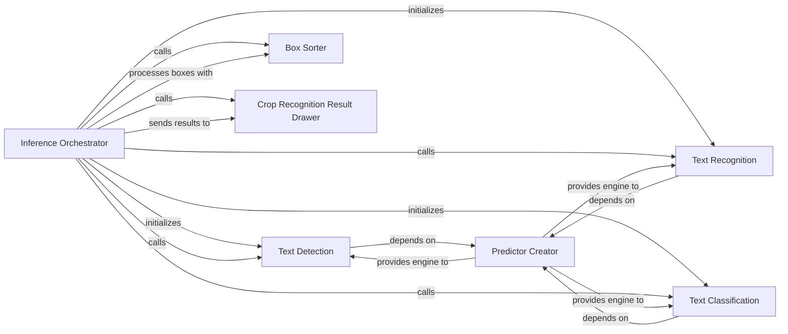

## Details

The PaddleOCR inference subsystem is orchestrated by the `Inference Orchestrator`, which manages the end-to-end OCR pipeline. This pipeline typically involves `Text Detection` to locate text regions, optional `Text Classification` for orientation correction, and `Text Recognition` to convert image crops into readable text. The `Predictor Creator` is a foundational component responsible for initializing the underlying PaddlePaddle inference engines used by the detection, recognition, and classification stages. Additionally, a `Box Sorter` ensures the detected text boxes are processed in a logical reading order, and a `Crop Recognition Result Drawer` assists in visualizing and saving intermediate results.

### Inference Orchestrator [[Expand]](./Inference_Orchestrator.md)
The central unit for running trained models on new input data, coordinating the execution of various ML pipelines. It manages the sequential execution of text detection, orientation classification (if enabled), and text recognition. It initializes and holds references to the sub-components, ensuring a cohesive data flow from raw image input to structured text output.

**Related Classes/Methods**:

### Text Detection
Responsible for identifying and localizing text regions within an image, outputting bounding box coordinates. This is the first stage of the OCR pipeline.

**Related Classes/Methods**:

### Text Recognition
Focuses on converting cropped image regions (containing text) into readable character sequences. This is the final stage of text processing after detection and optional classification.

**Related Classes/Methods**:

### Text Classification
Performs text classification, typically for determining text orientation (e.g., 0, 90, 180, 270 degrees) of cropped text images. This step is crucial for correcting text orientation before recognition.

**Related Classes/Methods**:

### Predictor Creator
Manages the loading, configuration, and initialization of PaddlePaddle inference models (e.g., Paddle Inference Engine). It abstracts the underlying model loading mechanisms, providing a standardized way for other components to get their inference engines.

**Related Classes/Methods**:

### Box Sorter
A utility function for ordering detected text bounding boxes into a logical reading sequence (e.g., top-to-bottom, left-to-right). This ensures the extracted text is presented in a coherent order.

**Related Classes/Methods**:

### Crop Recognition Result Drawer
A utility method within TextSystem for saving cropped images and their corresponding recognition results. Primarily used for debugging, visualization, or generating intermediate outputs.

**Related Classes/Methods**:

### [FAQ](https://github.com/CodeBoarding/GeneratedOnBoardings/tree/main?tab=readme-ov-file#faq)