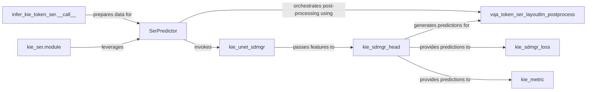

## Details

The Intelligent Information Extraction (KIE) Pipeline subsystem is designed to extract specific entities, key-value pairs, and their relationships from recognized text and structured document content. It forms a critical part of the overall document understanding capabilities within the PaddleOCR project.

### SerPredictor
Acts as the primary interface and orchestrator for the entire KIE prediction workflow. It manages the flow from input data preparation through feature extraction, prediction, and final result post-processing.

**Related Classes/Methods**:

- <a href="https://github.com/PaddlePaddle/PaddleOCR/blob/main/ppstructure/kie/predict_kie_token_ser.py#L41-L140" target="_blank" rel="noopener noreferrer">`ppstructure.kie.predict_kie_token_ser.SerPredictor`:41-140</a>

### kie_unet_sdmgr
Serves as the backbone model responsible for extracting rich visual and textual features from input documents, which are crucial for subsequent KIE tasks.

**Related Classes/Methods**:

- <a href="https://github.com/PaddlePaddle/PaddleOCR/blob/main/ppocr/modeling/backbones/kie_unet_sdmgr.py#L1-L100" target="_blank" rel="noopener noreferrer">`ppocr.modeling.backbones.kie_unet_sdmgr`:1-100</a>

### kie_sdmgr_head
Processes the features provided by the backbone to perform the core task of predicting entities, key-value pairs, and their relationships, embodying the KIE model's intelligence.

**Related Classes/Methods**:

- <a href="https://github.com/PaddlePaddle/PaddleOCR/blob/main/ppocr/modeling/heads/kie_sdmgr_head.py#L1-L100" target="_blank" rel="noopener noreferrer">`ppocr.modeling.heads.kie_sdmgr_head`:1-100</a>

### vqa_token_ser_layoutlm_postprocess
Transforms the raw, often numerical, outputs from the prediction head into structured, human-readable KIE results, such as identified entities and key-value pairs.

**Related Classes/Methods**:

- <a href="https://github.com/PaddlePaddle/PaddleOCR/blob/main/ppocr/postprocess/vqa_token_ser_layoutlm_postprocess.py#L1-L100" target="_blank" rel="noopener noreferrer">`ppocr.postprocess.vqa_token_ser_layoutlm_postprocess`:1-100</a>

### infer_kie_token_ser.__call__
Handles the specific preprocessing and formatting of input data required for token-level Sequence Entity Recognition (SER) within the KIE pipeline, ensuring data is in the correct format for the `SerPredictor`.

**Related Classes/Methods**:

- <a href="https://github.com/PaddlePaddle/PaddleOCR/blob/main/tools/infer_kie_token_ser.py#L111-L122" target="_blank" rel="noopener noreferrer">`tools.infer_kie_token_ser.__call__`:111-122</a>

### kie_ser.module
Facilitates the deployment and serving of the KIE model, exposing its prediction functionality as a service for consumption by external applications.

**Related Classes/Methods**:

- <a href="https://github.com/PaddlePaddle/PaddleOCR/blob/main/deploy/hubserving/kie_ser/module.py#L1-L100" target="_blank" rel="noopener noreferrer">`deploy.hubserving.kie_ser.module`:1-100</a>

### kie_sdmgr_loss
Quantifies the discrepancy between the model's predictions and the ground truth during the training phase, guiding the model's learning and optimization. This is crucial for the "ML Toolkit" aspect.

**Related Classes/Methods**:

- <a href="https://github.com/PaddlePaddle/PaddleOCR/blob/main/ppocr/losses/kie_sdmgr_loss.py#L1-L100" target="_blank" rel="noopener noreferrer">`ppocr.losses.kie_sdmgr_loss`:1-100</a>

### kie_metric
Measures the performance of the KIE model against predefined criteria, providing insights into its accuracy and effectiveness during evaluation. This is crucial for the "ML Toolkit" aspect.

**Related Classes/Methods**:

- <a href="https://github.com/PaddlePaddle/PaddleOCR/blob/main/ppocr/metrics/kie_metric.py#L1-L100" target="_blank" rel="noopener noreferrer">`ppocr.metrics.kie_metric`:1-100</a>

### [FAQ](https://github.com/CodeBoarding/GeneratedOnBoardings/tree/main?tab=readme-ov-file#faq)