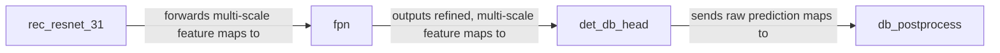

## Details

The Text Detection Pipeline subsystem is responsible for identifying and localizing text regions within an image.

### rec_resnet_31
This component acts as the initial feature extractor, converting raw pixel data from the input image into a rich set of hierarchical visual feature maps at various scales. It forms the backbone of the detection process.

**Related Classes/Methods**:

- <a href="https://github.com/PaddlePaddle/PaddleOCR/blob/main/ppocr/modeling/backbones/rec_resnet_31.py" target="_blank" rel="noopener noreferrer">`ppocr/modeling/backbones/rec_resnet_31.py`</a>

### fpn
The FPN aggregates and enhances the multi-scale feature maps received from the `rec_resnet_31` backbone. Its role is to create a robust feature representation that is invariant to scale changes, which is critical for detecting text of varying sizes.

**Related Classes/Methods**:

- <a href="https://github.com/PaddlePaddle/PaddleOCR/blob/main/ppocr/modeling/necks/fpn.py" target="_blank" rel="noopener noreferrer">`ppocr/modeling/necks/fpn.py`</a>

### det_db_head
This component takes the enhanced feature maps from the `fpn` and predicts the core components for text detection: a probability map (indicating the likelihood of text presence) and a threshold map (for adaptive binarization).

**Related Classes/Methods**:

- <a href="https://github.com/PaddlePaddle/PaddleOCR/blob/main/ppocr/modeling/heads/det_db_head.py" target="_blank" rel="noopener noreferrer">`ppocr/modeling/heads/det_db_head.py`</a>

### db_postprocess
This component converts the raw probability and threshold maps from the `det_db_head` into final, precise text bounding boxes or polygons. This involves binarization, contour extraction, and geometric post-processing (e.g., unclipping) to refine the detected regions into usable output.

**Related Classes/Methods**:

- <a href="https://github.com/PaddlePaddle/PaddleOCR/blob/main/ppocr/postprocess/db_postprocess.py" target="_blank" rel="noopener noreferrer">`ppocr/postprocess/db_postprocess.py`</a>

### [FAQ](https://github.com/CodeBoarding/GeneratedOnBoardings/tree/main?tab=readme-ov-file#faq)