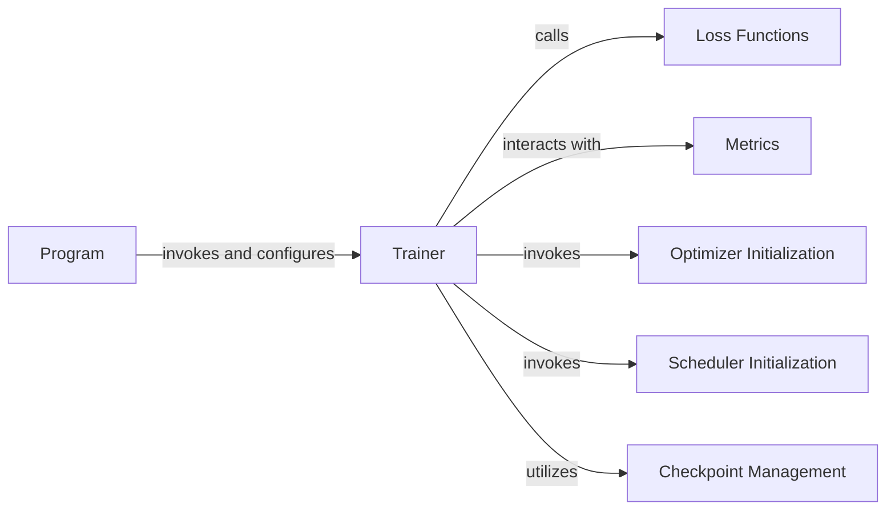

## Details

The `Training & Evaluation System` subsystem is central to the `PaddleOCR` project, managing the entire model training lifecycle, including optimization, loss computation, and performance metric evaluation.

### Program
Acts as the primary entry point for training and evaluation scripts. It handles configuration loading, parsing command-line arguments, and orchestrating the overall process by initiating the Trainer.

**Related Classes/Methods**:

- <a href="https://github.com/PaddlePaddle/PaddleOCR/blob/main/deploy/slim/auto_compression/run.py" target="_blank" rel="noopener noreferrer">`program`</a>

### Trainer
Manages the entire training and evaluation lifecycle. This includes model initialization, managing training epochs, iterating over datasets, performing forward and backward passes, updating model weights, and monitoring performance. It orchestrates interactions with Loss Functions, Metrics, Optimizer, Scheduler, and Checkpoint Management.

**Related Classes/Methods**:

- <a href="https://github.com/PaddlePaddle/PaddleOCR/blob/main/benchmark/PaddleOCR_DBNet/base/base_trainer.py" target="_blank" rel="noopener noreferrer">`base_trainer`</a>

### Loss Functions
Computes the discrepancy between model predictions and ground truth labels. It provides the objective function that guides the model's learning process during training. Composite loss functions can combine multiple specialized sub-loss components.

**Related Classes/Methods**:

- <a href="https://github.com/PaddlePaddle/PaddleOCR/blob/main/ppocr/losses/det_basic_loss.py" target="_blank" rel="noopener noreferrer">`det_basic_loss`</a>
- <a href="https://github.com/PaddlePaddle/PaddleOCR/blob/main/ppocr/losses/basic_loss.py" target="_blank" rel="noopener noreferrer">`basic_loss`</a>

### Metrics
Quantifies model performance on specific tasks during evaluation. It calculates various performance indicators (e.g., accuracy, precision, recall, F1-score) based on model predictions and ground truth.

**Related Classes/Methods**:

- <a href="https://github.com/PaddlePaddle/PaddleOCR/blob/main/ppocr/metrics/det_metric.py" target="_blank" rel="noopener noreferrer">`det_metric`</a>
- <a href="https://github.com/PaddlePaddle/PaddleOCR/blob/main/ppocr/metrics/rec_metric.py" target="_blank" rel="noopener noreferrer">`rec_metric`</a>

### Optimizer Initialization
Configures and initializes the optimization algorithm (e.g., SGD, Adam) used to update model weights based on the computed loss.

**Related Classes/Methods**:

- <a href="https://github.com/PaddlePaddle/PaddleOCR/blob/main/benchmark/PaddleOCR_DBNet/base/base_trainer.py" target="_blank" rel="noopener noreferrer">`base_trainer:_initialize_optimizer`</a>

### Scheduler Initialization
Sets up the learning rate schedule, dynamically adjusting the learning rate during training to optimize convergence and performance.

**Related Classes/Methods**:

- <a href="https://github.com/PaddlePaddle/PaddleOCR/blob/main/benchmark/PaddleOCR_DBNet/base/base_trainer.py" target="_blank" rel="noopener noreferrer">`base_trainer:_initialize_scheduler`</a>

### Checkpoint Management
Handles the loading and saving of model parameters, optimizer states, and other training progress information. This enables resuming training from a specific point or deploying a trained model.

**Related Classes/Methods**:

- <a href="https://github.com/PaddlePaddle/PaddleOCR/blob/main/benchmark/PaddleOCR_DBNet/base/base_trainer.py" target="_blank" rel="noopener noreferrer">`base_trainer:_load_checkpoint`</a>

### [FAQ](https://github.com/CodeBoarding/GeneratedOnBoardings/tree/main?tab=readme-ov-file#faq)