```mermaid
graph LR
    External_Interfaces["External Interfaces"]
    Data_Management["Data Management"]
    Text_Detection_Pipeline["Text Detection Pipeline"]
    Text_Recognition_Pipeline["Text Recognition Pipeline"]
    Document_Structure_Analysis_Pipeline["Document Structure Analysis Pipeline"]
    Intelligent_Information_Extraction_KIE_Pipeline["Intelligent Information Extraction (KIE) Pipeline"]
    Inference_Orchestrator["Inference Orchestrator"]
    Training_Evaluation_System["Training & Evaluation System"]
    External_Interfaces -- "Initiates prediction requests" --> Inference_Orchestrator
    External_Interfaces -- "Initiates training/evaluation tasks" --> Training_Evaluation_System
    Data_Management -- "Provides input data for prediction" --> Inference_Orchestrator
    Data_Management -- "Supplies datasets for training" --> Training_Evaluation_System
    Inference_Orchestrator -- "Orchestrates image processing for text localization" --> Text_Detection_Pipeline
    Text_Detection_Pipeline -- "Passes detected regions for transcription" --> Text_Recognition_Pipeline
    Text_Recognition_Pipeline -- "Forwards recognized text for layout analysis" --> Document_Structure_Analysis_Pipeline
    Document_Structure_Analysis_Pipeline -- "Provides structured content for semantic extraction" --> Intelligent_Information_Extraction_KIE_Pipeline
    Intelligent_Information_Extraction_KIE_Pipeline -- "Returns final processed results" --> Inference_Orchestrator
    Training_Evaluation_System -- "Manages training" --> Text_Detection_Pipeline
    Text_Detection_Pipeline -- "Provides feedback" --> Training_Evaluation_System
    Training_Evaluation_System -- "Manages training" --> Text_Recognition_Pipeline
    Text_Recognition_Pipeline -- "Provides feedback" --> Training_Evaluation_System
    Training_Evaluation_System -- "Manages training" --> Document_Structure_Analysis_Pipeline
    Document_Structure_Analysis_Pipeline -- "Provides feedback" --> Training_Evaluation_System
    Training_Evaluation_System -- "Manages training" --> Intelligent_Information_Extraction_KIE_Pipeline
    Intelligent_Information_Extraction_KIE_Pipeline -- "Provides feedback" --> Training_Evaluation_System
    click External_Interfaces href "https://github.com/CodeBoarding/GeneratedOnBoardings/blob/main/PaddleOCR/External_Interfaces.md" "Details"
    click Data_Management href "https://github.com/CodeBoarding/GeneratedOnBoardings/blob/main/PaddleOCR/Data_Management.md" "Details"
    click Text_Detection_Pipeline href "https://github.com/CodeBoarding/GeneratedOnBoardings/blob/main/PaddleOCR/Text_Detection_Pipeline.md" "Details"
    click Text_Recognition_Pipeline href "https://github.com/CodeBoarding/GeneratedOnBoardings/blob/main/PaddleOCR/Text_Recognition_Pipeline.md" "Details"
    click Document_Structure_Analysis_Pipeline href "https://github.com/CodeBoarding/GeneratedOnBoardings/blob/main/PaddleOCR/Document_Structure_Analysis_Pipeline.md" "Details"
    click Intelligent_Information_Extraction_KIE_Pipeline href "https://github.com/CodeBoarding/GeneratedOnBoardings/blob/main/PaddleOCR/Intelligent_Information_Extraction_KIE_Pipeline.md" "Details"
    click Inference_Orchestrator href "https://github.com/CodeBoarding/GeneratedOnBoardings/blob/main/PaddleOCR/Inference_Orchestrator.md" "Details"
    click Training_Evaluation_System href "https://github.com/CodeBoarding/GeneratedOnBoardings/blob/main/PaddleOCR/Training_Evaluation_System.md" "Details"
```

## Details

PaddleOCR's architecture is designed for robust optical character recognition and document understanding. The system initiates interactions through External Interfaces, which serve as the primary entry points for users and applications. These interfaces can trigger either inference or training workflows. For inference, the Inference Orchestrator takes charge, coordinating the Data Management component to preprocess input data. The processed data then flows through specialized pipelines: Text Detection Pipeline identifies text regions, followed by the Text Recognition Pipeline for transcribing text. For more complex documents, the Document Structure Analysis Pipeline and Intelligent Information Extraction (KIE) Pipeline further process the recognized text to extract structured information. The final results are then returned via the Inference Orchestrator back to the External Interfaces. In parallel, the Training & Evaluation System manages the model lifecycle. It leverages Data Management to access datasets for training and continuously evaluates model performance using metrics and loss computations. This system interacts with the various pipelines (Text Detection, Text Recognition, Document Structure Analysis, and KIE) to manage their training and receive feedback for iterative improvement.

### External Interfaces [[Expand]](./External_Interfaces.md)
The primary entry points for users and external applications to interact with PaddleOCR, abstracting underlying complexities.

**Related Classes/Methods**:

- <a href="https://github.com/PaddlePaddle/PaddleOCR/blob/main/paddleocr/_cli.py" target="_blank" rel="noopener noreferrer">`paddleocr/_cli.py`</a>
- <a href="https://github.com/PaddlePaddle/PaddleOCR/blob/main/deploy/hubserving/ocr_system/module.py" target="_blank" rel="noopener noreferrer">`deploy/hubserving/ocr_system/module.py`</a>

### Data Management [[Expand]](./Data_Management.md)
Manages the loading, preprocessing, and augmentation of image and annotation data for both training and inference.

**Related Classes/Methods**:

- <a href="https://github.com/PaddlePaddle/PaddleOCR/blob/main/ppocr/data/simple_dataset.py" target="_blank" rel="noopener noreferrer">`ppocr/data/simple_dataset.py`</a>
- <a href="https://github.com/PaddlePaddle/PaddleOCR/blob/main/ppocr/data/imaug/operators.py" target="_blank" rel="noopener noreferrer">`ppocr/data/imaug/operators.py`</a>

### Text Detection Pipeline [[Expand]](./Text_Detection_Pipeline.md)
Identifies and localizes text regions within an image, outputting precise bounding boxes or polygons.

**Related Classes/Methods**:

- <a href="https://github.com/PaddlePaddle/PaddleOCR/blob/main/ppocr/modeling/backbones/rec_resnet_31.py" target="_blank" rel="noopener noreferrer">`ppocr/modeling/backbones/rec_resnet_31.py`</a>
- <a href="https://github.com/PaddlePaddle/PaddleOCR/blob/main/ppocr/modeling/necks/fpn.py" target="_blank" rel="noopener noreferrer">`ppocr/modeling/necks/fpn.py`</a>
- <a href="https://github.com/PaddlePaddle/PaddleOCR/blob/main/ppocr/modeling/heads/det_db_head.py" target="_blank" rel="noopener noreferrer">`ppocr/modeling/heads/det_db_head.py`</a>
- <a href="https://github.com/PaddlePaddle/PaddleOCR/blob/main/ppocr/postprocess/db_postprocess.py" target="_blank" rel="noopener noreferrer">`ppocr/postprocess/db_postprocess.py`</a>

### Text Recognition Pipeline [[Expand]](./Text_Recognition_Pipeline.md)
Transcribes characters within detected text regions into readable text strings.

**Related Classes/Methods**:

- <a href="https://github.com/PaddlePaddle/PaddleOCR/blob/main/ppocr/modeling/backbones/rec_resnet_31.py" target="_blank" rel="noopener noreferrer">`ppocr/modeling/backbones/rec_resnet_31.py`</a>
- <a href="https://github.com/PaddlePaddle/PaddleOCR/blob/main/ppocr/modeling/necks/fpn.py" target="_blank" rel="noopener noreferrer">`ppocr/modeling/necks/fpn.py`</a>
- <a href="https://github.com/PaddlePaddle/PaddleOCR/blob/main/ppocr/modeling/heads/rec_ctc_head.py" target="_blank" rel="noopener noreferrer">`ppocr/modeling/heads/rec_ctc_head.py`</a>
- <a href="https://github.com/PaddlePaddle/PaddleOCR/blob/main/ppocr/postprocess/rec_postprocess.py" target="_blank" rel="noopener noreferrer">`ppocr/postprocess/rec_postprocess.py`</a>

### Document Structure Analysis Pipeline [[Expand]](./Document_Structure_Analysis_Pipeline.md)
Analyzes the layout and structural elements of documents, such as identifying tables, paragraphs, and figures.

**Related Classes/Methods**:

- <a href="https://github.com/PaddlePaddle/PaddleOCR/blob/main/ppstructure/table/predict_table.py" target="_blank" rel="noopener noreferrer">`ppstructure/table/predict_table.py`</a>
- <a href="https://github.com/PaddlePaddle/PaddleOCR/blob/main/ppstructure/layout/predict_layout.py" target="_blank" rel="noopener noreferrer">`ppstructure/layout/predict_layout.py`</a>

### Intelligent Information Extraction (KIE) Pipeline [[Expand]](./Intelligent_Information_Extraction_KIE_Pipeline.md)
Extracts specific entities, key-value pairs, and their relationships from recognized text and structured document content.

**Related Classes/Methods**:

- <a href="https://github.com/PaddlePaddle/PaddleOCR/blob/main/ppstructure/kie/predict_kie_token_ser.py" target="_blank" rel="noopener noreferrer">`ppstructure/kie/predict_kie_token_ser.py`</a>

### Inference Orchestrator [[Expand]](./Inference_Orchestrator.md)
The central unit for running trained models on new input data, coordinating the execution of various ML pipelines.

**Related Classes/Methods**:

- <a href="https://github.com/PaddlePaddle/PaddleOCR/blob/main/tools/infer/predict_system.py" target="_blank" rel="noopener noreferrer">`tools/infer/predict_system.py`</a>

### Training & Evaluation System [[Expand]](./Training_Evaluation_System.md)
Manages the entire model training lifecycle, including optimization, loss computation, and performance metric evaluation.

**Related Classes/Methods**:

- <a href="https://github.com/PaddlePaddle/PaddleOCR/blob/main/tools/program.py" target="_blank" rel="noopener noreferrer">`tools/program.py`</a>
- <a href="https://github.com/PaddlePaddle/PaddleOCR/blob/main/benchmark/PaddleOCR_DBNet/base/base_trainer.py" target="_blank" rel="noopener noreferrer">`benchmark/PaddleOCR_DBNet/base/base_trainer.py`</a>
- <a href="https://github.com/PaddlePaddle/PaddleOCR/blob/main/ppocr/losses/det_basic_loss.py" target="_blank" rel="noopener noreferrer">`ppocr/losses/det_basic_loss.py`</a>
- <a href="https://github.com/PaddlePaddle/PaddleOCR/blob/main/ppocr/losses/basic_loss.py" target="_blank" rel="noopener noreferrer">`ppocr/losses/basic_loss.py`</a>
- <a href="https://github.com/PaddlePaddle/PaddleOCR/blob/main/ppocr/metrics/det_metric.py" target="_blank" rel="noopener noreferrer">`ppocr/metrics/det_metric.py`</a>
- <a href="https://github.com/PaddlePaddle/PaddleOCR/blob/main/ppocr/metrics/rec_metric.py" target="_blank" rel="noopener noreferrer">`ppocr/metrics/rec_metric.py`</a>

### [FAQ](https://github.com/CodeBoarding/GeneratedOnBoardings/tree/main?tab=readme-ov-file#faq)