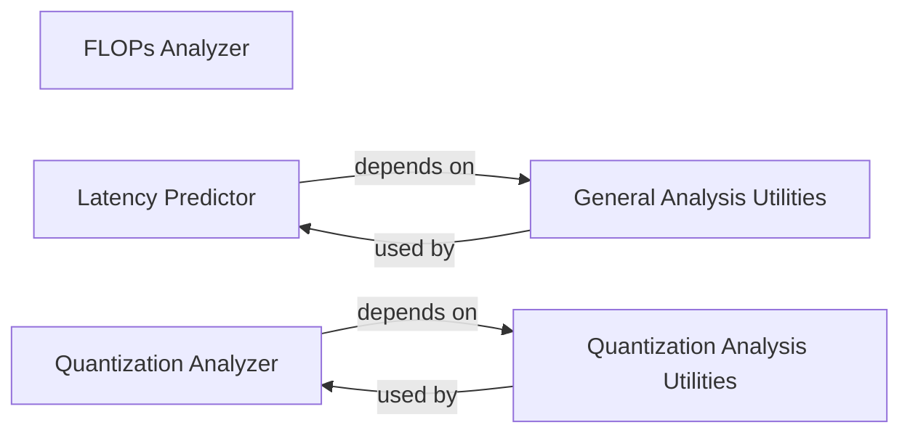

## Details

The `Analysis & Evaluation Tools` subsystem in PaddleSlim is designed to provide comprehensive functionalities for assessing model characteristics and evaluating the performance of compressed models.

### FLOPs Analyzer
Calculates the floating-point operations (FLOPs) for both dynamic and static graph PaddlePaddle models, providing a key metric for model complexity and computational cost. This component is crucial for understanding the computational demands of a model before deployment.

**Related Classes/Methods**:

- <a href="https://github.com/PaddlePaddle/PaddleSlim/blob/develop/paddleslim/analysis/flops.py" target="_blank" rel="noopener noreferrer">`paddleslim.analysis.flops`</a>

### Latency Predictor
Predicts the inference latency of model operations, offering crucial insights into runtime performance and efficiency on target hardware. This helps in assessing how a model will perform in real-world scenarios.

**Related Classes/Methods**:

- <a href="https://github.com/PaddlePaddle/PaddleSlim/blob/develop/paddleslim/analysis/latency.py" target="_blank" rel="noopener noreferrer">`paddleslim.analysis.latency`</a>

### Quantization Analyzer
Provides comprehensive statistical and error analysis capabilities specifically for quantized models. This includes data collection, distribution visualization, sensitivity metric calculation, and detailed error analysis to evaluate the impact of quantization on model accuracy. It's a core component for validating the quality of compressed models.

**Related Classes/Methods**:

- <a href="https://github.com/PaddlePaddle/PaddleSlim/blob/develop/paddleslim/quant/analysis.py" target="_blank" rel="noopener noreferrer">`paddleslim.quant.analysis`</a>

### Quantization Analysis Utilities
Serves as a utility module providing common functions for data processing, distribution plotting, and metric calculations specifically tailored for quantization analysis. It supports the `Quantization Analyzer` by abstracting common helper functions.

**Related Classes/Methods**:

- <a href="https://github.com/PaddlePaddle/PaddleSlim/blob/develop/paddleslim/quant/analysis_utils.py" target="_blank" rel="noopener noreferrer">`paddleslim.quant.analysis_utils`</a>

### General Analysis Utilities
A general utility module providing common functions for model manipulation (e.g., optimization) and resource management within the broader analysis domain. It offers foundational utilities used across various analysis tasks.

**Related Classes/Methods**:

- <a href="https://github.com/PaddlePaddle/PaddleSlim/blob/develop/paddleslim/analysis/_utils.py" target="_blank" rel="noopener noreferrer">`paddleslim.analysis._utils`</a>

### [FAQ](https://github.com/CodeBoarding/GeneratedOnBoardings/tree/main?tab=readme-ov-file#faq)