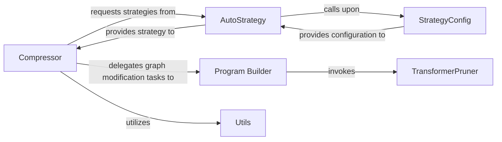

## Details

The `Automated Compression Orchestrator` subsystem is primarily responsible for automating and managing the end-to-end process of applying model compression strategies, integrating training and evaluation loops. Its core functionality revolves around orchestrating various compression techniques and adapting the model's computational graph accordingly.

### Compressor
Acts as the primary orchestrator for the entire automated model compression workflow. It receives high-level compression strategies, invokes program builders to modify computational graphs, manages the training/finetuning process for compressed models, and handles model saving and export. It provides the main user-facing API for automated compression.

**Related Classes/Methods**:

- <a href="https://github.com/PaddlePaddle/PaddleSlim/blob/develop/paddleslim/auto_compression/compressor.py" target="_blank" rel="noopener noreferrer">`paddleslim.auto_compression.compressor.Compressor`</a>
- <a href="https://github.com/PaddlePaddle/PaddleSlim/blob/develop/paddleslim/auto_compression/compressor.py#L576-L632" target="_blank" rel="noopener noreferrer">`paddleslim.auto_compression.compressor.compress`:576-632</a>

### Program Builder
Dynamically constructs and modifies PaddlePaddle computational graphs to integrate specific compression techniques. This includes specialized builders for distillation and pruning, adapting the model's structure and operations as required by the chosen compression strategy.

**Related Classes/Methods**:

- <a href="https://github.com/PaddlePaddle/PaddleSlim/blob/develop/paddleslim/auto_compression/create_compressed_program.py#L233-L403" target="_blank" rel="noopener noreferrer">`paddleslim.auto_compression.create_compressed_program.build_distill_program`:233-403</a>
- <a href="https://github.com/PaddlePaddle/PaddleSlim/blob/develop/paddleslim/auto_compression/create_compressed_program.py#L492-L600" target="_blank" rel="noopener noreferrer">`paddleslim.auto_compression.create_compressed_program.build_prune_program`:492-600</a>

### AutoStrategy
Defines and prepares the sequence and parameters of various compression algorithms. It encapsulates the overarching plan for the compression process, determining which strategies to apply and in what order, often based on predefined or learned policies.

**Related Classes/Methods**:

- <a href="https://github.com/PaddlePaddle/PaddleSlim/blob/develop/paddleslim/auto_compression/auto_strategy.py" target="_blank" rel="noopener noreferrer">`paddleslim.auto_compression.auto_strategy`</a>

### StrategyConfig
Manages and merges detailed configuration settings for different compression strategies. It ensures that each compression technique is correctly parameterized, handling default values, user overrides, and consistency checks across the entire compression plan.

**Related Classes/Methods**:

- <a href="https://github.com/PaddlePaddle/PaddleSlim/blob/develop/paddleslim/auto_compression/strategy_config.py" target="_blank" rel="noopener noreferrer">`paddleslim.auto_compression.strategy_config`</a>

### TransformerPruner
Specializes in applying pruning techniques specifically to transformer-based models. This component handles the intricacies of pruning attention heads, hidden layers, or specific weights within transformer architectures, including importance calculation and weight modification.

**Related Classes/Methods**:

- <a href="https://github.com/PaddlePaddle/PaddleSlim/blob/develop/paddleslim/auto_compression/transformer_pruner.py" target="_blank" rel="noopener noreferrer">`paddleslim.auto_compression.transformer_pruner`</a>

### Utils
Provides a collection of auxiliary functions supporting the main compression workflow. This includes utilities for tasks such as fake post-training quantization analysis, model performance prediction, and other helper functions that streamline the compression process.

**Related Classes/Methods**:

- <a href="https://github.com/PaddlePaddle/PaddleSlim/blob/develop/paddleslim/auto_compression/utils" target="_blank" rel="noopener noreferrer">`paddleslim.auto_compression.utils`</a>

### [FAQ](https://github.com/CodeBoarding/GeneratedOnBoardings/tree/main?tab=readme-ov-file#faq)