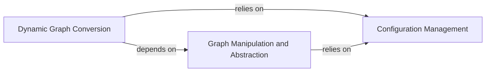

## Details

The `Core Framework & Utilities` subsystem provides the foundational infrastructure for PaddleSlim, encompassing essential services for graph manipulation, dynamic-to-static graph conversion, and configuration management. These components are critical for enabling model optimization workflows by providing the necessary abstractions and utilities.

### Dynamic Graph Conversion
This component is responsible for converting PaddlePaddle's dynamic execution graphs into static graph representations. This conversion is a prerequisite for applying many static graph-based optimizations within the toolkit. It manages the transformation of variables and tensors during this process, aligning with the "Model Integration/Conversion Layer" pattern.

**Related Classes/Methods**:

- <a href="https://github.com/PaddlePaddle/PaddleSlim/blob/develop/paddleslim/core/dygraph.py" target="_blank" rel="noopener noreferrer">`paddleslim.core.dygraph`</a>

### Graph Manipulation and Abstraction
Provides a high-level, object-oriented API for interacting with and modifying the underlying PaddlePaddle program graph. It abstracts away the complexities of direct graph operations, allowing other components to easily access, analyze, and modify graph elements (operations, variables, parameters). This component embodies the "API Layer Pattern" and is a core part of the "Model Integration/Conversion Layer" by offering a unified interface to the model's structure.

**Related Classes/Methods**:

- <a href="https://github.com/PaddlePaddle/PaddleSlim/blob/develop/paddleslim/core/graph_wrapper.py" target="_blank" rel="noopener noreferrer">`paddleslim.core.graph_wrapper`</a>

### Configuration Management
Handles the loading, parsing, and printing of configuration arguments for various PaddleSlim components. It ensures consistent management and accessibility of settings throughout the project, promoting modularity and ease of use. This is a fundamental "Utility" component, crucial for the extensibility and usability of an ML toolkit.

**Related Classes/Methods**:

- <a href="https://github.com/PaddlePaddle/PaddleSlim/blob/develop/paddleslim/common/config_helper.py" target="_blank" rel="noopener noreferrer">`paddleslim.common.config_helper`</a>

### [FAQ](https://github.com/CodeBoarding/GeneratedOnBoardings/tree/main?tab=readme-ov-file#faq)