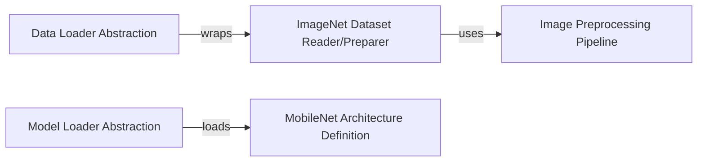

## Details

The `Data & Model Input Layer` subsystem is responsible for managing the loading and preparation of datasets and pre-trained models for the optimization pipeline. It acts as the entry point for all data and model assets required by the PaddleSlim framework.

### Data Loader Abstraction
Provides a generic interface for wrapping various data sources (e.g., datasets, custom data streams) and ensuring data format consistency across the optimization pipeline. It standardizes how data is accessed and iterated.

**Related Classes/Methods**:

- <a href="https://github.com/PaddlePaddle/PaddleSlim/blob/develop/paddleslim/common/dataloader.py#L1-L9999" target="_blank" rel="noopener noreferrer">`paddleslim.common.dataloader`:1-9999</a>

### Model Loader Abstraction
Offers a unified mechanism to load pre-trained models from diverse formats (e.g., PaddlePaddle inference models, ONNX models). It abstracts the complexities of model deserialization and preparation for use within the framework.

**Related Classes/Methods**:

- <a href="https://github.com/PaddlePaddle/PaddleSlim/blob/develop/paddleslim/common/load_model.py#L1-L9999" target="_blank" rel="noopener noreferrer">`paddleslim.common.load_model`:1-9999</a>

### ImageNet Dataset Reader/Preparer
Manages the creation of data readers specifically for the ImageNet dataset across different phases (train, validation, test). It orchestrates the retrieval of individual data items and integrates with preprocessing steps.

**Related Classes/Methods**:

- <a href="https://github.com/PaddlePaddle/PaddleSlim/blob/develop/demo/imagenet_reader.py#L1-L9999" target="_blank" rel="noopener noreferrer">`demo.imagenet_reader`:1-9999</a>

### Image Preprocessing Pipeline
Encapsulates a sequence of image transformation operations (e.g., resizing, cropping, color distortion) to prepare raw image data for model input. It ensures that images conform to the expected input dimensions and normalization requirements of the models.

**Related Classes/Methods**:

- <a href="https://github.com/PaddlePaddle/PaddleSlim/blob/develop/demo/imagenet_reader.py#L1-L9999" target="_blank" rel="noopener noreferrer">`demo.imagenet_reader`:1-9999</a>

### MobileNet Architecture Definition
Defines the structural blueprint of the MobileNet neural network model. This component assembles various layers and blocks (e.g., depthwise separable convolutions, convolution-batch normalization layers) according to the MobileNet design, making the model available for loading and optimization.

**Related Classes/Methods**:

- <a href="https://github.com/PaddlePaddle/PaddleSlim/blob/develop/demo/models/mobilenet.py#L1-L9999" target="_blank" rel="noopener noreferrer">`demo.models.mobilenet`:1-9999</a>

### [FAQ](https://github.com/CodeBoarding/GeneratedOnBoardings/tree/main?tab=readme-ov-file#faq)