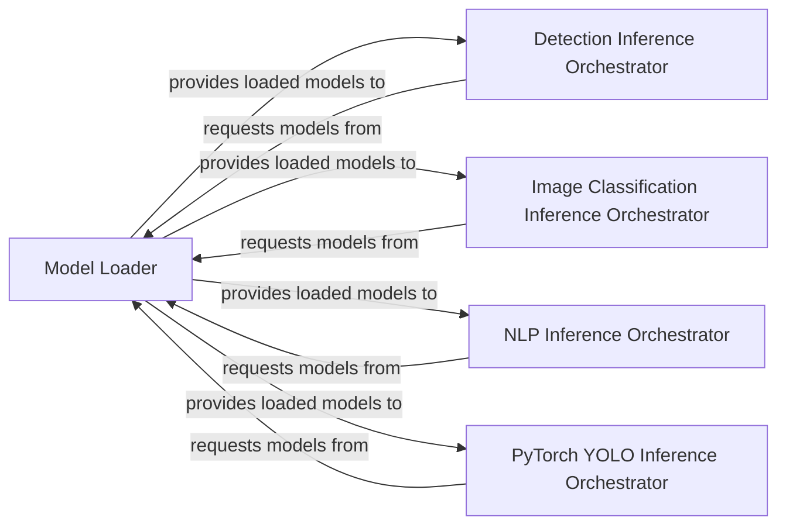

## Details

The `Deployment & Inference Layer` subsystem encompasses functionalities related to loading optimized models and executing inference across various machine learning tasks and model types. It acts as the bridge between the optimized model artifacts and their operational use in a runtime environment.

### Model Loader
Provides core utilities for loading optimized models (e.g., Paddle Inference format, ONNX) into a state usable by the PaddlePaddle inference engine. It acts as the initial entry point for optimized models into the inference environment.

**Related Classes/Methods**:

- <a href="https://github.com/PaddlePaddle/PaddleSlim/blob/develop/paddleslim/common/load_model.py" target="_blank" rel="noopener noreferrer">`paddleslim.common.load_model`</a>

### Detection Inference Orchestrator
Manages the end-to-end inference workflow specifically for detection tasks. This includes initializing the PaddlePaddle predictor, handling image preprocessing, executing the model, and post-processing results (e.g., drawing bounding boxes).

**Related Classes/Methods**:

- <a href="https://github.com/PaddlePaddle/PaddleSlim/blob/develop/example/auto_compression/detection/paddle_inference_eval.py" target="_blank" rel="noopener noreferrer">`example.auto_compression.detection.paddle_inference_eval`</a>

### Image Classification Inference Orchestrator
Orchestrates the inference pipeline for image classification models, focusing on creating the PaddlePaddle predictor and managing the prediction process for classification outputs.

**Related Classes/Methods**:

- <a href="https://github.com/PaddlePaddle/PaddleSlim/blob/develop/example/auto_compression/image_classification/paddle_inference_eval.py" target="_blank" rel="noopener noreferrer">`example.auto_compression.image_classification.paddle_inference_eval`</a>

### NLP Inference Orchestrator
Handles the inference workflow for Natural Language Processing (NLP) models, including predictor creation and managing the prediction logic tailored for text-based inputs and outputs.

**Related Classes/Methods**:

- <a href="https://github.com/PaddlePaddle/PaddleSlim/blob/develop/example/auto_compression/nlp/paddle_inference_eval.py" target="_blank" rel="noopener noreferrer">`example.auto_compression.nlp.paddle_inference_eval`</a>

### PyTorch YOLO Inference Orchestrator
Facilitates inference for models originating from PyTorch YOLO series, adapting the PaddlePaddle inference engine for compatibility and managing the specific inference and post-processing steps required for these models.

**Related Classes/Methods**:

- <a href="https://github.com/PaddlePaddle/PaddleSlim/blob/develop/example/auto_compression/pytorch_yolo_series/paddle_inference_eval.py" target="_blank" rel="noopener noreferrer">`example.auto_compression.pytorch_yolo_series.paddle_inference_eval`</a>

### [FAQ](https://github.com/CodeBoarding/GeneratedOnBoardings/tree/main?tab=readme-ov-file#faq)