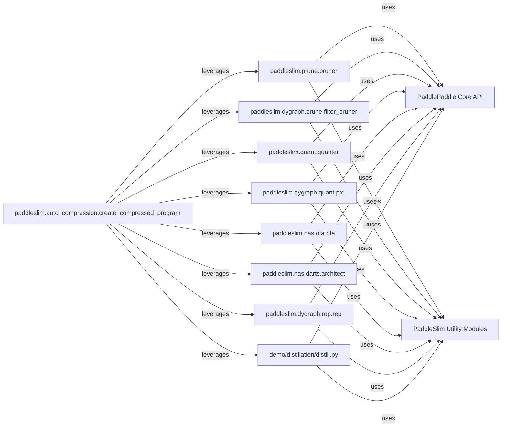

## Details

The PaddleSlim project provides a comprehensive suite of model compression techniques, primarily interacting with the core PaddlePaddle API for model manipulation and execution. The paddleslim.auto_compression.create_compressed_program component serves as a central orchestrator, leveraging various specialized components for pruning (paddleslim.prune.pruner, paddleslim.dygraph.prune.filter_pruner), quantization (paddleslim.quant.quanter, paddleslim.dygraph.quant.ptq), neural architecture search (paddleslim.nas.ofa.ofa, paddleslim.nas.darts.architect), and reparameterization (paddleslim.dygraph.rep.rep). Additionally, the demo/distillation/distill.py component showcases knowledge distillation. All these components extensively utilize the PaddlePaddle Core API for fundamental deep learning operations and rely on PaddleSlim Utility Modules for common internal functionalities, forming a cohesive ecosystem for model optimization.

### paddleslim.prune.pruner
Implements static graph pruning techniques, modifying graph operations and pruning tensors to reduce model size and computation. This component focuses on optimizing models compiled into a static graph representation.

**Related Classes/Methods**:

- <a href="https://github.com/PaddlePaddle/PaddleSlim/blob/develop/paddleslim/prune/pruner.py#L1-L9999" target="_blank" rel="noopener noreferrer">`paddleslim.prune.pruner`:1-9999</a>

### paddleslim.dygraph.prune.filter_pruner
Manages and applies filter pruning specifically for dynamic graphs, calculating and applying pruning masks to model filters during runtime. This component is tailored for PaddlePaddle's imperative (dygraph) mode.

**Related Classes/Methods**:

- <a href="https://github.com/PaddlePaddle/PaddleSlim/blob/develop/paddleslim/dygraph/prune/filter_pruner.py#L1-L9999" target="_blank" rel="noopener noreferrer">`paddleslim.dygraph.prune.filter_pruner`:1-9999</a>

### paddleslim.quant.quanter
Implements Quantization-Aware Training (QAT) for static graphs, integrating quantization operations directly into the training process to achieve higher accuracy with quantized models.

**Related Classes/Methods**:

- <a href="https://github.com/PaddlePaddle/PaddleSlim/blob/develop/paddleslim/quant/quanter.py#L1-L9999" target="_blank" rel="noopener noreferrer">`paddleslim.quant.quanter`:1-9999</a>

### paddleslim.dygraph.quant.ptq
Performs Post-Training Quantization (PTQ) for dynamic graphs, converting pre-trained floating-point models to quantized models without requiring retraining. This is optimized for dynamic graph execution.

**Related Classes/Methods**:

- <a href="https://github.com/PaddlePaddle/PaddleSlim/blob/develop/paddleslim/dygraph/quant/ptq.py#L1-L9999" target="_blank" rel="noopener noreferrer">`paddleslim.dygraph.quant.ptq`:1-9999</a>

### paddleslim.nas.ofa.ofa
Manages the Once-for-All (OFA) Neural Architecture Search process, enabling efficient search and deployment of specialized sub-networks from a supernet without extensive retraining.

**Related Classes/Methods**:

- <a href="https://github.com/PaddlePaddle/PaddleSlim/blob/develop/paddleslim/nas/ofa/ofa.py#L1-L9999" target="_blank" rel="noopener noreferrer">`paddleslim.nas.ofa.ofa`:1-9999</a>

### paddleslim.nas.darts.architect
Implements the core optimization step for DARTS (Differentiable Architecture Search), updating architecture parameters through gradient computation to find optimal network structures.

**Related Classes/Methods**:

- <a href="https://github.com/PaddlePaddle/PaddleSlim/blob/develop/paddleslim/nas/darts/architect.py#L1-L9999" target="_blank" rel="noopener noreferrer">`paddleslim.nas.darts.architect`:1-9999</a>

### paddleslim.dygraph.rep.rep
Handles reparameterization techniques in dynamic graphs, typically by replacing standard Conv-BN layers with reparameterized blocks for improved inference efficiency and reduced latency.

**Related Classes/Methods**:

- <a href="https://github.com/PaddlePaddle/PaddleSlim/blob/develop/paddleslim/dygraph/rep/rep.py#L1-L9999" target="_blank" rel="noopener noreferrer">`paddleslim.dygraph.rep.rep`:1-9999</a>

### demo/distillation/distill.py
Provides an example implementation and entry point for knowledge distillation, a technique where a smaller "student" model learns from a larger "teacher" model to achieve comparable performance with fewer parameters. While a demo, it serves as the primary reference for distillation within the project context.

**Related Classes/Methods**:

- <a href="https://github.com/PaddlePaddle/PaddleSlim/blob/develop/demo/distillation/distill.py#L1-L9999" target="_blank" rel="noopener noreferrer">`demo.distillation.distill`:1-9999</a>

### PaddlePaddle Core API
Represents the fundamental PaddlePaddle framework functionalities, including tensor operations, model definition, training loops, and graph execution. This component is essential for all model optimization techniques implemented in PaddleSlim, as it provides the underlying deep learning primitives.

**Related Classes/Methods**: _None_

### PaddleSlim Utility Modules
Encompasses common utility functions and helper modules within PaddleSlim that support various optimization techniques. This includes functionalities like model loading, configuration parsing, logging, and other shared internal tools.

**Related Classes/Methods**: _None_

### paddleslim.auto_compression.create_compressed_program
Orchestrates the automatic compression process by integrating various optimization techniques such as pruning, quantization, and neural architecture search. It acts as a high-level API to apply a combination of these methods to a given model, simplifying the compression workflow for users.

**Related Classes/Methods**:

- <a href="https://github.com/PaddlePaddle/PaddleSlim/blob/develop/paddleslim/auto_compression/create_compressed_program.py#L1-L9999" target="_blank" rel="noopener noreferrer">`paddleslim.auto_compression.create_compressed_program`:1-9999</a>

### [FAQ](https://github.com/CodeBoarding/GeneratedOnBoardings/tree/main?tab=readme-ov-file#faq)