```mermaid
graph LR
    Data_Model_Input_Layer["Data & Model Input Layer"]
    Model_Optimization_Algorithms["Model Optimization Algorithms"]
    Automated_Compression_Orchestrator["Automated Compression Orchestrator"]
    Analysis_Evaluation_Tools["Analysis & Evaluation Tools"]
    Deployment_Inference_Layer["Deployment & Inference Layer"]
    Core_Framework_Utilities["Core Framework & Utilities"]
    Data_Model_Input_Layer -- "provides raw data and base models to" --> Model_Optimization_Algorithms
    Data_Model_Input_Layer -- "provides raw data and base models to" --> Automated_Compression_Orchestrator
    Automated_Compression_Orchestrator -- "triggers and configures" --> Model_Optimization_Algorithms
    Model_Optimization_Algorithms -- "outputs optimized models to" --> Analysis_Evaluation_Tools
    Analysis_Evaluation_Tools -- "provides feedback on model performance to" --> Automated_Compression_Orchestrator
    Analysis_Evaluation_Tools -- "provides feedback on model performance to" --> Model_Optimization_Algorithms
    Model_Optimization_Algorithms -- "outputs final optimized models to" --> Deployment_Inference_Layer
    Automated_Compression_Orchestrator -- "outputs optimized models to" --> Deployment_Inference_Layer
    Core_Framework_Utilities -- "provides foundational services to" --> Data_Model_Input_Layer
    Core_Framework_Utilities -- "provides foundational services to" --> Model_Optimization_Algorithms
    Core_Framework_Utilities -- "provides foundational services to" --> Automated_Compression_Orchestrator
    Core_Framework_Utilities -- "provides foundational services to" --> Analysis_Evaluation_Tools
    Core_Framework_Utilities -- "provides foundational services to" --> Deployment_Inference_Layer
    click Data_Model_Input_Layer href "https://github.com/CodeBoarding/GeneratedOnBoardings/blob/main/PaddleSlim/Data_Model_Input_Layer.md" "Details"
    click Model_Optimization_Algorithms href "https://github.com/CodeBoarding/GeneratedOnBoardings/blob/main/PaddleSlim/Model_Optimization_Algorithms.md" "Details"
    click Automated_Compression_Orchestrator href "https://github.com/CodeBoarding/GeneratedOnBoardings/blob/main/PaddleSlim/Automated_Compression_Orchestrator.md" "Details"
    click Analysis_Evaluation_Tools href "https://github.com/CodeBoarding/GeneratedOnBoardings/blob/main/PaddleSlim/Analysis_Evaluation_Tools.md" "Details"
    click Deployment_Inference_Layer href "https://github.com/CodeBoarding/GeneratedOnBoardings/blob/main/PaddleSlim/Deployment_Inference_Layer.md" "Details"
    click Core_Framework_Utilities href "https://github.com/CodeBoarding/GeneratedOnBoardings/blob/main/PaddleSlim/Core_Framework_Utilities.md" "Details"
```

## Details

PaddleSlim's architecture is structured around a clear pipeline for model optimization. The Data & Model Input Layer initiates the process by providing necessary datasets and pre-trained models. These inputs are then fed into the Model Optimization Algorithms component, which houses the core compression techniques like pruning, quantization, and NAS. For automated and sequential application of these techniques, the Automated Compression Orchestrator takes charge, often integrating training and evaluation loops. The Analysis & Evaluation Tools component plays a crucial role in assessing the performance of optimized models, providing critical feedback to both the individual optimization algorithms and the orchestrator for iterative refinement. Finally, the Deployment & Inference Layer handles the export of optimized models for real-world deployment and inference. Underlying all these components, the Core Framework & Utilities provides essential services such as graph manipulation, dynamic-to-static graph conversion, and configuration management, ensuring the smooth operation and interoperability of the entire system. This modular design facilitates efficient model compression and deployment.

### Data & Model Input Layer [[Expand]](./Data_Model_Input_Layer.md)
Manages the loading and preparation of datasets and pre-trained models for the optimization pipeline.

**Related Classes/Methods**:

- <a href="https://github.com/PaddlePaddle/PaddleSlim/blob/develop/paddleslim/common/dataloader.py" target="_blank" rel="noopener noreferrer">`paddleslim/common/dataloader.py:wrap_dataloader`</a>
- <a href="https://github.com/PaddlePaddle/PaddleSlim/blob/develop/paddleslim/common/load_model.py" target="_blank" rel="noopener noreferrer">`paddleslim/common/load_model.py:load_inference_model`</a>
- <a href="https://github.com/PaddlePaddle/PaddleSlim/blob/develop/demo/imagenet_reader.py" target="_blank" rel="noopener noreferrer">`demo/imagenet_reader.py`</a>
- <a href="https://github.com/PaddlePaddle/PaddleSlim/blob/develop/demo/models/mobilenet.py" target="_blank" rel="noopener noreferrer">`demo/models/mobilenet.py`</a>

### Model Optimization Algorithms [[Expand]](./Model_Optimization_Algorithms.md)
Contains the core implementation of various model compression techniques, including pruning, quantization, neural architecture search (NAS), reparameterization, and distillation.

**Related Classes/Methods**:

- <a href="https://github.com/PaddlePaddle/PaddleSlim/blob/develop/paddleslim/prune/pruner.py" target="_blank" rel="noopener noreferrer">`paddleslim/prune/pruner.py:prune`</a>
- <a href="https://github.com/PaddlePaddle/PaddleSlim/blob/develop/paddleslim/dygraph/prune/filter_pruner.py" target="_blank" rel="noopener noreferrer">`paddleslim/dygraph/prune/filter_pruner.py:prune_var`</a>
- <a href="https://github.com/PaddlePaddle/PaddleSlim/blob/develop/paddleslim/quant/quanter.py" target="_blank" rel="noopener noreferrer">`paddleslim/quant/quanter.py:quant_aware`</a>
- <a href="https://github.com/PaddlePaddle/PaddleSlim/blob/develop/paddleslim/dygraph/quant/ptq.py" target="_blank" rel="noopener noreferrer">`paddleslim/dygraph/quant/ptq.py:quantize`</a>
- <a href="https://github.com/PaddlePaddle/PaddleSlim/blob/develop/paddleslim/nas/ofa/ofa.py" target="_blank" rel="noopener noreferrer">`paddleslim/nas/ofa/ofa.py:forward`</a>
- <a href="https://github.com/PaddlePaddle/PaddleSlim/blob/develop/paddleslim/nas/darts/architect.py" target="_blank" rel="noopener noreferrer">`paddleslim/nas/darts/architect.py:step`</a>
- <a href="https://github.com/PaddlePaddle/PaddleSlim/blob/develop/paddleslim/dygraph/rep/rep.py" target="_blank" rel="noopener noreferrer">`paddleslim/dygraph/rep/rep.py:prepare`</a>
- <a href="https://github.com/PaddlePaddle/PaddleSlim/blob/develop/demo/distillation/distill.py" target="_blank" rel="noopener noreferrer">`demo/distillation/distill.py`</a>

### Automated Compression Orchestrator [[Expand]](./Automated_Compression_Orchestrator.md)
Provides a high-level interface to automatically apply and manage sequences of compression strategies, often integrating training and evaluation loops.

**Related Classes/Methods**:

- <a href="https://github.com/PaddlePaddle/PaddleSlim/blob/develop/paddleslim/auto_compression/compressor.py" target="_blank" rel="noopener noreferrer">`paddleslim/auto_compression/compressor.py:compress`</a>
- <a href="https://github.com/PaddlePaddle/PaddleSlim/blob/develop/paddleslim/auto_compression/create_compressed_program.py" target="_blank" rel="noopener noreferrer">`paddleslim/auto_compression/create_compressed_program.py:build_distill_program`</a>
- <a href="https://github.com/PaddlePaddle/PaddleSlim/blob/develop/paddleslim/auto_compression/create_compressed_program.py" target="_blank" rel="noopener noreferrer">`paddleslim/auto_compression/create_compressed_program.py:build_prune_program`</a>

### Analysis & Evaluation Tools [[Expand]](./Analysis_Evaluation_Tools.md)
Offers functionalities to analyze model characteristics (e.g., FLOPs, latency) and evaluate the performance and accuracy of compressed models.

**Related Classes/Methods**:

- <a href="https://github.com/PaddlePaddle/PaddleSlim/blob/develop/paddleslim/analysis/flops.py" target="_blank" rel="noopener noreferrer">`paddleslim/analysis/flops.py:flops`</a>
- <a href="https://github.com/PaddlePaddle/PaddleSlim/blob/develop/paddleslim/analysis/latency.py" target="_blank" rel="noopener noreferrer">`paddleslim/analysis/latency.py:latency`</a>
- <a href="https://github.com/PaddlePaddle/PaddleSlim/blob/develop/paddleslim/quant/analysis.py" target="_blank" rel="noopener noreferrer">`paddleslim/quant/analysis.py:statistical_analyse`</a>

### Deployment & Inference Layer [[Expand]](./Deployment_Inference_Layer.md)
Facilitates the export of optimized models into formats suitable for deployment and provides utilities for running inference on various hardware platforms.

**Related Classes/Methods**:

- <a href="https://github.com/PaddlePaddle/PaddleSlim/blob/develop/paddleslim/common/load_model.py" target="_blank" rel="noopener noreferrer">`paddleslim/common/load_model.py:load_inference_model`</a>
- <a href="https://github.com/PaddlePaddle/PaddleSlim/blob/develop/example/auto_compression/detection/paddle_inference_eval.py" target="_blank" rel="noopener noreferrer">`example/auto_compression/detection/paddle_inference_eval.py`</a>

### Core Framework & Utilities [[Expand]](./Core_Framework_Utilities.md)
Provides foundational infrastructure and common utilities that support all other components, including graph manipulation, dynamic-to-static graph conversion, and configuration management.

**Related Classes/Methods**:

- <a href="https://github.com/PaddlePaddle/PaddleSlim/blob/develop/paddleslim/core/dygraph.py" target="_blank" rel="noopener noreferrer">`paddleslim.core.dygraph`</a>
- <a href="https://github.com/PaddlePaddle/PaddleSlim/blob/develop/paddleslim/core/graph_wrapper.py" target="_blank" rel="noopener noreferrer">`paddleslim/core/graph_wrapper.py`</a>
- <a href="https://github.com/PaddlePaddle/PaddleSlim/blob/develop/paddleslim/common/config_helper.py" target="_blank" rel="noopener noreferrer">`paddleslim/common/config_helper.py`</a>

### [FAQ](https://github.com/CodeBoarding/GeneratedOnBoardings/tree/main?tab=readme-ov-file#faq)