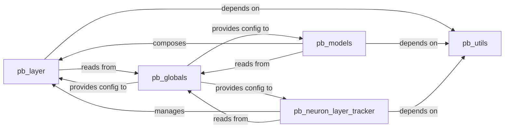

## Details

The `Core Library` subsystem, located within the `perforatedai/` directory, forms the foundational elements of the dendritic intelligence framework. It adheres to a modular design, separating core computational logic from integration, utility, and configuration concerns. These components collectively form the robust and extensible `Core Library`, providing the essential building blocks and integration mechanisms for the dendritic intelligence framework.

### pb_layer
This component serves as the fundamental building block for dendritic layers. It encapsulates the core mathematical operations and structural definitions of individual dendritic units, likely implemented as custom PyTorch `nn.Module` subclasses. Its architectural importance lies in defining the atomic computational units of the dendritic intelligence.

**Related Classes/Methods**:

- `perforatedai.pb_layer`

### pb_models
This component provides higher-level model wrappers and utilities designed to seamlessly inject dendritic components (`pb_layer`) into existing PyTorch models. It acts as the primary integration layer, enabling the extension of standard neural networks with dendritic intelligence. Its architectural importance is in facilitating the practical application and integration of the core dendritic layers.

**Related Classes/Methods**:

- `perforatedai.pb_models`

### pb_utils
A comprehensive utility component housing various helper functions, common operations, and auxiliary classes. These utilities support both the core `pb_layer` computations and the `pb_models` integration processes. Its architectural importance lies in promoting code reusability and maintaining a clean, focused design for other components by centralizing common functionalities.

**Related Classes/Methods**:

- `perforatedai.pb_utils`

### pb_globals
This component centralizes all global configurations, constants, and shared settings specific to the dendritic implementation. It acts as a single source of truth for parameters that influence the behavior of various parts of the core library. Its architectural importance is in providing a consistent and easily manageable configuration mechanism across the subsystem.

**Related Classes/Methods**:

- <a href="https://github.com/PerforatedAI/PerforatedAI/blob/main/perforatedai/pb_globals.py#L1-L1" target="_blank" rel="noopener noreferrer">`perforatedai.pb_globals` (1:1)</a>

### pb_neuron_layer_tracker
This component is responsible for managing the state, interactions, and coordination of multiple dendritic layers (`pb_layer`) within a larger neural network. It ensures that dendritic layers behave cohesively and can be effectively monitored or controlled. Its architectural importance is in orchestrating the dynamic aspects of dendritic intelligence across a network.

**Related Classes/Methods**:

- <a href="https://github.com/PerforatedAI/PerforatedAI/blob/main/perforatedai/pb_neuron_layer_tracker.py#L33-L1531" target="_blank" rel="noopener noreferrer">`perforatedai.pb_neuron_layer_tracker` (33:1531)</a>

### [FAQ](https://github.com/CodeBoarding/GeneratedOnBoardings/tree/main?tab=readme-ov-file#faq)