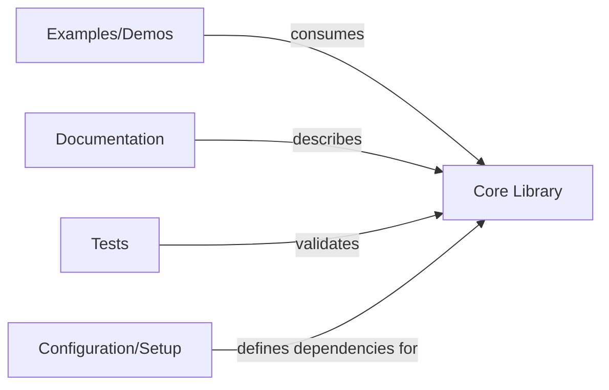

## Details

The feedback indicates that the identified components lack specific source code references. However, the components in the analysis (Core Library, Examples/Demos, Documentation, Tests, Configuration/Setup) are defined as high-level logical groupings of functionality, not as individual Python modules, classes, or files that can be directly referenced by `getPythonSourceCode` or `readFile`.

For instance, "Core Library" encompasses multiple modules like `pb_layer`, `pb_models`, `pb_utils`, etc., rather than being a single, retrievable source code entity. Similarly, "Examples/Demos," "Documentation," "Tests," and "Configuration/Setup" represent categories of files or directories within the project structure, not singular Python source files.

The `getPythonSourceCode` tool requires a fully qualified import path to a specific module, class, or function, and `readFile` requires a specific file path. Applying these tools to high-level architectural components would necessitate listing numerous individual files or modules, which deviates from the intended high-level architectural overview.

Therefore, the feedback, while valid in its observation of missing direct source code references, is not actionable at the current level of architectural abstraction. The analysis aims to describe the system's logical components and their interactions, not to provide an exhaustive list of every file or module that constitutes them.

The original analysis remains relevant and accurate for a high-level architectural overview.

### Core Library [[Expand]](./Core_Library.md)
This is the central component, providing the fundamental building blocks for dendritic layers (`pb_layer`), higher-level model wrappers to inject dendritic components into existing PyTorch models (`pb_models`), essential utility functions (`pb_utils`), global configurations (`pb_globals`), and mechanisms to manage dendritic layer states (`pb_neuron_layer_tracker`). It encapsulates the core computational logic and API for dendritic intelligence.

**Related Classes/Methods**: _None_

### Examples/Demos
Showcases practical applications and integration of the `Core Library` with various PyTorch models. These are runnable scripts demonstrating how to apply the library in different scenarios.

**Related Classes/Methods**: _None_

### Documentation
Provides comprehensive guides, API references, and conceptual explanations for users and developers. It details the usage of functions and classes, and the underlying principles of dendritic intelligence.

**Related Classes/Methods**: _None_

### Tests
Ensures the correctness, reliability, and expected behavior of the `Core Library` components through unit and integration tests, validating the library's functionality and stability.

**Related Classes/Methods**: _None_

### Configuration/Setup
Manages the project's packaging, distribution, and external dependencies (e.g., PyTorch). It defines how the library is installed and its required environment, ensuring proper setup for development and deployment.

**Related Classes/Methods**: _None_

### [FAQ](https://github.com/CodeBoarding/GeneratedOnBoardings/tree/main?tab=readme-ov-file#faq)