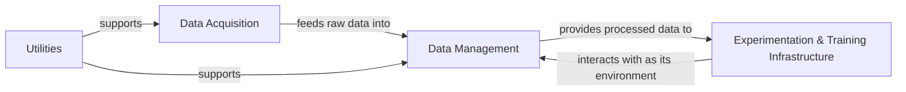

## Details

The `Personae` system is structured around a core data flow that begins with Data Acquisition, responsible for gathering raw financial market information. This raw data is then ingested and prepared by the Data Management component, primarily embodied by the `Market` class, which handles data storage, scaling, and structuring for subsequent use. The processed and managed data serves as the foundation for the Experimentation & Training Infrastructure, where machine learning algorithms, such as those found in `algorithm.RL`, are trained and evaluated within the simulated market environment provided by the `Market` class. Supporting these core functions, the Utilities component, exemplified by `base.model.document.Stock`, provides essential data models and helper functions for financial instruments, ensuring data consistency and facilitating data handling across the system. This architecture enables a continuous cycle of data acquisition, preparation, and algorithmic experimentation for financial market analysis.

### Data Acquisition [[Expand]](./Data_Acquisition.md)
Responsible for crawling, extracting, and acquiring external financial market data. It acts as the primary interface for bringing raw market information into the Personae system, providing the foundational data required for financial simulations, algorithm training, and backtesting. Its role is to ensure a consistent and reliable flow of up-to-date market data.

**Related Classes/Methods**:

- <a href="https://github.com/Ceruleanacg/Personae/blob/master/spider/stock_spider.py" target="_blank" rel="noopener noreferrer">`spider.stock_spider`</a>

### Data Management
Manages the storage, retrieval, and initial processing/transformation of acquired financial data. It acts as the persistent layer for the data collected by Data Acquisition and prepares it for consumption by other components, particularly the Experimentation & Training Infrastructure. This includes handling data scaling, structuring, and providing access to historical and current market data.

**Related Classes/Methods**:

- <a href="https://github.com/Ceruleanacg/Personae/blob/master/base/env/market.py#L12-L350" target="_blank" rel="noopener noreferrer">`base.env.market.Market`:12-350</a>
- <a href="https://github.com/Ceruleanacg/Personae/blob/master/base/env/market.py" target="_blank" rel="noopener noreferrer">`base.env.market.Market:_init_data_frames`</a>
- <a href="https://github.com/Ceruleanacg/Personae/blob/master/base/env/market.py" target="_blank" rel="noopener noreferrer">`base.env.market.Market:_init_env_data`</a>
- <a href="https://github.com/Ceruleanacg/Personae/blob/master/base/env/market.py" target="_blank" rel="noopener noreferrer">`base.env.market.Market:_init_series_data`</a>
- <a href="https://github.com/Ceruleanacg/Personae/blob/master/base/env/market.py" target="_blank" rel="noopener noreferrer">`base.env.market.Market:_init_sequence_data`</a>
- <a href="https://github.com/Ceruleanacg/Personae/blob/master/base/env/market.py" target="_blank" rel="noopener noreferrer">`base.env.market.Market:_origin_data`</a>
- <a href="https://github.com/Ceruleanacg/Personae/blob/master/base/env/market.py" target="_blank" rel="noopener noreferrer">`base.env.market.Market:_scaled_data_as_state`</a>
- <a href="https://github.com/Ceruleanacg/Personae/blob/master/base/env/market.py" target="_blank" rel="noopener noreferrer">`base.env.market.Market:get_batch_data`</a>
- <a href="https://github.com/Ceruleanacg/Personae/blob/master/base/env/market.py" target="_blank" rel="noopener noreferrer">`base.env.market.Market:get_test_data`</a>

### Experimentation & Training Infrastructure
Orchestrates the training, evaluation, and backtesting workflows for machine learning algorithms. It utilizes processed data from Data Management to train models, simulate trading strategies, and assess performance. This component encompasses the core machine learning models and the environment in which they operate.

**Related Classes/Methods**:

- <a href="https://github.com/Ceruleanacg/Personae/blob/master/algorithm/RL/DDPG.py" target="_blank" rel="noopener noreferrer">`algorithm.RL.DDPG`</a>
- <a href="https://github.com/Ceruleanacg/Personae/blob/master/base/env/market.py#L12-L350" target="_blank" rel="noopener noreferrer">`base.env.market.Market`:12-350</a>
- <a href="https://github.com/Ceruleanacg/Personae/blob/master/base/env/market.py" target="_blank" rel="noopener noreferrer">`base.env.market.Market:reset`</a>
- <a href="https://github.com/Ceruleanacg/Personae/blob/master/base/env/market.py" target="_blank" rel="noopener noreferrer">`base.env.market.Market:forward`</a>

### Utilities
Provides foundational data models and helper functions for financial instruments. While not a standalone service, this component defines the structure of financial data (e.g., stock information) and offers methods for data validation and retrieval from the database, supporting data management and acquisition processes.

**Related Classes/Methods**:

- <a href="https://github.com/Ceruleanacg/Personae/blob/master/base/model/document.py#L7-L72" target="_blank" rel="noopener noreferrer">`base.model.document.Stock`:7-72</a>
- <a href="https://github.com/Ceruleanacg/Personae/blob/master/base/model/document.py" target="_blank" rel="noopener noreferrer">`base.model.document.Stock:exist_in_db`</a>
- <a href="https://github.com/Ceruleanacg/Personae/blob/master/base/model/document.py" target="_blank" rel="noopener noreferrer">`base.model.document.Stock:get_k_data`</a>
- <a href="https://github.com/Ceruleanacg/Personae/blob/master/base/model/document.py" target="_blank" rel="noopener noreferrer">`base.model.document.Stock:to_dic`</a>

### [FAQ](https://github.com/CodeBoarding/GeneratedOnBoardings/tree/main?tab=readme-ov-file#faq)