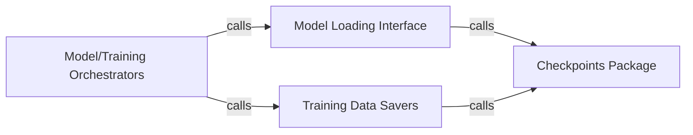

## Details

The `Model Persistence & Checkpointing` subsystem is a critical part of the ML Toolkit/Library and Simulation Platform, responsible for the reliable saving and loading of machine learning models, their learned parameters, and associated training progress or metadata. It ensures that training can be resumed, models can be deployed, and experimental results are reproducible.

### Checkpoints Package
This is the foundational, low-level component providing the direct mechanisms for serializing and deserializing machine learning models, their weights, and any associated metadata. It acts as the primary interface to the persistent storage layer.

**Related Classes/Methods**:

- <a href="https://github.com/Ceruleanacg/Personae/blob/master/checkpoints/__init__.py" target="_blank" rel="noopener noreferrer">`checkpoints`</a>

### Model Loading Interface
Offers a generic, high-level API for loading previously saved models or their states. It abstracts the complexities of the underlying `Checkpoints Package`, providing a clean interface for other parts of the system to restore models.

**Related Classes/Methods**:

- <a href="https://github.com/Ceruleanacg/Personae/blob/master/base/algorithm/model.py" target="_blank" rel="noopener noreferrer">`base.algorithm.model:restore`</a>

### Training Data Savers
These are algorithm-specific methods responsible for persisting various forms of training data, such as experience replay buffers, policy states, or other intermediate learning artifacts generated during the learning process. Each algorithm typically implements its own `save_transition` method.

**Related Classes/Methods**:

- <a href="https://github.com/Ceruleanacg/Personae/blob/master/algorithm/RL/DoubleDQN.py" target="_blank" rel="noopener noreferrer">`algorithm.RL.DoubleDQN:save_transition`</a>
- <a href="https://github.com/Ceruleanacg/Personae/blob/master/algorithm/RL/DuelingDQN.py" target="_blank" rel="noopener noreferrer">`algorithm.RL.DuelingDQN:save_transition`</a>
- <a href="https://github.com/Ceruleanacg/Personae/blob/master/algorithm/RL/DDPG.py" target="_blank" rel="noopener noreferrer">`algorithm.RL.DDPG:save_transition`</a>
- <a href="https://github.com/Ceruleanacg/Personae/blob/master/algorithm/RL/PolicyGradient.py" target="_blank" rel="noopener noreferrer">`algorithm.RL.PolicyGradient:save_transition`</a>
- <a href="https://github.com/Ceruleanacg/Personae/blob/master/deprecated/DDPG_v2.py" target="_blank" rel="noopener noreferrer">`deprecated.DDPG_v2:save_transition`</a>

### Model/Training Orchestrators
These components manage the overall training and simulation workflows. They are responsible for determining when and what to save (checkpointing) or load (model restoration), coordinating calls to the `Model Loading Interface` and `Training Data Savers` at appropriate times during the execution lifecycle.

**Related Classes/Methods**:

- <a href="https://github.com/Ceruleanacg/Personae/blob/master/base/algorithm/model.py" target="_blank" rel="noopener noreferrer">`base.algorithm.model:run`</a>
- <a href="https://github.com/Ceruleanacg/Personae/blob/master/algorithm/RL/DoubleDQN.py" target="_blank" rel="noopener noreferrer">`algorithm.RL.DoubleDQN:run`</a>
- <a href="https://github.com/Ceruleanacg/Personae/blob/master/algorithm/RL/DuelingDQN.py" target="_blank" rel="noopener noreferrer">`algorithm.RL.DuelingDQN:run`</a>
- <a href="https://github.com/Ceruleanacg/Personae/blob/master/algorithm/RL/DDPG.py" target="_blank" rel="noopener noreferrer">`algorithm.RL.DDPG:run`</a>
- <a href="https://github.com/Ceruleanacg/Personae/blob/master/algorithm/RL/PolicyGradient.py" target="_blank" rel="noopener noreferrer">`algorithm.RL.PolicyGradient:run`</a>
- <a href="https://github.com/Ceruleanacg/Personae/blob/master/deprecated/DDPG_v2.py" target="_blank" rel="noopener noreferrer">`deprecated.DDPG_v2:run`</a>

### [FAQ](https://github.com/CodeBoarding/GeneratedOnBoardings/tree/main?tab=readme-ov-file#faq)