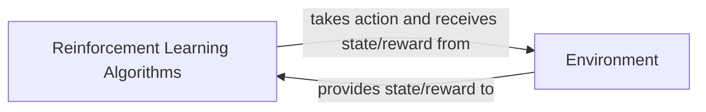

## Details

Analysis of the RL subsystem, clarifying that Agent functionality is embedded within RL Algorithms, ReplayBuffer is an internal data structure, and Policy/Value Functions are internal neural networks. The core interaction is between Reinforcement Learning Algorithms and the Market Environment.

### Reinforcement Learning Algorithms [[Expand]](./Reinforcement_Learning_Algorithms.md)
Encapsulates the learning logic and decision-making capabilities, processing observations, selecting actions, learning from rewards, and updating internal models. Manages internal buffers for experience storage and implements neural networks for policies/value functions.

**Related Classes/Methods**:

- <a href="https://github.com/Ceruleanacg/Personae/blob/master/algorithm/RL/DoubleDQN.py" target="_blank" rel="noopener noreferrer">`algorithm.RL.DoubleDQN.Algorithm`</a>
- <a href="https://github.com/Ceruleanacg/Personae/blob/master/algorithm/RL/DuelingDQN.py" target="_blank" rel="noopener noreferrer">`algorithm.RL.DuelingDQN.Algorithm`</a>
- <a href="https://github.com/Ceruleanacg/Personae/blob/master/algorithm/RL/DDPG.py" target="_blank" rel="noopener noreferrer">`algorithm.RL.DDPG.Algorithm`</a>
- <a href="https://github.com/Ceruleanacg/Personae/blob/master/algorithm/RL/PolicyGradient.py" target="_blank" rel="noopener noreferrer">`algorithm.RL.PolicyGradient.Algorithm`</a>

### Environment
Simulates the external system (e.g., trading market), providing observations to algorithms, processing actions, and calculating rewards and next states.

**Related Classes/Methods**:

- <a href="https://github.com/Ceruleanacg/Personae/blob/master/base/env/market.py#L12-L350" target="_blank" rel="noopener noreferrer">`base.env.market.Market`:12-350</a>

### [FAQ](https://github.com/CodeBoarding/GeneratedOnBoardings/tree/main?tab=readme-ov-file#faq)