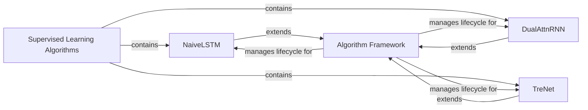

## Details

The Supervised Learning subsystem within Personae is structured to provide a robust and extensible framework for developing and deploying machine learning models, particularly for financial prediction. At its core, the `Algorithm Framework` (`base.algorithm.model.BaseSLTFModel`) defines the common operational lifecycle, including training, prediction, and evaluation, ensuring consistency across various algorithms. This framework is extended by specific model implementations like `NaiveLSTM`, `DualAttnRNN`, and `TreNet`, each tailored for distinct supervised learning tasks. These specialized algorithms are collectively organized under the `Supervised Learning Algorithms` package (`algorithm.SL`), which acts as the central repository for accessing and managing the project's supervised learning capabilities. This architecture promotes reusability and simplifies the integration of new algorithms by adhering to a standardized framework.

### Supervised Learning Algorithms [[Expand]](./Supervised_Learning_Algorithms.md)
This is a high-level logical grouping representing the collection of all supervised learning model implementations within the Personae project. It serves as the primary interface for users or other components to access and utilize various supervised learning capabilities. This component embodies the "ML Toolkit/Library" aspect by providing a consolidated entry point for supervised models.

**Related Classes/Methods**:

- <a href="https://github.com/Ceruleanacg/Personae/blob/master/algorithm/SL" target="_blank" rel="noopener noreferrer">`algorithm.SL`</a>

### Algorithm Framework
Acts as a generic base or orchestrator for various supervised learning algorithms, providing a standardized lifecycle management mechanism (e.g., training, evaluation, prediction phases). This component embodies the "framework" aspect of the ML Toolkit, ensuring consistency and reusability across different algorithms.

**Related Classes/Methods**:

- <a href="https://github.com/Ceruleanacg/Personae/blob/master/base/algorithm/model.py#L222-L265" target="_blank" rel="noopener noreferrer">`base.algorithm.model.BaseSLTFModel`:222-265</a>

### NaiveLSTM
Implements a basic Long Short-Term Memory (LSTM) neural network, specifically tailored for supervised learning tasks within the financial prediction domain. This component represents a concrete "Algorithm Implementation" within the ML Toolkit.

**Related Classes/Methods**:

### DualAttnRNN
Implements a Recurrent Neural Network (RNN) enhanced with dual attention mechanisms, designed for supervised learning in financial prediction. This component represents another specialized "Algorithm Implementation."

**Related Classes/Methods**:

### TreNet
Implements a Tree-based Neural Network (TreNet), a specialized model for supervised learning applications, likely leveraging hierarchical or tree-like data structures. This component is a distinct "Algorithm Implementation."

**Related Classes/Methods**:

### [FAQ](https://github.com/CodeBoarding/GeneratedOnBoardings/tree/main?tab=readme-ov-file#faq)