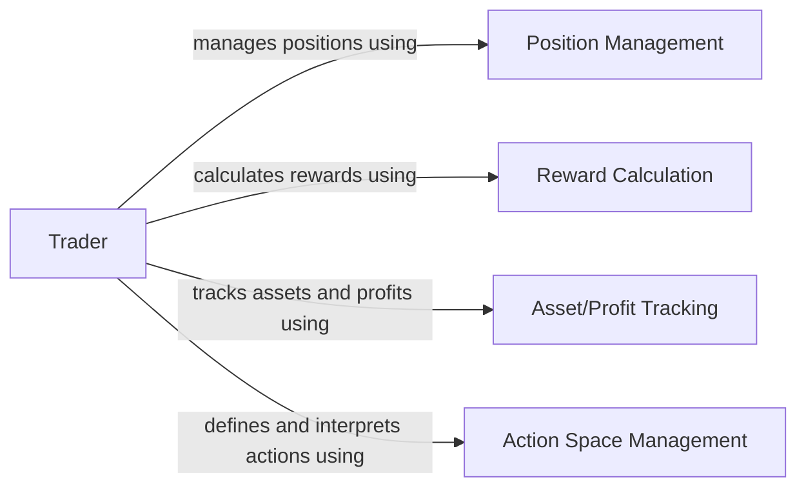

## Details

The `Trader Agent` subsystem is centered around the `base.env.trader.Trader` class, which acts as the primary active trading entity within the simulation environment. Its boundaries are defined by the functionalities encapsulated within this class and its direct dependencies, specifically those related to managing trading state, executing actions, and evaluating performance.

### Trader
The core component representing the active trading agent. It orchestrates trading actions, manages its internal state (e.g., capital, holdings), and provides the interface for interaction with the simulation environment. It embodies the "Agent" aspect of the Agent-Environment Interaction pattern.

**Related Classes/Methods**:

- <a href="https://github.com/Ceruleanacg/Personae/blob/master/base/env/trader.py#L21-L214" target="_blank" rel="noopener noreferrer">`base.env.trader.Trader`:21-214</a>

### Position Management
Responsible for managing and validating the trader's current holdings and open positions. It ensures that trading actions are consistent with the agent's current portfolio and handles the mechanics of opening, closing, and adjusting positions.

**Related Classes/Methods**:

- <a href="https://github.com/Ceruleanacg/Personae/blob/master/base/env/trader.py" target="_blank" rel="noopener noreferrer">`base.env.trader.Trader._exist_position`</a>
- <a href="https://github.com/Ceruleanacg/Personae/blob/master/base/env/trader.py" target="_blank" rel="noopener noreferrer">`base.env.trader.Trader._position`</a>

### Reward Calculation
Computes the reward signal for the agent based on its trading actions and market outcomes. This component is crucial for reinforcement learning algorithms, providing the feedback necessary for the agent to learn optimal strategies.

**Related Classes/Methods**:

- <a href="https://github.com/Ceruleanacg/Personae/blob/master/base/env/trader.py" target="_blank" rel="noopener noreferrer">`base.env.trader.Trader._update_reward`</a>
- <a href="https://github.com/Ceruleanacg/Personae/blob/master/base/env/trader.py" target="_blank" rel="noopener noreferrer">`base.env.trader.Trader._calculate_reward_v2`</a>

### Asset/Profit Tracking
Monitors and reports the financial performance and asset value of the trader. It provides key metrics such as current capital, total asset value, and realized/unrealized profits, which are vital for evaluation, logging, and decision-making.

**Related Classes/Methods**:

- <a href="https://github.com/Ceruleanacg/Personae/blob/master/base/env/trader.py" target="_blank" rel="noopener noreferrer">`base.env.trader.Trader.profits`</a>
- <a href="https://github.com/Ceruleanacg/Personae/blob/master/base/env/trader.py" target="_blank" rel="noopener noreferrer">`base.env.trader.Trader.holdings_value`</a>
- <a href="https://github.com/Ceruleanacg/Personae/blob/master/base/env/trader.py" target="_blank" rel="noopener noreferrer">`base.env.trader.Trader.log_asset`</a>

### Action Space Management
Defines the set of permissible trading actions that the agent can take and facilitates the mapping between abstract action codes (often used by an ML algorithm) and concrete trading operations (e.g., buy, sell, hold, specific quantities).

**Related Classes/Methods**:

- <a href="https://github.com/Ceruleanacg/Personae/blob/master/base/env/trader.py" target="_blank" rel="noopener noreferrer">`base.env.trader.Trader.action_space`</a>
- <a href="https://github.com/Ceruleanacg/Personae/blob/master/base/env/trader.py" target="_blank" rel="noopener noreferrer">`base.env.trader.Trader.action_by_code`</a>
- <a href="https://github.com/Ceruleanacg/Personae/blob/master/base/env/trader.py" target="_blank" rel="noopener noreferrer">`base.env.trader.Trader.codes_count`</a>
- <a href="https://github.com/Ceruleanacg/Personae/blob/master/base/env/trader.py" target="_blank" rel="noopener noreferrer">`base.env.trader.Trader.ActionCode`</a>

### [FAQ](https://github.com/CodeBoarding/GeneratedOnBoardings/tree/main?tab=readme-ov-file#faq)