```mermaid
graph LR
    Data_Acquisition["Data Acquisition"]
    Market_Simulation_Environment["Market Simulation Environment"]
    Trader_Agent["Trader Agent"]
    Position_Management["Position Management"]
    Reinforcement_Learning_Algorithms["Reinforcement Learning Algorithms"]
    Supervised_Learning_Algorithms["Supervised Learning Algorithms"]
    Model_Persistence_Checkpointing["Model Persistence & Checkpointing"]
    Data_Acquisition -- "Feeds Raw Data" --> Market_Simulation_Environment
    Market_Simulation_Environment -- "Provides Market State & Rewards" --> Reinforcement_Learning_Algorithms
    Market_Simulation_Environment -- "Provides Historical Data" --> Supervised_Learning_Algorithms
    Reinforcement_Learning_Algorithms -- "Sends Actions" --> Trader_Agent
    Trader_Agent -- "Reports Action Outcomes & Portfolio State" --> Reinforcement_Learning_Algorithms
    Trader_Agent -- "Manages Positions Via" --> Position_Management
    Position_Management -- "Updates Position Status For" --> Trader_Agent
    Reinforcement_Learning_Algorithms -- "Saves/Loads Models" --> Model_Persistence_Checkpointing
    Supervised_Learning_Algorithms -- "Saves/Loads Models" --> Model_Persistence_Checkpointing
    click Data_Acquisition href "https://github.com/CodeBoarding/GeneratedOnBoardings/blob/main/Personae/Data_Acquisition.md" "Details"
    click Trader_Agent href "https://github.com/CodeBoarding/GeneratedOnBoardings/blob/main/Personae/Trader_Agent.md" "Details"
    click Reinforcement_Learning_Algorithms href "https://github.com/CodeBoarding/GeneratedOnBoardings/blob/main/Personae/Reinforcement_Learning_Algorithms.md" "Details"
    click Supervised_Learning_Algorithms href "https://github.com/CodeBoarding/GeneratedOnBoardings/blob/main/Personae/Supervised_Learning_Algorithms.md" "Details"
    click Model_Persistence_Checkpointing href "https://github.com/CodeBoarding/GeneratedOnBoardings/blob/main/Personae/Model_Persistence_Checkpointing.md" "Details"
```

## Details

The `Personae` project is structured as a modular financial market simulation and machine learning experimentation platform. Data flows from `Data Acquisition` into the `Market Simulation Environment`, which serves as the central hub for providing market context. Both `Reinforcement Learning Algorithms` and `Supervised Learning Algorithms` consume data from this environment, with RL algorithms actively interacting with the `Trader Agent` to execute actions and receive feedback. The `Trader Agent` manages its portfolio through `Position Management`. All trained models are systematically saved and loaded via `Model Persistence & Checkpointing`, enabling robust experimentation and deployment. This architecture emphasizes clear separation of concerns, facilitating the development and evaluation of diverse quantitative trading strategies.

### Data Acquisition [[Expand]](./Data_Acquisition.md)
Responsible for crawling, extracting, and acquiring external financial market data.

**Related Classes/Methods**:

- <a href="https://github.com/Ceruleanacg/Personae/blob/master/spider/stock_spider.py" target="_blank" rel="noopener noreferrer">`spider.stock_spider`</a>

### Market Simulation Environment
The central simulation engine mimicking a financial market, managing time, providing data, and calculating rewards.

**Related Classes/Methods**:

- <a href="https://github.com/Ceruleanacg/Personae/blob/master/base/env/market.py" target="_blank" rel="noopener noreferrer">`base.env.market`</a>

### Trader Agent [[Expand]](./Trader_Agent.md)
Represents the active trading entity, executing actions, managing the portfolio, and interacting with position management.

**Related Classes/Methods**:

- <a href="https://github.com/Ceruleanacg/Personae/blob/master/base/env/trader.py" target="_blank" rel="noopener noreferrer">`base.env.trader`</a>

### Position Management
Handles granular details of individual stock positions within the Trader Agent's portfolio.

**Related Classes/Methods**:

- <a href="https://github.com/Ceruleanacg/Personae/blob/master/base/env/position.py" target="_blank" rel="noopener noreferrer">`base.env.position`</a>

### Reinforcement Learning Algorithms [[Expand]](./Reinforcement_Learning_Algorithms.md)
Core implementations of various RL algorithms for learning optimal trading strategies.

**Related Classes/Methods**:

- <a href="https://github.com/Ceruleanacg/Personae/blob/master/algorithm/RL/DoubleDQN.py" target="_blank" rel="noopener noreferrer">`algorithm.RL.DoubleDQN`</a>
- <a href="https://github.com/Ceruleanacg/Personae/blob/master/algorithm/RL/DuelingDQN.py" target="_blank" rel="noopener noreferrer">`algorithm.RL.DuelingDQN`</a>
- <a href="https://github.com/Ceruleanacg/Personae/blob/master/algorithm/RL/DDPG.py" target="_blank" rel="noopener noreferrer">`algorithm.RL.DDPG`</a>
- <a href="https://github.com/Ceruleanacg/Personae/blob/master/algorithm/RL/PolicyGradient.py" target="_blank" rel="noopener noreferrer">`algorithm.RL.PolicyGradient`</a>

### Supervised Learning Algorithms [[Expand]](./Supervised_Learning_Algorithms.md)
Implementations of supervised learning models for financial prediction tasks.

**Related Classes/Methods**:

- <a href="https://github.com/Ceruleanacg/Personae/blob/master/algorithm/SL/NaiveLSTM.py" target="_blank" rel="noopener noreferrer">`algorithm.SL.NaiveLSTM`</a>
- <a href="https://github.com/Ceruleanacg/Personae/blob/master/algorithm/SL/DualAttnRNN.py" target="_blank" rel="noopener noreferrer">`algorithm.SL.DualAttnRNN`</a>
- <a href="https://github.com/Ceruleanacg/Personae/blob/master/algorithm/SL/TreNet.py" target="_blank" rel="noopener noreferrer">`algorithm.SL.TreNet`</a>

### Model Persistence & Checkpointing [[Expand]](./Model_Persistence_Checkpointing.md)
Manages saving and loading of trained machine learning models and associated metadata.

**Related Classes/Methods**:

- <a href="https://github.com/Ceruleanacg/Personae/blob/master/checkpoints/__init__.py" target="_blank" rel="noopener noreferrer">`checkpoints`</a>

### [FAQ](https://github.com/CodeBoarding/GeneratedOnBoardings/tree/main?tab=readme-ov-file#faq)