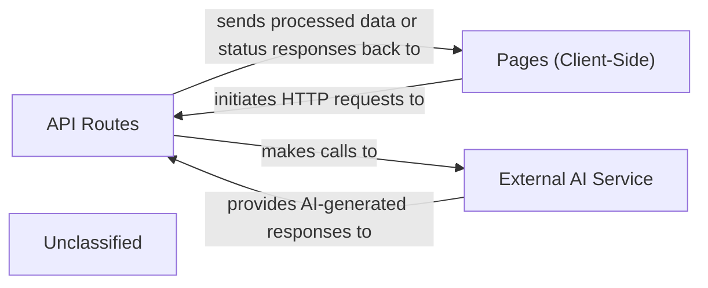

## Details

The PharmaSage application employs a client-server architecture built on Next.js. The Pages (Client-Side) serve as the user interface, responsible for capturing user input and displaying information. These client-side components communicate with API Routes, which act as server-side intermediaries. The API Routes handle business logic, including making requests to an External AI Service (such as the Groq API) for processing natural language queries and generating medical assistant responses. The responses from the External AI Service are then relayed back through the API Routes to the Pages (Client-Side) for presentation to the user, ensuring a clear separation of concerns between the presentation layer, application logic, and external integrations.

### API Routes [[Expand]](./API_Routes.md)
Server-side endpoints that process HTTP requests, execute business logic, and interact with external AI services. They function as distinct, co-located backend services within the Next.js framework, providing data and functionality to the client-side.

**Related Classes/Methods**:

- <a href="https://github.com/Devyansh26/PharmaSage/blob/mainNext-Project/app/api/chat/route.ts" target="_blank" rel="noopener noreferrer">`Next-Project/app/api/chat/route.ts`</a>

### Pages (Client-Side)
Client-side components or pages that initiate HTTP requests to API Routes and display processed data or status responses.

**Related Classes/Methods**:

- <a href="https://github.com/Devyansh26/PharmaSage/blob/mainNext-Project/app/page.tsx" target="_blank" rel="noopener noreferrer">`Next-Project/app/page.tsx`</a>

### External AI Service
An external AI API (e.g., Groq API) that API Routes interact with to process natural language queries and generate medical assistant responses.

**Related Classes/Methods**:

- <a href="https://github.com/Devyansh26/PharmaSage/blob/mainNext-Project/app/api/chat/route.ts" target="_blank" rel="noopener noreferrer">`process.env.GROQ_API_ENDPOINT`</a>

### Unclassified
Component for all unclassified files and utility functions (Utility functions/External Libraries/Dependencies)

**Related Classes/Methods**: _None_

### [FAQ](https://github.com/CodeBoarding/GeneratedOnBoardings/tree/main?tab=readme-ov-file#faq)