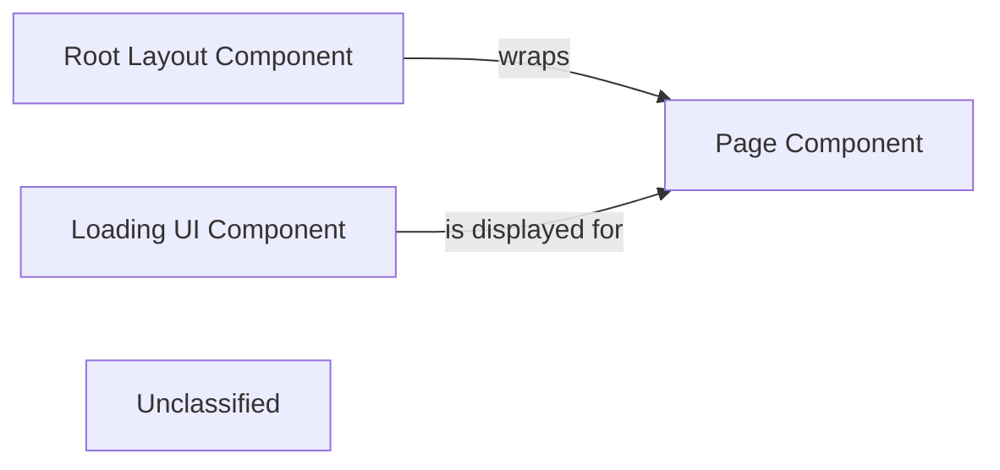

## Details

The application's core architecture is built around Next.js's file-system based routing and component structure. The `RootLayout` component establishes the global UI, including navigation and authentication, and acts as the primary container for all other page-specific content. The `Home` component represents the main landing page, responsible for rendering the application's initial user interface and guiding users to key functionalities. During data fetching or initial rendering of pages, the `Loading` component provides a visual indication to the user, enhancing the perceived performance and user experience.

### Page Component
The primary entry point for a specific route, responsible for rendering the unique content and logic of that URL path. It orchestrates data display and composes other UI components to form the final view.

**Related Classes/Methods**:

- <a href="https://github.com/Devyansh26/PharmaSage/blob/mainNext-Project/app/page.tsx" target="_blank" rel="noopener noreferrer">`Home`</a>

### Root Layout Component
Defines the top-level shared UI structure that wraps all pages and nested layouts in the application. It typically includes global elements like navigation, headers, and footers.

**Related Classes/Methods**:

- <a href="https://github.com/Devyansh26/PharmaSage/blob/mainNext-Project/app/layout.tsx" target="_blank" rel="noopener noreferrer">`RootLayout`</a>

### Loading UI Component
Presents a temporary loading state to the user while the main page content or a route segment is being fetched or rendered, improving perceived performance.

**Related Classes/Methods**:

- <a href="https://github.com/Devyansh26/PharmaSage/blob/mainNext-Project/app/loading.tsx" target="_blank" rel="noopener noreferrer">`Loading`</a>

### Unclassified
Component for all unclassified files and utility functions (Utility functions/External Libraries/Dependencies)

**Related Classes/Methods**: _None_

### [FAQ](https://github.com/CodeBoarding/GeneratedOnBoardings/tree/main?tab=readme-ov-file#faq)