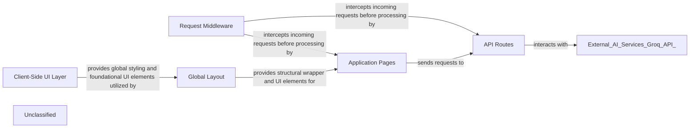

## Details

The Next.js application follows a component-based architecture, separating concerns into distinct layers for UI, layout, page-specific logic, API interactions, and request handling. The Client-Side UI Layer establishes the visual foundation through global styles. The Global Layout component wraps the entire application, providing a consistent header and navigation, and integrates with Clerk for user authentication. Application Pages represent the user-facing views, with page.tsx serving as the entry point and query/page.tsx handling interactive medicine queries. These pages communicate with API Routes, such as api/chat/route.ts, which act as server-side intermediaries to external services like the Groq API for AI-powered responses. All incoming requests are first processed by the Request Middleware, which enforces authentication and other global policies, ensuring secure and controlled access to the application's resources. This structure facilitates a clear data flow from user interaction through the UI, to server-side processing, and finally to external AI services, with middleware ensuring security and consistency.

### Client-Side UI Layer
The foundational layer for the user interface, responsible for global styling and core interactive elements.

**Related Classes/Methods**:

- <a href="https://github.com/Devyansh26/PharmaSage/blob/mainNext-Project/app/globals.css" target="_blank" rel="noopener noreferrer">`globals`</a>

### Global Layout
Defines the consistent structural elements (e.g., header, navigation) that are shared across all application pages.

**Related Classes/Methods**:

- <a href="https://github.com/Devyansh26/PharmaSage/blob/mainNext-Project/app/layout.tsx" target="_blank" rel="noopener noreferrer">`layout`</a>

### Application Pages [[Expand]](./Application_Pages.md)
Route-driven views that compose UI components, orchestrate data fetching, and present specific application features to the user.

**Related Classes/Methods**:

- <a href="https://github.com/Devyansh26/PharmaSage/blob/mainNext-Project/app/page.tsx" target="_blank" rel="noopener noreferrer">`page`</a>

### API Routes [[Expand]](./API_Routes.md)
Server-side endpoints within the Next.js application that handle specific data operations, business logic, and serve as the backend interface for client-side requests.

**Related Classes/Methods**:

- <a href="https://github.com/Devyansh26/PharmaSage/blob/mainNext-Project/app/api/chat/route.ts" target="_blank" rel="noopener noreferrer">`route`</a>

### Request Middleware
Intercepts incoming requests before they reach pages or API routes, allowing for custom logic such as authentication, logging, or request modification.

**Related Classes/Methods**:

- <a href="https://github.com/Devyansh26/PharmaSage/blob/mainNext-Project/middleware.ts" target="_blank" rel="noopener noreferrer">`middleware`</a>

### Unclassified
Component for all unclassified files and utility functions (Utility functions/External Libraries/Dependencies)

**Related Classes/Methods**: _None_

### [FAQ](https://github.com/CodeBoarding/GeneratedOnBoardings/tree/main?tab=readme-ov-file#faq)