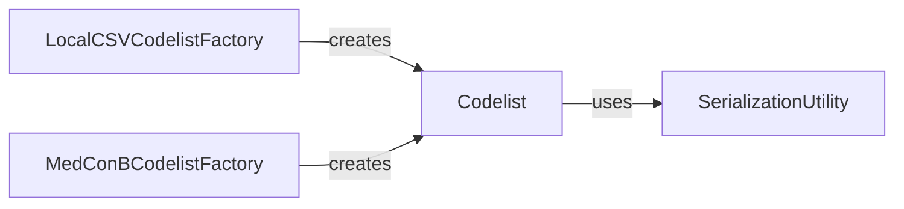

## Component Details

The Codelist Management subsystem provides a robust framework for defining, loading, and manipulating medical codelists from various external sources. It centers around the `Codelist` component, which serves as the core data structure for representing medical concepts and their associated codes. Factory components like `LocalCSVCodelistFactory` and `MedConBCodelistFactory` are responsible for creating `Codelist` instances from specific data formats and external systems, respectively. The `SerializationUtility` component assists in converting `Codelist` objects into dictionary formats for various purposes.

### Codelist
The Codelist component is a core data structure for managing medical codes. It allows for the representation of a single medical concept with associated codes from various vocabularies. It provides methods for initialization from different data formats (YAML, Excel, CSV, MedConB), copying, converting to pandas DataFrames or dictionaries, and performing set operations (union and difference) on codelists. It also handles fuzzy matching and punctuation removal for codes.

**Related Classes/Methods**:

- <a href="https://github.com/Bayer-Group/PhenEx/blob/master/phenex/codelists/codelists.py#L8-L458" target="_blank" rel="noopener noreferrer">`phenex.codelists.codelists.Codelist` (8:458)</a>
- <a href="https://github.com/Bayer-Group/PhenEx/blob/master/phenex/codelists/codelists.py#L174-L196" target="_blank" rel="noopener noreferrer">`phenex.codelists.codelists.Codelist:copy` (174:196)</a>
- <a href="https://github.com/Bayer-Group/PhenEx/blob/master/phenex/codelists/codelists.py#L222-L252" target="_blank" rel="noopener noreferrer">`phenex.codelists.codelists.Codelist:from_yaml` (222:252)</a>
- <a href="https://github.com/Bayer-Group/PhenEx/blob/master/phenex/codelists/codelists.py#L255-L333" target="_blank" rel="noopener noreferrer">`phenex.codelists.codelists.Codelist:from_excel` (255:333)</a>
- <a href="https://github.com/Bayer-Group/PhenEx/blob/master/phenex/codelists/codelists.py#L336-L357" target="_blank" rel="noopener noreferrer">`phenex.codelists.codelists.Codelist:from_csv` (336:357)</a>
- <a href="https://github.com/Bayer-Group/PhenEx/blob/master/phenex/codelists/codelists.py#L360-L381" target="_blank" rel="noopener noreferrer">`phenex.codelists.codelists.Codelist:from_medconb` (360:381)</a>
- <a href="https://github.com/Bayer-Group/PhenEx/blob/master/phenex/codelists/codelists.py#L399-L406" target="_blank" rel="noopener noreferrer">`phenex.codelists.codelists.Codelist:to_pandas` (399:406)</a>
- <a href="https://github.com/Bayer-Group/PhenEx/blob/master/phenex/codelists/codelists.py#L408-L409" target="_blank" rel="noopener noreferrer">`phenex.codelists.codelists.Codelist:to_dict` (408:409)</a>
- <a href="https://github.com/Bayer-Group/PhenEx/blob/master/phenex/codelists/codelists.py#L411-L432" target="_blank" rel="noopener noreferrer">`phenex.codelists.codelists.Codelist:__add__` (411:432)</a>
- <a href="https://github.com/Bayer-Group/PhenEx/blob/master/phenex/codelists/codelists.py#L434-L458" target="_blank" rel="noopener noreferrer">`phenex.codelists.codelists.Codelist:__sub__` (434:458)</a>
- <a href="https://github.com/Bayer-Group/PhenEx/blob/master/phenex/codelists/codelists.py#L383-L391" target="_blank" rel="noopener noreferrer">`phenex.codelists.codelists.Codelist.to_tuples` (383:391)</a>

### LocalCSVCodelistFactory
The LocalCSVCodelistFactory component is responsible for creating Codelist instances from a single CSV file that contains multiple codelists. It provides methods to retrieve a list of all available codelists within the CSV and to retrieve a specific Codelist by its name.

**Related Classes/Methods**:

- <a href="https://github.com/Bayer-Group/PhenEx/blob/master/phenex/codelists/codelists.py#L461-L524" target="_blank" rel="noopener noreferrer">`phenex.codelists.codelists.LocalCSVCodelistFactory` (461:524)</a>
- <a href="https://github.com/Bayer-Group/PhenEx/blob/master/phenex/codelists/codelists.py#L511-L524" target="_blank" rel="noopener noreferrer">`phenex.codelists.codelists.LocalCSVCodelistFactory:get_codelist` (511:524)</a>

### MedConBCodelistFactory
The MedConBCodelistFactory component facilitates the retrieval of Codelists from the MedConB system. It interacts with a MedConB client to fetch codelists by ID and convert them into the PhenEx Codelist format.

**Related Classes/Methods**:

- <a href="https://github.com/Bayer-Group/PhenEx/blob/master/phenex/codelists/codelists.py#L527-L564" target="_blank" rel="noopener noreferrer">`phenex.codelists.codelists.MedConBCodelistFactory` (527:564)</a>
- <a href="https://github.com/Bayer-Group/PhenEx/blob/master/phenex/codelists/codelists.py#L551-L556" target="_blank" rel="noopener noreferrer">`phenex.codelists.codelists.MedConBCodelistFactory:get_codelist` (551:556)</a>

### SerializationUtility
The SerializationUtility component provides a generic method for converting objects to dictionaries. In this context, it is used by the Codelist component to serialize its data.

**Related Classes/Methods**:

- <a href="https://github.com/Bayer-Group/PhenEx/blob/master/phenex/util/serialization/to_dict.py#L5-L39" target="_blank" rel="noopener noreferrer">`phenex.util.serialization.to_dict.to_dict` (5:39)</a>

### [FAQ](https://github.com/CodeBoarding/GeneratedOnBoardings/tree/main?tab=readme-ov-file#faq)