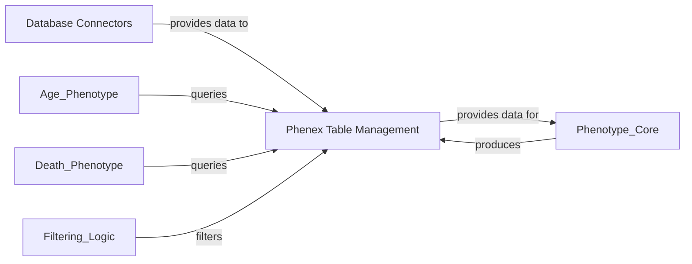

## Component Details

The Data Access Layer manages connections to various databases and provides an abstract representation of data tables for querying and manipulation within the PhenEx system. It is composed of database connectors for establishing and managing connections to different database types, and a table management component that defines and handles the various data table structures used throughout the application.

### Database Connectors
This component provides functionalities to establish and manage connections to various databases like Snowflake and DuckDB using the Ibis framework. It handles environment variable checks and connection pooling for both source and destination databases, allowing for data retrieval and materialization (creating views/tables).

**Related Classes/Methods**:

- <a href="https://github.com/Bayer-Group/PhenEx/blob/master/phenex/ibis_connect.py#L25-L319" target="_blank" rel="noopener noreferrer">`phenex.ibis_connect.SnowflakeConnector` (25:319)</a>
- <a href="https://github.com/Bayer-Group/PhenEx/blob/master/phenex/ibis_connect.py#L322-L354" target="_blank" rel="noopener noreferrer">`phenex.ibis_connect.DuckDBConnector` (322:354)</a>
- <a href="https://github.com/Bayer-Group/PhenEx/blob/master/phenex/ibis_connect.py#L8-L22" target="_blank" rel="noopener noreferrer">`phenex.ibis_connect._check_env_vars` (8:22)</a>

### Phenex Table Management
This component defines abstract and concrete table types within the Phenex system, providing a standardized interface for data manipulation. It includes functionalities for column mapping, joining tables based on predefined keys and paths, and basic table operations like mutation and filtering, ensuring data consistency across different phenotype computations.

**Related Classes/Methods**:

- <a href="https://github.com/Bayer-Group/PhenEx/blob/master/phenex/tables.py#L8-L152" target="_blank" rel="noopener noreferrer">`phenex.tables.PhenexTable` (8:152)</a>
- <a href="https://github.com/Bayer-Group/PhenEx/blob/master/phenex/tables.py#L155-L170" target="_blank" rel="noopener noreferrer">`phenex.tables.PhenexPersonTable` (155:170)</a>
- <a href="https://github.com/Bayer-Group/PhenEx/blob/master/phenex/tables.py#L183-L195" target="_blank" rel="noopener noreferrer">`phenex.tables.CodeTable` (183:195)</a>
- <a href="https://github.com/Bayer-Group/PhenEx/blob/master/phenex/tables.py#L173-L180" target="_blank" rel="noopener noreferrer">`phenex.tables.EventTable` (173:180)</a>
- <a href="https://github.com/Bayer-Group/PhenEx/blob/master/phenex/tables.py#L198-L214" target="_blank" rel="noopener noreferrer">`phenex.tables.PhenexVisitOccurrenceTable` (198:214)</a>
- <a href="https://github.com/Bayer-Group/PhenEx/blob/master/phenex/tables.py#L217-L227" target="_blank" rel="noopener noreferrer">`phenex.tables.PhenexIndexTable` (217:227)</a>
- <a href="https://github.com/Bayer-Group/PhenEx/blob/master/phenex/tables.py#L230-L241" target="_blank" rel="noopener noreferrer">`phenex.tables.PhenexObservationPeriodTable` (230:241)</a>
- <a href="https://github.com/Bayer-Group/PhenEx/blob/master/phenex/tables.py#L244-L263" target="_blank" rel="noopener noreferrer">`phenex.tables.MeasurementTable` (244:263)</a>
- <a href="https://github.com/Bayer-Group/PhenEx/blob/master/phenex/tables.py#L266-L274" target="_blank" rel="noopener noreferrer">`phenex.tables.PhenotypeTable` (266:274)</a>
- <a href="https://github.com/Bayer-Group/PhenEx/blob/master/phenex/tables.py#L277-L282" target="_blank" rel="noopener noreferrer">`phenex.tables.is_phenex_person_table` (277:282)</a>
- <a href="https://github.com/Bayer-Group/PhenEx/blob/master/phenex/tables.py#L285-L289" target="_blank" rel="noopener noreferrer">`phenex.tables.is_phenex_code_table` (285:289)</a>
- <a href="https://github.com/Bayer-Group/PhenEx/blob/master/phenex/tables.py#L292-L296" target="_blank" rel="noopener noreferrer">`phenex.tables.is_phenex_event_table` (292:296)</a>
- <a href="https://github.com/Bayer-Group/PhenEx/blob/master/phenex/tables.py#L299-L303" target="_blank" rel="noopener noreferrer">`phenex.tables.is_phenex_phenotype_table` (299:303)</a>
- <a href="https://github.com/Bayer-Group/PhenEx/blob/master/phenex/tables.py#L306-L310" target="_blank" rel="noopener noreferrer">`phenex.tables.is_phenex_index_table` (306:310)</a>

### [FAQ](https://github.com/CodeBoarding/GeneratedOnBoardings/tree/main?tab=readme-ov-file#faq)