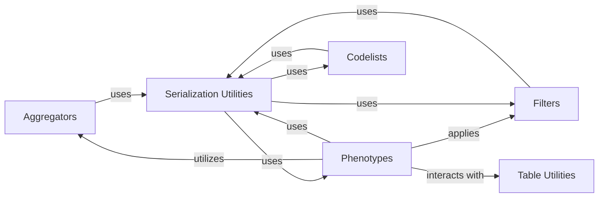

## Component Details

This graph illustrates the structure and interactions within the Data Transformation & Utilities subsystem of PhenEx. It encompasses components responsible for data aggregation, filtering, serialization/deserialization of PhenEx objects, and managing phenotype definitions, codelists, and table utilities. The main flow involves phenotypes utilizing aggregators and filters to process data, with serialization utilities facilitating object persistence and exchange, and codelists and table utilities providing supporting data structures and validation.

### Aggregators
This component provides various strategies for aggregating data, including vertical date-based aggregations (like finding the first, last, or nearest date) and value-based aggregations (like mean, max, min, and daily variations).

**Related Classes/Methods**:

- <a href="https://github.com/Bayer-Group/PhenEx/blob/master/phenex/aggregators/aggregator.py#L7-L60" target="_blank" rel="noopener noreferrer">`PhenEx.phenex.aggregators.aggregator.VerticalDateAggregator` (7:60)</a>
- <a href="https://github.com/Bayer-Group/PhenEx/blob/master/phenex/aggregators/aggregator.py#L63-L65" target="_blank" rel="noopener noreferrer">`PhenEx.phenex.aggregators.aggregator.Nearest` (63:65)</a>
- <a href="https://github.com/Bayer-Group/PhenEx/blob/master/phenex/aggregators/aggregator.py#L68-L70" target="_blank" rel="noopener noreferrer">`PhenEx.phenex.aggregators.aggregator.First` (68:70)</a>
- <a href="https://github.com/Bayer-Group/PhenEx/blob/master/phenex/aggregators/aggregator.py#L73-L75" target="_blank" rel="noopener noreferrer">`PhenEx.phenex.aggregators.aggregator.Last` (73:75)</a>
- <a href="https://github.com/Bayer-Group/PhenEx/blob/master/phenex/aggregators/aggregator.py#L78-L137" target="_blank" rel="noopener noreferrer">`PhenEx.phenex.aggregators.aggregator.ValueAggregator` (78:137)</a>
- <a href="https://github.com/Bayer-Group/PhenEx/blob/master/phenex/aggregators/aggregator.py#L140-L142" target="_blank" rel="noopener noreferrer">`PhenEx.phenex.aggregators.aggregator.Mean` (140:142)</a>
- <a href="https://github.com/Bayer-Group/PhenEx/blob/master/phenex/aggregators/aggregator.py#L145-L147" target="_blank" rel="noopener noreferrer">`PhenEx.phenex.aggregators.aggregator.Max` (145:147)</a>
- <a href="https://github.com/Bayer-Group/PhenEx/blob/master/phenex/aggregators/aggregator.py#L150-L152" target="_blank" rel="noopener noreferrer">`PhenEx.phenex.aggregators.aggregator.Min` (150:152)</a>
- <a href="https://github.com/Bayer-Group/PhenEx/blob/master/phenex/aggregators/aggregator.py#L155-L160" target="_blank" rel="noopener noreferrer">`PhenEx.phenex.aggregators.aggregator.DailyValueAggregator` (155:160)</a>
- <a href="https://github.com/Bayer-Group/PhenEx/blob/master/phenex/aggregators/aggregator.py#L163-L165" target="_blank" rel="noopener noreferrer">`PhenEx.phenex.aggregators.aggregator.DailyMean` (163:165)</a>
- <a href="https://github.com/Bayer-Group/PhenEx/blob/master/phenex/aggregators/aggregator.py#L168-L170" target="_blank" rel="noopener noreferrer">`PhenEx.phenex.aggregators.aggregator.DailyMedian` (168:170)</a>
- <a href="https://github.com/Bayer-Group/PhenEx/blob/master/phenex/aggregators/aggregator.py#L173-L175" target="_blank" rel="noopener noreferrer">`PhenEx.phenex.aggregators.aggregator.DailyMax` (173:175)</a>
- <a href="https://github.com/Bayer-Group/PhenEx/blob/master/phenex/aggregators/aggregator.py#L178-L180" target="_blank" rel="noopener noreferrer">`PhenEx.phenex.aggregators.aggregator.DailyMin` (178:180)</a>

### Phenotypes
This component defines the core phenotype logic, including specific implementations for categorical, measurement change, and codelist-based phenotypes. It also includes the base phenotype definition and computation graph management.

**Related Classes/Methods**:

- <a href="https://github.com/Bayer-Group/PhenEx/blob/master/phenex/phenotypes/categorical_phenotype.py#L51-L138" target="_blank" rel="noopener noreferrer">`PhenEx.phenex.phenotypes.categorical_phenotype.HospitalizationPhenotype` (51:138)</a>
- <a href="https://github.com/Bayer-Group/PhenEx/blob/master/phenex/phenotypes/measurement_change_phenotype.py#L12-L161" target="_blank" rel="noopener noreferrer">`PhenEx.phenex.phenotypes.measurement_change_phenotype.MeasurementChangePhenotype` (12:161)</a>
- <a href="https://github.com/Bayer-Group/PhenEx/blob/master/phenex/phenotypes/codelist_phenotype.py#L13-L178" target="_blank" rel="noopener noreferrer">`PhenEx.phenex.phenotypes.codelist_phenotype.CodelistPhenotype` (13:178)</a>
- <a href="https://github.com/Bayer-Group/PhenEx/blob/master/phenex/phenotypes/phenotype.py#L15-L184" target="_blank" rel="noopener noreferrer">`PhenEx.phenex.phenotypes.phenotype.Phenotype` (15:184)</a>
- <a href="https://github.com/Bayer-Group/PhenEx/blob/master/phenex/phenotypes/phenotype.py#L194-L346" target="_blank" rel="noopener noreferrer">`PhenEx.phenex.phenotypes.phenotype.ComputationGraph` (194:346)</a>

### Filters
This component offers a flexible framework for filtering data based on various criteria, supporting logical operations (AND, OR, NOT) and specific value-based filtering.

**Related Classes/Methods**:

- <a href="https://github.com/Bayer-Group/PhenEx/blob/master/phenex/filters/filter.py#L7-L62" target="_blank" rel="noopener noreferrer">`PhenEx.phenex.filters.filter.Filter` (7:62)</a>
- <a href="https://github.com/Bayer-Group/PhenEx/blob/master/phenex/filters/filter.py#L65-L80" target="_blank" rel="noopener noreferrer">`PhenEx.phenex.filters.filter.AndFilter` (65:80)</a>
- <a href="https://github.com/Bayer-Group/PhenEx/blob/master/phenex/filters/filter.py#L83-L100" target="_blank" rel="noopener noreferrer">`PhenEx.phenex.filters.filter.OrFilter` (83:100)</a>
- <a href="https://github.com/Bayer-Group/PhenEx/blob/master/phenex/filters/filter.py#L103-L117" target="_blank" rel="noopener noreferrer">`PhenEx.phenex.filters.filter.NotFilter` (103:117)</a>
- <a href="https://github.com/Bayer-Group/PhenEx/blob/master/phenex/filters/value.py#L6-L30" target="_blank" rel="noopener noreferrer">`PhenEx.phenex.filters.value.Value` (6:30)</a>
- <a href="https://github.com/Bayer-Group/PhenEx/blob/master/phenex/filters/value_filter.py#L13-L71" target="_blank" rel="noopener noreferrer">`PhenEx.phenex.filters.value_filter.ValueFilter` (13:71)</a>

### Serialization Utilities
This component provides utility functions for converting PhenEx objects to and from dictionary representations, facilitating serialization (e.g., to JSON) and deserialization.

**Related Classes/Methods**:

- <a href="https://github.com/Bayer-Group/PhenEx/blob/master/phenex/util/serialization/to_dict.py#L5-L39" target="_blank" rel="noopener noreferrer">`PhenEx.phenex.util.serialization.to_dict.to_dict` (5:39)</a>
- <a href="https://github.com/Bayer-Group/PhenEx/blob/master/phenex/util/serialization/to_dict.py#L42-L51" target="_blank" rel="noopener noreferrer">`PhenEx.phenex.util.serialization.to_dict.get_phenex_init_params` (42:51)</a>
- <a href="https://github.com/Bayer-Group/PhenEx/blob/master/phenex/util/serialization/from_dict.py#L13-L58" target="_blank" rel="noopener noreferrer">`PhenEx.phenex.util.serialization.from_dict.from_dict` (13:58)</a>
- <a href="https://github.com/Bayer-Group/PhenEx/blob/master/phenex/util/serialization/from_dict.py#L61-L72" target="_blank" rel="noopener noreferrer">`PhenEx.phenex.util.serialization.from_dict.convert_null_keys_to_none_in_dictionary` (61:72)</a>

### Codelists
This component manages the definition and representation of codelists, which are used to categorize and group medical codes or other identifiers.

**Related Classes/Methods**:

- <a href="https://github.com/Bayer-Group/PhenEx/blob/master/phenex/codelists/codelists.py#L8-L458" target="_blank" rel="noopener noreferrer">`PhenEx.phenex.codelists.codelists.Codelist` (8:458)</a>

### Table Utilities
This component provides utility functions for interacting with data tables, specifically to determine if a given table is a PhenEx code table.

**Related Classes/Methods**:

- <a href="https://github.com/Bayer-Group/PhenEx/blob/master/phenex/tables.py#L285-L289" target="_blank" rel="noopener noreferrer">`PhenEx.phenex.tables.is_phenex_code_table` (285:289)</a>

### [FAQ](https://github.com/CodeBoarding/GeneratedOnBoardings/tree/main?tab=readme-ov-file#faq)