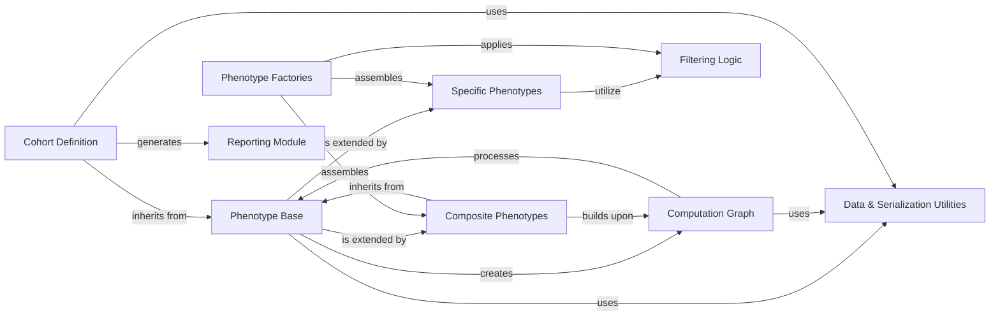

## Component Details

The Phenotype Engine defines the core logic for creating and executing phenotypes and managing patient cohorts based on defined criteria. It encompasses the foundational abstract phenotype definitions, mechanisms for building complex computational graphs, tools for cohort definition and management, and various specific and composite phenotype implementations. Additionally, it includes utilities for data handling, serialization, filtering, and reporting, providing a comprehensive framework for phenotypic analysis.

### Phenotype Base
The foundational component defining the abstract concept of a phenotype, its execution lifecycle, and basic properties. It serves as the parent for all specific phenotype implementations.

**Related Classes/Methods**:

- <a href="https://github.com/Bayer-Group/PhenEx/blob/master/phenex/phenotypes/phenotype.py#L15-L184" target="_blank" rel="noopener noreferrer">`phenex.phenotypes.phenotype.Phenotype` (15:184)</a>

### Computation Graph
Manages the representation and evaluation of complex arithmetic and logical operations between phenotypes, forming a directed acyclic graph (DAG) of computations.

**Related Classes/Methods**:

- <a href="https://github.com/Bayer-Group/PhenEx/blob/master/phenex/phenotypes/phenotype.py#L194-L346" target="_blank" rel="noopener noreferrer">`phenex.phenotypes.phenotype.ComputationGraph` (194:346)</a>

### Cohort Definition
Responsible for defining and executing cohorts, which involve combining multiple phenotypes to identify specific patient populations based on inclusion and exclusion criteria.

**Related Classes/Methods**:

- <a href="https://github.com/Bayer-Group/PhenEx/blob/master/phenex/phenotypes/cohort.py#L25-L359" target="_blank" rel="noopener noreferrer">`phenex.phenotypes.cohort.Cohort` (25:359)</a>
- <a href="https://github.com/Bayer-Group/PhenEx/blob/master/phenex/phenotypes/cohort.py#L14-L22" target="_blank" rel="noopener noreferrer">`phenex.phenotypes.cohort.subset_and_add_index_date` (14:22)</a>

### Specific Phenotypes
A broad category encompassing various concrete implementations of phenotypes, each designed to identify a particular clinical or demographic characteristic. These include codelist-based, categorical, measurement, and time-based phenotypes.

**Related Classes/Methods**:

- <a href="https://github.com/Bayer-Group/PhenEx/blob/master/phenex/phenotypes/within_same_encounter_phenotype.py#L5-L100" target="_blank" rel="noopener noreferrer">`phenex.phenotypes.within_same_encounter_phenotype.WithinSameEncounterPhenotype` (5:100)</a>
- <a href="https://github.com/Bayer-Group/PhenEx/blob/master/phenex/phenotypes/categorical_phenotype.py#L14-L48" target="_blank" rel="noopener noreferrer">`phenex.phenotypes.categorical_phenotype.CategoricalPhenotype` (14:48)</a>
- <a href="https://github.com/Bayer-Group/PhenEx/blob/master/phenex/phenotypes/categorical_phenotype.py#L51-L138" target="_blank" rel="noopener noreferrer">`phenex.phenotypes.categorical_phenotype.HospitalizationPhenotype` (51:138)</a>
- <a href="https://github.com/Bayer-Group/PhenEx/blob/master/phenex/phenotypes/measurement_phenotype.py#L12-L135" target="_blank" rel="noopener noreferrer">`phenex.phenotypes.measurement_phenotype.MeasurementPhenotype` (12:135)</a>
- <a href="https://github.com/Bayer-Group/PhenEx/blob/master/phenex/phenotypes/continuous_coverage_phenotype.py#L11-L102" target="_blank" rel="noopener noreferrer">`phenex.phenotypes.continuous_coverage_phenotype.ContinuousCoveragePhenotype` (11:102)</a>
- <a href="https://github.com/Bayer-Group/PhenEx/blob/master/phenex/phenotypes/age_phenotype.py#L15-L157" target="_blank" rel="noopener noreferrer">`phenex.phenotypes.age_phenotype.AgePhenotype` (15:157)</a>
- <a href="https://github.com/Bayer-Group/PhenEx/blob/master/phenex/phenotypes/multiple_occurrences_phenotype.py#L9-L109" target="_blank" rel="noopener noreferrer">`phenex.phenotypes.multiple_occurrences_phenotype.MultipleOccurrencesPhenotype` (9:109)</a>
- <a href="https://github.com/Bayer-Group/PhenEx/blob/master/phenex/phenotypes/sex_phenotype.py#L10-L43" target="_blank" rel="noopener noreferrer">`phenex.phenotypes.sex_phenotype.SexPhenotype` (10:43)</a>
- <a href="https://github.com/Bayer-Group/PhenEx/blob/master/phenex/phenotypes/codelist_phenotype.py#L13-L178" target="_blank" rel="noopener noreferrer">`phenex.phenotypes.codelist_phenotype.CodelistPhenotype` (13:178)</a>
- <a href="https://github.com/Bayer-Group/PhenEx/blob/master/phenex/phenotypes/death_phenotype.py#L9-L54" target="_blank" rel="noopener noreferrer">`phenex.phenotypes.death_phenotype.DeathPhenotype` (9:54)</a>

### Composite Phenotypes
Phenotypes that are built upon ComputationGraph to perform arithmetic or logical operations on other phenotypes, enabling the creation of more complex definitions like scores or boolean combinations.

**Related Classes/Methods**:

- <a href="https://github.com/Bayer-Group/PhenEx/blob/master/phenex/phenotypes/computation_graph_phenotypes.py#L10-L173" target="_blank" rel="noopener noreferrer">`phenex.phenotypes.computation_graph_phenotypes.ComputationGraphPhenotype` (10:173)</a>
- <a href="https://github.com/Bayer-Group/PhenEx/blob/master/phenex/phenotypes/computation_graph_phenotypes.py#L176-L220" target="_blank" rel="noopener noreferrer">`phenex.phenotypes.computation_graph_phenotypes.ScorePhenotype` (176:220)</a>
- <a href="https://github.com/Bayer-Group/PhenEx/blob/master/phenex/phenotypes/computation_graph_phenotypes.py#L223-L263" target="_blank" rel="noopener noreferrer">`phenex.phenotypes.computation_graph_phenotypes.ArithmeticPhenotype` (223:263)</a>
- <a href="https://github.com/Bayer-Group/PhenEx/blob/master/phenex/phenotypes/computation_graph_phenotypes.py#L266-L295" target="_blank" rel="noopener noreferrer">`phenex.phenotypes.computation_graph_phenotypes.LogicPhenotype` (266:295)</a>

### Phenotype Factories
Provides pre-packaged, complex phenotype definitions, often combining multiple simpler phenotypes and logical operations, to facilitate the creation of commonly used clinical definitions.

**Related Classes/Methods**:

- <a href="https://github.com/Bayer-Group/PhenEx/blob/master/phenex/phenotypes/factory/isth_major_bleed.py#L44-L81" target="_blank" rel="noopener noreferrer">`phenex.phenotypes.factory.isth_major_bleed.ISTHMajorBleedPhenotype` (44:81)</a>
- <a href="https://github.com/Bayer-Group/PhenEx/blob/master/phenex/phenotypes/factory/isth_major_bleed.py#L84-L115" target="_blank" rel="noopener noreferrer">`phenex.phenotypes.factory.isth_major_bleed.CriticalOrganBleedPhenotype` (84:115)</a>
- <a href="https://github.com/Bayer-Group/PhenEx/blob/master/phenex/phenotypes/factory/isth_major_bleed.py#L118-L152" target="_blank" rel="noopener noreferrer">`phenex.phenotypes.factory.isth_major_bleed.SymptomaticBleedPhenotype` (118:152)</a>
- <a href="https://github.com/Bayer-Group/PhenEx/blob/master/phenex/phenotypes/factory/isth_major_bleed.py#L155-L201" target="_blank" rel="noopener noreferrer">`phenex.phenotypes.factory.isth_major_bleed.FatalBleedPhenotype` (155:201)</a>
- <a href="https://github.com/Bayer-Group/PhenEx/blob/master/phenex/phenotypes/factory/isth_major_bleed.py#L204-L239" target="_blank" rel="noopener noreferrer">`phenex.phenotypes.factory.isth_major_bleed.BleedVerificationPhenotype` (204:239)</a>

### Data & Serialization Utilities
Contains utility functions for data table validation, manipulation (like horizontal stacking), and object serialization to dictionary format.

**Related Classes/Methods**:

- <a href="https://github.com/Bayer-Group/PhenEx/blob/master/phenex/tables.py#L299-L303" target="_blank" rel="noopener noreferrer">`phenex.tables.is_phenex_phenotype_table` (299:303)</a>
- <a href="https://github.com/Bayer-Group/PhenEx/blob/master/phenex/util/serialization/to_dict.py#L5-L39" target="_blank" rel="noopener noreferrer">`phenex.util.serialization.to_dict.to_dict` (5:39)</a>
- <a href="https://github.com/Bayer-Group/PhenEx/blob/master/phenex/phenotypes/functions.py#L28-L56" target="_blank" rel="noopener noreferrer">`phenex.phenotypes.functions.hstack` (28:56)</a>

### Filtering Logic
Provides a set of reusable filter classes that define criteria for selecting or excluding data based on various attributes such as categories, codelists, time ranges, and value comparisons.

**Related Classes/Methods**:

- <a href="https://github.com/Bayer-Group/PhenEx/blob/master/phenex/filters/categorical_filter.py#L5-L125" target="_blank" rel="noopener noreferrer">`phenex.filters.categorical_filter.CategoricalFilter` (5:125)</a>
- <a href="https://github.com/Bayer-Group/PhenEx/blob/master/phenex/filters/relative_time_range_filter.py#L9-L100" target="_blank" rel="noopener noreferrer">`phenex.filters.relative_time_range_filter.RelativeTimeRangeFilter` (9:100)</a>
- <a href="https://github.com/Bayer-Group/PhenEx/blob/master/phenex/filters/codelist_filter.py#L10-L83" target="_blank" rel="noopener noreferrer">`phenex.filters.codelist_filter.CodelistFilter` (10:83)</a>
- <a href="https://github.com/Bayer-Group/PhenEx/blob/master/phenex/filters/value.py#L38-L40" target="_blank" rel="noopener noreferrer">`phenex.filters.value.GreaterThanOrEqualTo` (38:40)</a>
- <a href="https://github.com/Bayer-Group/PhenEx/blob/master/phenex/filters/value.py#L48-L50" target="_blank" rel="noopener noreferrer">`phenex.filters.value.LessThanOrEqualTo` (48:50)</a>

### Reporting Module
Handles the generation of structured reports, such as summary tables, from processed phenotype and cohort data.

**Related Classes/Methods**:

- <a href="https://github.com/Bayer-Group/PhenEx/blob/master/phenex/reporting/table1.py#L9-L115" target="_blank" rel="noopener noreferrer">`phenex.reporting.table1.Table1` (9:115)</a>

### [FAQ](https://github.com/CodeBoarding/GeneratedOnBoardings/tree/main?tab=readme-ov-file#faq)