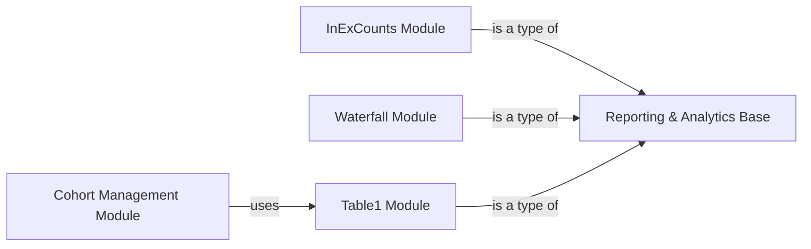

## Component Details

The Reporting & Analytics subsystem provides comprehensive tools for generating various reports, summaries, and visualizations from processed patient data and defined cohorts. It encompasses modules for calculating inclusion/exclusion counts, generating waterfall diagrams to track cohort attrition, and creating detailed 'Table 1' baseline characteristic reports. The system is designed to integrate with cohort management functionalities, allowing for direct reporting on defined patient groups.

### Reporting & Analytics Base
Provides a unified interface and base functionality for generating various types of reports, summaries, and visualizations from processed patient data and defined cohorts. It acts as a central hub for different reporting modules.

**Related Classes/Methods**:

- <a href="https://github.com/Bayer-Group/PhenEx/blob/master/phenex/reporting/reporter.py#L1-L13" target="_blank" rel="noopener noreferrer">`phenex.reporting.reporter.Reporter` (1:13)</a>

### InExCounts Module
This module is responsible for calculating and reporting the counts of patients satisfying specific inclusion and exclusion criteria. It provides methods to get counts for a list of phenotypes.

**Related Classes/Methods**:

- <a href="https://github.com/Bayer-Group/PhenEx/blob/master/phenex/reporting/counts.py#L6-L35" target="_blank" rel="noopener noreferrer">`phenex.reporting.counts.InExCounts` (6:35)</a>
- <a href="https://github.com/Bayer-Group/PhenEx/blob/master/phenex/reporting/counts.py#L12-L20" target="_blank" rel="noopener noreferrer">`phenex.reporting.counts.InExCounts.execute` (12:20)</a>
- <a href="https://github.com/Bayer-Group/PhenEx/blob/master/phenex/reporting/counts.py#L22-L35" target="_blank" rel="noopener noreferrer">`phenex.reporting.counts.InExCounts.get_counts_for_phenotypes` (22:35)</a>

### Waterfall Module
This module generates a waterfall diagram or attrition table, showing the sequential impact of inclusion and exclusion criteria on cohort size. It appends phenotype data and calculates deltas in patient numbers.

**Related Classes/Methods**:

- <a href="https://github.com/Bayer-Group/PhenEx/blob/master/phenex/reporting/waterfall.py#L9-L93" target="_blank" rel="noopener noreferrer">`phenex.reporting.waterfall.Waterfall` (9:93)</a>
- <a href="https://github.com/Bayer-Group/PhenEx/blob/master/phenex/reporting/waterfall.py#L22-L62" target="_blank" rel="noopener noreferrer">`phenex.reporting.waterfall.Waterfall.execute` (22:62)</a>
- <a href="https://github.com/Bayer-Group/PhenEx/blob/master/phenex/reporting/waterfall.py#L64-L85" target="_blank" rel="noopener noreferrer">`phenex.reporting.waterfall.Waterfall.append_phenotype_to_waterfall` (64:85)</a>
- <a href="https://github.com/Bayer-Group/PhenEx/blob/master/phenex/reporting/waterfall.py#L87-L93" target="_blank" rel="noopener noreferrer">`phenex.reporting.waterfall.Waterfall.append_delta` (87:93)</a>

### Table1 Module
This module is dedicated to creating a 'Table 1' report, summarizing baseline characteristics of a cohort. It handles both boolean and value-based characteristics, providing counts, percentages, and summary statistics.

**Related Classes/Methods**:

- <a href="https://github.com/Bayer-Group/PhenEx/blob/master/phenex/reporting/table1.py#L9-L115" target="_blank" rel="noopener noreferrer">`phenex.reporting.table1.Table1` (9:115)</a>
- <a href="https://github.com/Bayer-Group/PhenEx/blob/master/phenex/reporting/table1.py#L18-L46" target="_blank" rel="noopener noreferrer">`phenex.reporting.table1.Table1.execute` (18:46)</a>
- <a href="https://github.com/Bayer-Group/PhenEx/blob/master/phenex/reporting/table1.py#L62-L83" target="_blank" rel="noopener noreferrer">`phenex.reporting.table1.Table1._report_boolean_columns` (62:83)</a>
- <a href="https://github.com/Bayer-Group/PhenEx/blob/master/phenex/reporting/table1.py#L85-L115" target="_blank" rel="noopener noreferrer">`phenex.reporting.table1.Table1._report_value_columns` (85:115)</a>
- <a href="https://github.com/Bayer-Group/PhenEx/blob/master/phenex/reporting/table1.py#L48-L53" target="_blank" rel="noopener noreferrer">`phenex.reporting.table1.Table1._get_boolean_characteristics` (48:53)</a>
- <a href="https://github.com/Bayer-Group/PhenEx/blob/master/phenex/reporting/table1.py#L55-L60" target="_blank" rel="noopener noreferrer">`phenex.reporting.table1.Table1._get_value_characteristics` (55:60)</a>

### Cohort Management Module
This module defines and manages a patient cohort based on entry criteria, inclusions, exclusions, and characteristics. It orchestrates the execution of these criteria and provides an interface to generate reports like Table 1.

**Related Classes/Methods**:

- <a href="https://github.com/Bayer-Group/PhenEx/blob/master/phenex/phenotypes/cohort.py#L25-L359" target="_blank" rel="noopener noreferrer">`phenex.phenotypes.cohort.Cohort` (25:359)</a>
- <a href="https://github.com/Bayer-Group/PhenEx/blob/master/phenex/phenotypes/cohort.py#L353-L359" target="_blank" rel="noopener noreferrer">`phenex.phenotypes.cohort.Cohort.table1` (353:359)</a>

### [FAQ](https://github.com/CodeBoarding/GeneratedOnBoardings/tree/main?tab=readme-ov-file#faq)