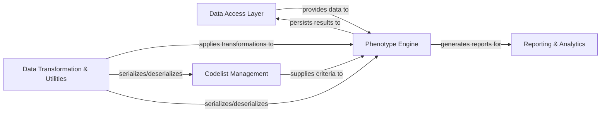

## Component Details

The PhenEx system is designed for defining, computing, and reporting on patient phenotypes and cohorts from various database sources. It leverages a Data Access Layer to connect to databases and abstract data tables. The core Phenotype Engine utilizes Codelist Management for criteria and Data Transformation & Utilities for filtering and aggregation to define and execute complex phenotypes and manage cohorts. Finally, the Reporting & Analytics component generates insights from the computed cohorts.

### Data Access Layer
Manages connections to various databases and provides an abstract representation of data tables for querying and manipulation.

**Related Classes/Methods**:

- <a href="https://github.com/Bayer-Group/PhenEx/blob/master/phenex/ibis_connect.py#L25-L319" target="_blank" rel="noopener noreferrer">`PhenEx.phenex.ibis_connect.SnowflakeConnector` (25:319)</a>
- <a href="https://github.com/Bayer-Group/PhenEx/blob/master/phenex/ibis_connect.py#L322-L354" target="_blank" rel="noopener noreferrer">`PhenEx.phenex.ibis_connect.DuckDBConnector` (322:354)</a>
- <a href="https://github.com/Bayer-Group/PhenEx/blob/master/phenex/tables.py#L8-L152" target="_blank" rel="noopener noreferrer">`PhenEx.phenex.tables.PhenexTable` (8:152)</a>
- <a href="https://github.com/Bayer-Group/PhenEx/blob/master/phenex/tables.py#L183-L195" target="_blank" rel="noopener noreferrer">`PhenEx.phenex.tables.CodeTable` (183:195)</a>
- <a href="https://github.com/Bayer-Group/PhenEx/blob/master/phenex/tables.py#L244-L263" target="_blank" rel="noopener noreferrer">`PhenEx.phenex.tables.MeasurementTable` (244:263)</a>
- <a href="https://github.com/Bayer-Group/PhenEx/blob/master/phenex/tables.py#L155-L170" target="_blank" rel="noopener noreferrer">`PhenEx.phenex.tables.PhenexPersonTable` (155:170)</a>
- <a href="https://github.com/Bayer-Group/PhenEx/blob/master/phenex/tables.py#L230-L241" target="_blank" rel="noopener noreferrer">`PhenEx.phenex.tables.PhenexObservationPeriodTable` (230:241)</a>
- <a href="https://github.com/Bayer-Group/PhenEx/blob/master/phenex/tables.py#L198-L214" target="_blank" rel="noopener noreferrer">`PhenEx.phenex.tables.PhenexVisitOccurrenceTable` (198:214)</a>
- <a href="https://github.com/Bayer-Group/PhenEx/blob/master/phenex/tables.py#L266-L274" target="_blank" rel="noopener noreferrer">`PhenEx.phenex.tables.PhenotypeTable` (266:274)</a>
- <a href="https://github.com/Bayer-Group/PhenEx/blob/master/phenex/tables.py#L173-L180" target="_blank" rel="noopener noreferrer">`PhenEx.phenex.tables.EventTable` (173:180)</a>

### Codelist Management
Provides tools for defining, loading, and manipulating medical codelists from various external sources.

**Related Classes/Methods**:

- <a href="https://github.com/Bayer-Group/PhenEx/blob/master/phenex/codelists/codelists.py#L8-L458" target="_blank" rel="noopener noreferrer">`PhenEx.phenex.codelists.codelists.Codelist` (8:458)</a>
- <a href="https://github.com/Bayer-Group/PhenEx/blob/master/phenex/codelists/codelists.py#L461-L524" target="_blank" rel="noopener noreferrer">`PhenEx.phenex.codelists.codelists.LocalCSVCodelistFactory` (461:524)</a>
- <a href="https://github.com/Bayer-Group/PhenEx/blob/master/phenex/codelists/codelists.py#L527-L564" target="_blank" rel="noopener noreferrer">`PhenEx.phenex.codelists.codelists.MedConBCodelistFactory` (527:564)</a>

### Data Transformation & Utilities
Offers a framework for filtering and aggregating data, along with utilities for serializing and deserializing PhenEx objects.

**Related Classes/Methods**:

- <a href="https://github.com/Bayer-Group/PhenEx/blob/master/phenex/aggregators/aggregator.py#L7-L60" target="_blank" rel="noopener noreferrer">`PhenEx.phenex.aggregators.aggregator.VerticalDateAggregator` (7:60)</a>
- <a href="https://github.com/Bayer-Group/PhenEx/blob/master/phenex/aggregators/aggregator.py#L63-L65" target="_blank" rel="noopener noreferrer">`PhenEx.phenex.aggregators.aggregator.Nearest` (63:65)</a>
- <a href="https://github.com/Bayer-Group/PhenEx/blob/master/phenex/aggregators/aggregator.py#L68-L70" target="_blank" rel="noopener noreferrer">`PhenEx.phenex.aggregators.aggregator.First` (68:70)</a>
- <a href="https://github.com/Bayer-Group/PhenEx/blob/master/phenex/aggregators/aggregator.py#L73-L75" target="_blank" rel="noopener noreferrer">`PhenEx.phenex.aggregators.aggregator.Last` (73:75)</a>
- <a href="https://github.com/Bayer-Group/PhenEx/blob/master/phenex/aggregators/aggregator.py#L78-L137" target="_blank" rel="noopener noreferrer">`PhenEx.phenex.aggregators.aggregator.ValueAggregator` (78:137)</a>
- <a href="https://github.com/Bayer-Group/PhenEx/blob/master/phenex/aggregators/aggregator.py#L140-L142" target="_blank" rel="noopener noreferrer">`PhenEx.phenex.aggregators.aggregator.Mean` (140:142)</a>
- <a href="https://github.com/Bayer-Group/PhenEx/blob/master/phenex/aggregators/aggregator.py#L145-L147" target="_blank" rel="noopener noreferrer">`PhenEx.phenex.aggregators.aggregator.Max` (145:147)</a>
- <a href="https://github.com/Bayer-Group/PhenEx/blob/master/phenex/aggregators/aggregator.py#L150-L152" target="_blank" rel="noopener noreferrer">`PhenEx.phenex.aggregators.aggregator.Min` (150:152)</a>
- <a href="https://github.com/Bayer-Group/PhenEx/blob/master/phenex/aggregators/aggregator.py#L155-L160" target="_blank" rel="noopener noreferrer">`PhenEx.phenex.aggregators.aggregator.DailyValueAggregator` (155:160)</a>
- <a href="https://github.com/Bayer-Group/PhenEx/blob/master/phenex/aggregators/aggregator.py#L163-L165" target="_blank" rel="noopener noreferrer">`PhenEx.phenex.aggregators.aggregator.DailyMean` (163:165)</a>
- <a href="https://github.com/Bayer-Group/PhenEx/blob/master/phenex/aggregators/aggregator.py#L168-L170" target="_blank" rel="noopener noreferrer">`PhenEx.phenex.aggregators.aggregator.DailyMedian` (168:170)</a>
- <a href="https://github.com/Bayer-Group/PhenEx/blob/master/phenex/aggregators/aggregator.py#L173-L175" target="_blank" rel="noopener noreferrer">`PhenEx.phenex.aggregators.aggregator.DailyMax` (173:175)</a>
- <a href="https://github.com/Bayer-Group/PhenEx/blob/master/phenex/aggregators/aggregator.py#L178-L180" target="_blank" rel="noopener noreferrer">`PhenEx.phenex.aggregators.aggregator.DailyMin` (178:180)</a>
- <a href="https://github.com/Bayer-Group/PhenEx/blob/master/phenex/filters/filter.py#L7-L62" target="_blank" rel="noopener noreferrer">`PhenEx.phenex.filters.filter.Filter` (7:62)</a>
- <a href="https://github.com/Bayer-Group/PhenEx/blob/master/phenex/filters/filter.py#L65-L80" target="_blank" rel="noopener noreferrer">`PhenEx.phenex.filters.filter.AndFilter` (65:80)</a>
- <a href="https://github.com/Bayer-Group/PhenEx/blob/master/phenex/filters/filter.py#L83-L100" target="_blank" rel="noopener noreferrer">`PhenEx.phenex.filters.filter.OrFilter` (83:100)</a>
- <a href="https://github.com/Bayer-Group/PhenEx/blob/master/phenex/filters/filter.py#L103-L117" target="_blank" rel="noopener noreferrer">`PhenEx.phenex.filters.filter.NotFilter` (103:117)</a>
- <a href="https://github.com/Bayer-Group/PhenEx/blob/master/phenex/util/serialization/to_dict.py#L5-L39" target="_blank" rel="noopener noreferrer">`PhenEx.phenex.util.serialization.to_dict.to_dict` (5:39)</a>
- <a href="https://github.com/Bayer-Group/PhenEx/blob/master/phenex/util/serialization/to_dict.py#L42-L51" target="_blank" rel="noopener noreferrer">`PhenEx.phenex.util.serialization.to_dict.get_phenex_init_params` (42:51)</a>

### Phenotype Engine
Defines the core logic for creating and executing phenotypes and managing patient cohorts based on defined criteria.

**Related Classes/Methods**:

- <a href="https://github.com/Bayer-Group/PhenEx/blob/master/phenex/phenotypes/phenotype.py#L15-L184" target="_blank" rel="noopener noreferrer">`PhenEx.phenex.phenotypes.phenotype.Phenotype` (15:184)</a>
- <a href="https://github.com/Bayer-Group/PhenEx/blob/master/phenex/phenotypes/phenotype.py#L194-L346" target="_blank" rel="noopener noreferrer">`PhenEx.phenex.phenotypes.phenotype.ComputationGraph` (194:346)</a>
- <a href="https://github.com/Bayer-Group/PhenEx/blob/master/phenex/phenotypes/cohort.py#L25-L359" target="_blank" rel="noopener noreferrer">`PhenEx.phenex.phenotypes.cohort.Cohort` (25:359)</a>
- <a href="https://github.com/Bayer-Group/PhenEx/blob/master/phenex/phenotypes/cohort.py#L14-L22" target="_blank" rel="noopener noreferrer">`PhenEx.phenex.phenotypes.cohort.subset_and_add_index_date` (14:22)</a>

### Reporting & Analytics
Provides tools for generating reports, summaries, and visualizations from processed data and defined cohorts.

**Related Classes/Methods**:

- <a href="https://github.com/Bayer-Group/PhenEx/blob/master/phenex/reporting/reporter.py#L1-L13" target="_blank" rel="noopener noreferrer">`PhenEx.phenex.reporting.reporter.Reporter` (1:13)</a>
- <a href="https://github.com/Bayer-Group/PhenEx/blob/master/phenex/reporting/table1.py#L9-L115" target="_blank" rel="noopener noreferrer">`PhenEx.phenex.reporting.table1.Table1` (9:115)</a>

### [FAQ](https://github.com/CodeBoarding/GeneratedOnBoardings/tree/main?tab=readme-ov-file#faq)