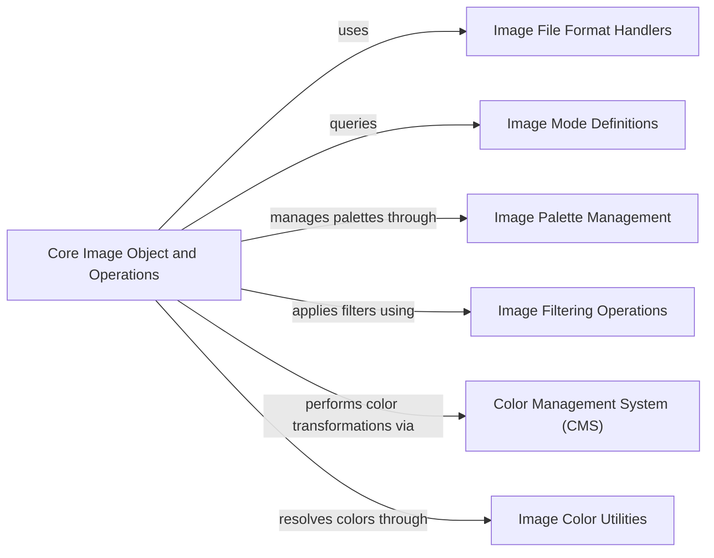

## Component Details

This graph illustrates the core image processing subsystem within Pillow. The central component, 'Core Image Object and Operations', encapsulates the fundamental `PIL.Image.Image` object and its primary manipulation capabilities, including creation, transformations, pixel access, and I/O. It interacts with specialized components for file format handling, color mode definitions, palette management, image filtering, color management, and color utility functions, forming a cohesive system for comprehensive image manipulation.

### Core Image Object and Operations
This component represents the fundamental image object (`PIL.Image.Image`) and its core manipulation capabilities within Pillow. It handles image creation, basic transformations like resizing and cropping, pixel data access, and the overarching mechanisms for loading and saving images. It also includes methods for color mode conversion, quantization, and provides access to image metadata like EXIF. It serves as the central hub for all image-related operations.

**Related Classes/Methods**:

- <a href="https://github.com/python-pillow/Pillow/blob/master/src/PIL/Image.py#L39-L2700" target="_blank" rel="noopener noreferrer">`Pillow.src.PIL.Image.Image` (39:2700)</a>
- <a href="https://github.com/python-pillow/Pillow/blob/master/src/PIL/Image.py#L2703-L2740" target="_blank" rel="noopener noreferrer">`Pillow.src.PIL.Image.new` (2703:2740)</a>
- <a href="https://github.com/python-pillow/Pillow/blob/master/src/PIL/Image.py#L2743-L2870" target="_blank" rel="noopener noreferrer">`Pillow.src.PIL.Image.open` (2743:2870)</a>
- <a href="https://github.com/python-pillow/Pillow/blob/master/src/PIL/Image.py#L2873-L2900" target="_blank" rel="noopener noreferrer">`Pillow.src.PIL.Image.frombytes` (2873:2900)</a>
- <a href="https://github.com/python-pillow/Pillow/blob/master/src/PIL/Image.py#L2903-L2929" target="_blank" rel="noopener noreferrer">`Pillow.src.PIL.Image.frombuffer` (2903:2929)</a>
- <a href="https://github.com/python-pillow/Pillow/blob/master/src/PIL/Image.py#L2932-L3000" target="_blank" rel="noopener noreferrer">`Pillow.src.PIL.Image.fromarray` (2932:3000)</a>
- <a href="https://github.com/python-pillow/Pillow/blob/master/src/PIL/Image.py#L3003-L3030" target="_blank" rel="noopener noreferrer">`Pillow.src.PIL.Image.merge` (3003:3030)</a>
- <a href="https://github.com/python-pillow/Pillow/blob/master/src/PIL/Image.py#L3033-L3040" target="_blank" rel="noopener noreferrer">`Pillow.src.PIL.Image.register_extensions` (3033:3040)</a>
- <a href="https://github.com/python-pillow/Pillow/blob/master/src/PIL/Image.py#L3043-L3044" target="_blank" rel="noopener noreferrer">`Pillow.src.PIL.Image.registered_extensions` (3043:3044)</a>
- <a href="https://github.com/python-pillow/Pillow/blob/master/src/PIL/Image.py#L3047-L3050" target="_blank" rel="noopener noreferrer">`Pillow.src.PIL.Image._show` (3047:3050)</a>
- <a href="https://github.com/python-pillow/Pillow/blob/master/src/PIL/Image.py#L3053-L3060" target="_blank" rel="noopener noreferrer">`Pillow.src.PIL.Image.effect_mandelbrot` (3053:3060)</a>
- <a href="https://github.com/python-pillow/Pillow/blob/master/src/PIL/Image.py#L3063-L3070" target="_blank" rel="noopener noreferrer">`Pillow.src.PIL.Image.effect_noise` (3063:3070)</a>
- <a href="https://github.com/python-pillow/Pillow/blob/master/src/PIL/Image.py#L3073-L3080" target="_blank" rel="noopener noreferrer">`Pillow.src.PIL.Image.linear_gradient` (3073:3080)</a>
- <a href="https://github.com/python-pillow/Pillow/blob/master/src/PIL/Image.py#L3083-L3090" target="_blank" rel="noopener noreferrer">`Pillow.src.PIL.Image.radial_gradient` (3083:3090)</a>
- <a href="https://github.com/python-pillow/Pillow/blob/master/src/PIL/Image.py#L3093-L3100" target="_blank" rel="noopener noreferrer">`Pillow.src.PIL.Image._decompression_bomb_check` (3093:3100)</a>
- <a href="https://github.com/python-pillow/Pillow/blob/master/src/PIL/Image.py#L3103-L3110" target="_blank" rel="noopener noreferrer">`Pillow.src.PIL.Image._getdecoder` (3103:3110)</a>
- <a href="https://github.com/python-pillow/Pillow/blob/master/src/PIL/Image.py#L3113-L3120" target="_blank" rel="noopener noreferrer">`Pillow.src.PIL.Image._getencoder` (3113:3120)</a>
- <a href="https://github.com/python-pillow/Pillow/blob/master/src/PIL/Image.py#L3123-L3130" target="_blank" rel="noopener noreferrer">`Pillow.src.PIL.Image._getscaleoffset` (3123:3130)</a>
- <a href="https://github.com/python-pillow/Pillow/blob/master/src/PIL/Image.py#L3133-L3140" target="_blank" rel="noopener noreferrer">`Pillow.src.PIL.Image._check_size` (3133:3140)</a>
- <a href="https://github.com/python-pillow/Pillow/blob/master/src/PIL/Image.py#L3143-L3150" target="_blank" rel="noopener noreferrer">`Pillow.src.PIL.Image._apply_env_variables` (3143:3150)</a>
- <a href="https://github.com/python-pillow/Pillow/blob/master/src/PIL/Image.py#L3153-L3160" target="_blank" rel="noopener noreferrer">`Pillow.src.PIL.Image.isImageType` (3153:3160)</a>
- <a href="https://github.com/python-pillow/Pillow/blob/master/src/PIL/Image.py#L3163-L3170" target="_blank" rel="noopener noreferrer">`Pillow.src.PIL.Image.getmodebase` (3163:3170)</a>
- <a href="https://github.com/python-pillow/Pillow/blob/master/src/PIL/Image.py#L3173-L3180" target="_blank" rel="noopener noreferrer">`Pillow.src.PIL.Image.getmodetype` (3173:3180)</a>
- <a href="https://github.com/python-pillow/Pillow/blob/master/src/PIL/Image.py#L3183-L3190" target="_blank" rel="noopener noreferrer">`Pillow.src.PIL.Image.getmodebandnames` (3183:3190)</a>
- <a href="https://github.com/python-pillow/Pillow/blob/master/src/PIL/Image.py#L3193-L3200" target="_blank" rel="noopener noreferrer">`Pillow.src.PIL.Image.getmodebands` (3193:3200)</a>
- <a href="https://github.com/python-pillow/Pillow/blob/master/src/PIL/Image.py#L3203-L3210" target="_blank" rel="noopener noreferrer">`Pillow.src.PIL.Image.preinit` (3203:3210)</a>
- <a href="https://github.com/python-pillow/Pillow/blob/master/src/PIL/Image.py#L3213-L3220" target="_blank" rel="noopener noreferrer">`Pillow.src.PIL.Image.init` (3213:3220)</a>
- <a href="https://github.com/python-pillow/Pillow/blob/master/src/PIL/Image.py#L3223-L3230" target="_blank" rel="noopener noreferrer">`Pillow.src.PIL.Image.register_open` (3223:3230)</a>
- <a href="https://github.com/python-pillow/Pillow/blob/master/src/PIL/Image.py#L3233-L3240" target="_blank" rel="noopener noreferrer">`Pillow.src.PIL.Image.register_decoder` (3233:3240)</a>
- <a href="https://github.com/python-pillow/Pillow/blob/master/src/PIL/Image.py#L3243-L3250" target="_blank" rel="noopener noreferrer">`Pillow.src.PIL.Image.register_encoder` (3243:3250)</a>
- <a href="https://github.com/python-pillow/Pillow/blob/master/src/PIL/Image.py#L3253-L3260" target="_blank" rel="noopener noreferrer">`Pillow.src.PIL.Image.alpha_composite` (3253:3260)</a>
- <a href="https://github.com/python-pillow/Pillow/blob/master/src/PIL/Image.py#L3263-L3270" target="_blank" rel="noopener noreferrer">`Pillow.src.PIL.Image.composite` (3263:3270)</a>
- <a href="https://github.com/python-pillow/Pillow/blob/master/src/PIL/Image.py#L3273-L3280" target="_blank" rel="noopener noreferrer">`Pillow.src.PIL.Image.blend` (3273:3280)</a>
- `Pillow.src.PIL.Image.Exif` (full file reference)

### Image File Format Handlers
This component provides the base classes and mechanisms for handling various image file formats, including decoding and encoding image data. It defines the interface for how different file types are read from and written to disk.

**Related Classes/Methods**:

- <a href="https://github.com/python-pillow/Pillow/blob/master/src/PIL/ImageFile.py#L113-L446" target="_blank" rel="noopener noreferrer">`Pillow.src.PIL.ImageFile.ImageFile` (113:446)</a>
- <a href="https://github.com/python-pillow/Pillow/blob/master/src/PIL/ImageFile.py#L812-L863" target="_blank" rel="noopener noreferrer">`Pillow.src.PIL.ImageFile.PyDecoder` (812:863)</a>
- <a href="https://github.com/python-pillow/Pillow/blob/master/src/PIL/ImageFile.py#L866-L922" target="_blank" rel="noopener noreferrer">`Pillow.src.PIL.ImageFile.PyEncoder` (866:922)</a>
- <a href="https://github.com/python-pillow/Pillow/blob/master/src/PIL/ImageFile.py#L458-L485" target="_blank" rel="noopener noreferrer">`Pillow.src.PIL.ImageFile.StubImageFile` (458:485)</a>

### Image Mode Definitions
This component defines and manages the various image modes (e.g., 'RGB', 'L', 'P') supported by Pillow, providing information about their band structure and pixel types.

**Related Classes/Methods**:

- <a href="https://github.com/python-pillow/Pillow/blob/master/src/PIL/ImageMode.py#L38-L92" target="_blank" rel="noopener noreferrer">`Pillow.src.PIL.ImageMode.getmode` (38:92)</a>

### Image Palette Management
This component is responsible for handling color palettes associated with images, particularly for 'P' mode images. It provides functionalities to create, retrieve, and manipulate image palettes.

**Related Classes/Methods**:

- <a href="https://github.com/python-pillow/Pillow/blob/master/src/PIL/ImagePalette.py#L31-L205" target="_blank" rel="noopener noreferrer">`Pillow.src.PIL.ImagePalette.ImagePalette` (31:205)</a>

### Image Filtering Operations
This component encapsulates various image filtering operations that can be applied to an image, such as blurring, sharpening, and edge detection.

**Related Classes/Methods**:

- <a href="https://github.com/python-pillow/Pillow/blob/master/src/PIL/ImageFilter.py#L31-L34" target="_blank" rel="noopener noreferrer">`Pillow.src.PIL.ImageFilter.Filter` (31:34)</a>
- <a href="https://github.com/python-pillow/Pillow/blob/master/src/PIL/ImageFilter.py#L37-L38" target="_blank" rel="noopener noreferrer">`Pillow.src.PIL.ImageFilter.MultibandFilter` (37:38)</a>
- <a href="https://github.com/python-pillow/Pillow/blob/master/src/PIL/ImageFilter.py#L41-L48" target="_blank" rel="noopener noreferrer">`Pillow.src.PIL.ImageFilter.BuiltinFilter` (41:48)</a>
- <a href="https://github.com/python-pillow/Pillow/blob/master/src/PIL/ImageFilter.py#L51-L82" target="_blank" rel="noopener noreferrer">`Pillow.src.PIL.ImageFilter.Kernel` (51:82)</a>
- <a href="https://github.com/python-pillow/Pillow/blob/master/src/PIL/ImageFilter.py#L85-L107" target="_blank" rel="noopener noreferrer">`Pillow.src.PIL.ImageFilter.RankFilter` (85:107)</a>
- <a href="https://github.com/python-pillow/Pillow/blob/master/src/PIL/ImageFilter.py#L196-L225" target="_blank" rel="noopener noreferrer">`Pillow.src.PIL.ImageFilter.BoxBlur` (196:225)</a>
- <a href="https://github.com/python-pillow/Pillow/blob/master/src/PIL/ImageFilter.py#L173-L193" target="_blank" rel="noopener noreferrer">`Pillow.src.PIL.ImageFilter.GaussianBlur` (173:193)</a>
- <a href="https://github.com/python-pillow/Pillow/blob/master/src/PIL/ImageFilter.py#L228-L253" target="_blank" rel="noopener noreferrer">`Pillow.src.PIL.ImageFilter.UnsharpMask` (228:253)</a>
- <a href="https://github.com/python-pillow/Pillow/blob/master/src/PIL/ImageFilter.py#L370-L604" target="_blank" rel="noopener noreferrer">`Pillow.src.PIL.ImageFilter.Color3DLUT` (370:604)</a>
- <a href="https://github.com/python-pillow/Pillow/blob/master/src/PIL/ImageFilter.py#L155-L170" target="_blank" rel="noopener noreferrer">`Pillow.src.PIL.ImageFilter.ModeFilter` (155:170)</a>
- <a href="https://github.com/python-pillow/Pillow/blob/master/src/PIL/ImageFilter.py#L140-L152" target="_blank" rel="noopener noreferrer">`Pillow.src.PIL.ImageFilter.MaxFilter` (140:152)</a>
- <a href="https://github.com/python-pillow/Pillow/blob/master/src/PIL/ImageFilter.py#L110-L122" target="_blank" rel="noopener noreferrer">`Pillow.src.PIL.ImageFilter.MedianFilter` (110:122)</a>
- <a href="https://github.com/python-pillow/Pillow/blob/master/src/PIL/ImageFilter.py#L125-L137" target="_blank" rel="noopener noreferrer">`Pillow.src.PIL.ImageFilter.MinFilter` (125:137)</a>

### Color Management System (CMS)
This component provides functionalities for color space transformations, particularly for handling LAB color profiles and building color transforms between different color spaces using ICC profiles.

**Related Classes/Methods**:

- `Pillow.src.PIL.ImageCms.createProfile` (full file reference)
- `Pillow.src.PIL.ImageCms.buildTransform` (full file reference)
- `Pillow.src.PIL.ImageCms.apply` (full file reference)
- `Pillow.src.PIL.ImageCms.ImageCmsProfile` (full file reference)
- `Pillow.src.PIL.ImageCms.ImageCmsTransform` (full file reference)

### Image Color Utilities
This component provides utility functions for parsing and converting color strings into pixel values, used when specifying colors in image operations.

**Related Classes/Methods**:

- <a href="https://github.com/python-pillow/Pillow/blob/master/src/PIL/ImageColor.py#L129-L165" target="_blank" rel="noopener noreferrer">`Pillow.src.PIL.ImageColor.getcolor` (129:165)</a>

### [FAQ](https://github.com/CodeBoarding/GeneratedOnBoardings/tree/main?tab=readme-ov-file#faq)