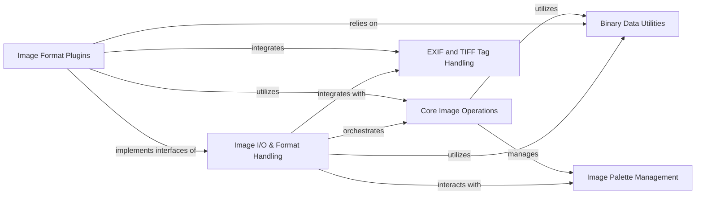

## Component Details

This subsystem of Pillow is responsible for the comprehensive handling of image file input and output, supporting a wide array of image formats. It establishes a foundational framework through abstract base classes and utilities for decoding and encoding image data, ensuring safe file operations. The core functionality revolves around fundamental image manipulations, supported by low-level binary data utilities for precise file parsing. Specialized components manage color palettes for indexed images and extract/interpret EXIF and TIFF metadata. A modular plugin architecture allows for the seamless integration of specific format handlers, each adhering to the defined interfaces for efficient and accurate image processing.

### Image I/O & Format Handling
This component provides the abstract base classes and common utilities for handling image file input and output. It defines the interface for image decoders and encoders, manages safe reading/writing of file data, and handles format-specific parsing and serialization. It acts as the central orchestrator for loading and saving images in Pillow.

**Related Classes/Methods**:

- <a href="https://github.com/python-pillow/Pillow/blob/master/src/PIL/ImageFile.py#L113-L446" target="_blank" rel="noopener noreferrer">`Pillow.src.PIL.ImageFile.ImageFile` (113:446)</a>
- <a href="https://github.com/python-pillow/Pillow/blob/master/src/PIL/ImageFile.py#L812-L863" target="_blank" rel="noopener noreferrer">`Pillow.src.PIL.ImageFile.PyDecoder` (812:863)</a>
- <a href="https://github.com/python-pillow/Pillow/blob/master/src/PIL/ImageFile.py#L866-L922" target="_blank" rel="noopener noreferrer">`Pillow.src.PIL.ImageFile.PyEncoder` (866:922)</a>
- <a href="https://github.com/python-pillow/Pillow/blob/master/src/PIL/ImageFile.py#L488-L619" target="_blank" rel="noopener noreferrer">`Pillow.src.PIL.ImageFile.Parser` (488:619)</a>
- <a href="https://github.com/python-pillow/Pillow/blob/master/src/PIL/ImageFile.py#L458-L485" target="_blank" rel="noopener noreferrer">`Pillow.src.PIL.ImageFile.StubImageFile` (458:485)</a>
- <a href="https://github.com/python-pillow/Pillow/blob/master/src/PIL/ImageFile.py#L625-L650" target="_blank" rel="noopener noreferrer">`Pillow.src.PIL.ImageFile._save` (625:650)</a>
- <a href="https://github.com/python-pillow/Pillow/blob/master/src/PIL/ImageFile.py#L653-L685" target="_blank" rel="noopener noreferrer">`Pillow.src.PIL.ImageFile._encode_tile` (653:685)</a>
- <a href="https://github.com/python-pillow/Pillow/blob/master/src/PIL/ImageFile.py#L688-L720" target="_blank" rel="noopener noreferrer">`Pillow.src.PIL.ImageFile._safe_read` (688:720)</a>
- <a href="https://github.com/python-pillow/Pillow/blob/master/src/PIL/ImageFile.py#L75-L83" target="_blank" rel="noopener noreferrer">`Pillow.src.PIL.ImageFile._get_oserror` (75:83)</a>
- <a href="https://github.com/python-pillow/Pillow/blob/master/src/PIL/ImageFile.py#L86-L93" target="_blank" rel="noopener noreferrer">`Pillow.src.PIL.ImageFile.raise_oserror` (86:93)</a>

### Core Image Operations
This component provides the fundamental functionalities for image manipulation, including opening, loading, saving, and basic image processing operations. It acts as the core interface for working with images in Pillow.

**Related Classes/Methods**:

- `Pillow.src.PIL.Image.new` (full file reference)
- `Pillow.src.PIL.Image.open` (full file reference)
- `Pillow.src.PIL.Image.frombuffer` (full file reference)
- `Pillow.src.PIL.Image.frombytes` (full file reference)
- `Pillow.src.PIL.Image.Image.load` (full file reference)
- `Pillow.src.PIL.Image.Image.putpalette` (full file reference)
- `Pillow.src.PIL.Image.Image.putdata` (full file reference)
- `Pillow.src.PIL.Image.Image.getexif` (full file reference)
- `Pillow.src.PIL.Image.Image._crop` (full file reference)
- `Pillow.src.PIL.Image._decompression_bomb_check` (full file reference)
- `Pillow.src.PIL.Image._getdecoder` (full file reference)
- `Pillow.src.PIL.Image._getencoder` (full file reference)
- `Pillow.src.PIL.Image.getmodebands` (full file reference)
- <a href="https://github.com/python-pillow/Pillow/blob/master/src/PIL/ImageFile.py#L113-L446" target="_blank" rel="noopener noreferrer">`Pillow.src.PIL.ImageFile.ImageFile` (113:446)</a>
- <a href="https://github.com/python-pillow/Pillow/blob/master/src/PIL/ImageFile.py#L166-L167" target="_blank" rel="noopener noreferrer">`Pillow.src.PIL.ImageFile.ImageFile._open` (166:167)</a>
- <a href="https://github.com/python-pillow/Pillow/blob/master/src/PIL/ImageFile.py#L273-L411" target="_blank" rel="noopener noreferrer">`Pillow.src.PIL.ImageFile.ImageFile.load` (273:411)</a>
- <a href="https://github.com/python-pillow/Pillow/blob/master/src/PIL/ImageFile.py#L413-L419" target="_blank" rel="noopener noreferrer">`Pillow.src.PIL.ImageFile.ImageFile.load_prepare` (413:419)</a>
- <a href="https://github.com/python-pillow/Pillow/blob/master/src/PIL/ImageFile.py#L433-L446" target="_blank" rel="noopener noreferrer">`Pillow.src.PIL.ImageFile.ImageFile._seek_check` (433:446)</a>
- <a href="https://github.com/python-pillow/Pillow/blob/master/src/PIL/ImageFile.py#L177-L195" target="_blank" rel="noopener noreferrer">`Pillow.src.PIL.ImageFile.ImageFile.close` (177:195)</a>
- <a href="https://github.com/python-pillow/Pillow/blob/master/src/PIL/ImageFile.py#L488-L619" target="_blank" rel="noopener noreferrer">`Pillow.src.PIL.ImageFile.Parser` (488:619)</a>
- <a href="https://github.com/python-pillow/Pillow/blob/master/src/PIL/ImageFile.py#L509-L583" target="_blank" rel="noopener noreferrer">`Pillow.src.PIL.ImageFile.Parser.feed` (509:583)</a>
- <a href="https://github.com/python-pillow/Pillow/blob/master/src/PIL/ImageFile.py#L625-L650" target="_blank" rel="noopener noreferrer">`Pillow.src.PIL.ImageFile._save` (625:650)</a>
- <a href="https://github.com/python-pillow/Pillow/blob/master/src/PIL/ImageFile.py#L653-L685" target="_blank" rel="noopener noreferrer">`Pillow.src.PIL.ImageFile._encode_tile` (653:685)</a>
- <a href="https://github.com/python-pillow/Pillow/blob/master/src/PIL/ImageFile.py#L812-L863" target="_blank" rel="noopener noreferrer">`Pillow.src.PIL.ImageFile.PyDecoder` (812:863)</a>
- <a href="https://github.com/python-pillow/Pillow/blob/master/src/PIL/ImageFile.py#L838-L863" target="_blank" rel="noopener noreferrer">`Pillow.src.PIL.ImageFile.PyDecoder.set_as_raw` (838:863)</a>
- <a href="https://github.com/python-pillow/Pillow/blob/master/src/PIL/ImageFile.py#L866-L922" target="_blank" rel="noopener noreferrer">`Pillow.src.PIL.ImageFile.PyEncoder` (866:922)</a>
- <a href="https://github.com/python-pillow/Pillow/blob/master/src/PIL/ImageFile.py#L880-L890" target="_blank" rel="noopener noreferrer">`Pillow.src.PIL.ImageFile.PyEncoder.encode` (880:890)</a>
- <a href="https://github.com/python-pillow/Pillow/blob/master/src/PIL/ImageFile.py#L892-L906" target="_blank" rel="noopener noreferrer">`Pillow.src.PIL.ImageFile.PyEncoder.encode_to_pyfd` (892:906)</a>
- <a href="https://github.com/python-pillow/Pillow/blob/master/src/PIL/ImageFile.py#L908-L922" target="_blank" rel="noopener noreferrer">`Pillow.src.PIL.ImageFile.PyEncoder.encode_to_file` (908:922)</a>
- <a href="https://github.com/python-pillow/Pillow/blob/master/src/PIL/ImageFile.py#L688-L720" target="_blank" rel="noopener noreferrer">`Pillow.src.PIL.ImageFile._safe_read` (688:720)</a>
- <a href="https://github.com/python-pillow/Pillow/blob/master/src/PIL/ImageFile.py#L75-L83" target="_blank" rel="noopener noreferrer">`Pillow.src.PIL.ImageFile._get_oserror` (75:83)</a>

### Binary Data Utilities
This component offers utility functions for reading and writing binary data in various formats (e.g., little-endian, big-endian integers and shorts). It is crucial for parsing and constructing image file headers and data blocks.

**Related Classes/Methods**:

- <a href="https://github.com/python-pillow/Pillow/blob/master/src/PIL/_binary.py#L21-L22" target="_blank" rel="noopener noreferrer">`Pillow.src.PIL._binary.i8` (21:22)</a>
- <a href="https://github.com/python-pillow/Pillow/blob/master/src/PIL/_binary.py#L90-L91" target="_blank" rel="noopener noreferrer">`Pillow.src.PIL._binary.i16be` (90:91)</a>
- <a href="https://github.com/python-pillow/Pillow/blob/master/src/PIL/_binary.py#L30-L37" target="_blank" rel="noopener noreferrer">`Pillow.src.PIL._binary.i16le` (30:37)</a>
- <a href="https://github.com/python-pillow/Pillow/blob/master/src/PIL/_binary.py#L94-L95" target="_blank" rel="noopener noreferrer">`Pillow.src.PIL._binary.i32be` (94:95)</a>
- <a href="https://github.com/python-pillow/Pillow/blob/master/src/PIL/_binary.py#L60-L67" target="_blank" rel="noopener noreferrer">`Pillow.src.PIL._binary.i32le` (60:67)</a>
- <a href="https://github.com/python-pillow/Pillow/blob/master/src/PIL/_binary.py#L25-L26" target="_blank" rel="noopener noreferrer">`Pillow.src.PIL._binary.o8` (25:26)</a>
- <a href="https://github.com/python-pillow/Pillow/blob/master/src/PIL/_binary.py#L107-L108" target="_blank" rel="noopener noreferrer">`Pillow.src.PIL._binary.o16be` (107:108)</a>
- <a href="https://github.com/python-pillow/Pillow/blob/master/src/PIL/_binary.py#L99-L100" target="_blank" rel="noopener noreferrer">`Pillow.src.PIL._binary.o16le` (99:100)</a>
- <a href="https://github.com/python-pillow/Pillow/blob/master/src/PIL/_binary.py#L111-L112" target="_blank" rel="noopener noreferrer">`Pillow.src.PIL._binary.o32be` (111:112)</a>
- <a href="https://github.com/python-pillow/Pillow/blob/master/src/PIL/_binary.py#L103-L104" target="_blank" rel="noopener noreferrer">`Pillow.src.PIL._binary.o32le` (103:104)</a>
- <a href="https://github.com/python-pillow/Pillow/blob/master/src/PIL/_binary.py#L50-L57" target="_blank" rel="noopener noreferrer">`Pillow.src.PIL._binary.si16be` (50:57)</a>
- <a href="https://github.com/python-pillow/Pillow/blob/master/src/PIL/_binary.py#L80-L87" target="_blank" rel="noopener noreferrer">`Pillow.src.PIL._binary.si32be` (80:87)</a>

### Image Palette Management
This component is responsible for handling color palettes, which are essential for indexed color image formats. It provides functionalities to create, manipulate, and retrieve color information from palettes.

**Related Classes/Methods**:

- <a href="https://github.com/python-pillow/Pillow/blob/master/src/PIL/ImagePalette.py#L212-L217" target="_blank" rel="noopener noreferrer">`Pillow.src.PIL.ImagePalette.raw` (212:217)</a>
- <a href="https://github.com/python-pillow/Pillow/blob/master/src/PIL/ImagePalette.py#L31-L205" target="_blank" rel="noopener noreferrer">`Pillow.src.PIL.ImagePalette.ImagePalette` (31:205)</a>
- <a href="https://github.com/python-pillow/Pillow/blob/master/src/PIL/ImagePalette.py#L142-L183" target="_blank" rel="noopener noreferrer">`Pillow.src.PIL.ImagePalette.ImagePalette.getcolor` (142:183)</a>
- <a href="https://github.com/python-pillow/Pillow/blob/master/src/PIL/ImagePalette.py#L89-L98" target="_blank" rel="noopener noreferrer">`Pillow.src.PIL.ImagePalette.ImagePalette.getdata` (89:98)</a>

### EXIF and TIFF Tag Handling
This component deals with EXIF metadata embedded in image files and manages TIFF tags, which are used to store various image properties and metadata. It provides mechanisms for reading, writing, and interpreting this metadata.

**Related Classes/Methods**:

- `Pillow.src.PIL.Image.Exif` (full file reference)
- `Pillow.src.PIL.Image.Exif._get_merged_dict` (full file reference)
- `Pillow.src.PIL.Image.Exif.load` (full file reference)
- `Pillow.src.PIL.Image.Exif.tobytes` (full file reference)
- `Pillow.src.PIL.Image.Exif.get_ifd` (full file reference)
- <a href="https://github.com/python-pillow/Pillow/blob/master/src/PIL/TiffTags.py#L52-L69" target="_blank" rel="noopener noreferrer">`Pillow.src.PIL.TiffTags.lookup` (52:69)</a>
- <a href="https://github.com/python-pillow/Pillow/blob/master/src/PIL/TiffTags.py#L32-L49" target="_blank" rel="noopener noreferrer">`Pillow.src.PIL.TiffTags.TagInfo` (32:49)</a>
- <a href="https://github.com/python-pillow/Pillow/blob/master/src/PIL/TiffTags.py#L439-L450" target="_blank" rel="noopener noreferrer">`Pillow.src.PIL.TiffTags._populate` (439:450)</a>
- <a href="https://github.com/python-pillow/Pillow/blob/master/src/PIL/TiffImagePlugin.py#L335-L470" target="_blank" rel="noopener noreferrer">`Pillow.src.PIL.TiffImagePlugin.IFDRational` (335:470)</a>
- <a href="https://github.com/python-pillow/Pillow/blob/master/src/PIL/TiffImagePlugin.py#L391-L403" target="_blank" rel="noopener noreferrer">`Pillow.src.PIL.TiffImagePlugin.IFDRational.limit_rational` (391:403)</a>
- <a href="https://github.com/python-pillow/Pillow/blob/master/src/PIL/TiffImagePlugin.py#L295-L300" target="_blank" rel="noopener noreferrer">`Pillow.src.PIL.TiffImagePlugin._limit_rational` (295:300)</a>
- <a href="https://github.com/python-pillow/Pillow/blob/master/src/PIL/TiffImagePlugin.py#L303-L316" target="_blank" rel="noopener noreferrer">`Pillow.src.PIL.TiffImagePlugin._limit_signed_rational` (303:316)</a>

### Image Format Plugins
This component encompasses all specific implementations for various image file formats (e.g., JPEG, PNG, TIFF, GIF, WebP, AVIF, BMP, ICO, etc.). Each plugin handles format-specific parsing, decoding, encoding, and serialization, interacting with the core image operations and binary data utilities.

**Related Classes/Methods**:

- <a href="https://github.com/python-pillow/Pillow/blob/master/src/PIL/JpegImagePlugin.py#L30-L100" target="_blank" rel="noopener noreferrer">`Pillow.src.PIL.JpegImagePlugin` (30:100)</a>
- <a href="https://github.com/python-pillow/Pillow/blob/master/src/PIL/MpoImagePlugin.py#L30-L100" target="_blank" rel="noopener noreferrer">`Pillow.src.PIL.MpoImagePlugin` (30:100)</a>
- <a href="https://github.com/python-pillow/Pillow/blob/master/src/PIL/PngImagePlugin.py#L30-L100" target="_blank" rel="noopener noreferrer">`Pillow.src.PIL.PngImagePlugin` (30:100)</a>
- <a href="https://github.com/python-pillow/Pillow/blob/master/src/PIL/TiffImagePlugin.py#L30-L100" target="_blank" rel="noopener noreferrer">`Pillow.src.PIL.TiffImagePlugin` (30:100)</a>
- <a href="https://github.com/python-pillow/Pillow/blob/master/src/PIL/GifImagePlugin.py#L30-L100" target="_blank" rel="noopener noreferrer">`Pillow.src.PIL.GifImagePlugin` (30:100)</a>
- <a href="https://github.com/python-pillow/Pillow/blob/master/src/PIL/WebPImagePlugin.py#L30-L100" target="_blank" rel="noopener noreferrer">`Pillow.src.PIL.WebPImagePlugin` (30:100)</a>
- <a href="https://github.com/python-pillow/Pillow/blob/master/src/PIL/AvifImagePlugin.py#L30-L100" target="_blank" rel="noopener noreferrer">`Pillow.src.PIL.AvifImagePlugin` (30:100)</a>
- <a href="https://github.com/python-pillow/Pillow/blob/master/src/PIL/IcoImagePlugin.py#L30-L100" target="_blank" rel="noopener noreferrer">`Pillow.src.PIL.IcoImagePlugin` (30:100)</a>
- <a href="https://github.com/python-pillow/Pillow/blob/master/src/PIL/PsdImagePlugin.py#L30-L100" target="_blank" rel="noopener noreferrer">`Pillow.src.PIL.PsdImagePlugin` (30:100)</a>
- <a href="https://github.com/python-pillow/Pillow/blob/master/src/PIL/EpsImagePlugin.py#L30-L100" target="_blank" rel="noopener noreferrer">`Pillow.src.PIL.EpsImagePlugin` (30:100)</a>
- <a href="https://github.com/python-pillow/Pillow/blob/master/src/PIL/XpmImagePlugin.py#L30-L100" target="_blank" rel="noopener noreferrer">`Pillow.src.PIL.XpmImagePlugin` (30:100)</a>
- <a href="https://github.com/python-pillow/Pillow/blob/master/src/PIL/TgaImagePlugin.py#L30-L100" target="_blank" rel="noopener noreferrer">`Pillow.src.PIL.TgaImagePlugin` (30:100)</a>
- <a href="https://github.com/python-pillow/Pillow/blob/master/src/PIL/PpmImagePlugin.py#L30-L100" target="_blank" rel="noopener noreferrer">`Pillow.src.PIL.PpmImagePlugin` (30:100)</a>
- <a href="https://github.com/python-pillow/Pillow/blob/master/src/PIL/DcxImagePlugin.py#L30-L100" target="_blank" rel="noopener noreferrer">`Pillow.src.PIL.DcxImagePlugin` (30:100)</a>
- <a href="https://github.com/python-pillow/Pillow/blob/master/src/PIL/FliImagePlugin.py#L30-L100" target="_blank" rel="noopener noreferrer">`Pillow.src.PIL.FliImagePlugin` (30:100)</a>
- <a href="https://github.com/python-pillow/Pillow/blob/master/src/PIL/SunImagePlugin.py#L30-L100" target="_blank" rel="noopener noreferrer">`Pillow.src.PIL.SunImagePlugin` (30:100)</a>
- <a href="https://github.com/python-pillow/Pillow/blob/master/src/PIL/MpegImagePlugin.py#L30-L100" target="_blank" rel="noopener noreferrer">`Pillow.src.PIL.MpegImagePlugin` (30:100)</a>
- <a href="https://github.com/python-pillow/Pillow/blob/master/src/PIL/PixarImagePlugin.py#L30-L100" target="_blank" rel="noopener noreferrer">`Pillow.src.PIL.PixarImagePlugin` (30:100)</a>
- <a href="https://github.com/python-pillow/Pillow/blob/master/src/PIL/GdImageFile.py#L38-L81" target="_blank" rel="noopener noreferrer">`Pillow.src.PIL.GdImageFile` (38:81)</a>
- <a href="https://github.com/python-pillow/Pillow/blob/master/src/PIL/WalImageFile.py#L34-L61" target="_blank" rel="noopener noreferrer">`Pillow.src.PIL.WalImageFile` (34:61)</a>
- <a href="https://github.com/python-pillow/Pillow/blob/master/src/PIL/IcnsImagePlugin.py#L30-L100" target="_blank" rel="noopener noreferrer">`Pillow.src.PIL.IcnsImagePlugin` (30:100)</a>
- <a href="https://github.com/python-pillow/Pillow/blob/master/src/PIL/Jpeg2KImagePlugin.py#L30-L100" target="_blank" rel="noopener noreferrer">`Pillow.src.PIL.Jpeg2KImagePlugin` (30:100)</a>
- <a href="https://github.com/python-pillow/Pillow/blob/master/src/PIL/MspImagePlugin.py#L30-L100" target="_blank" rel="noopener noreferrer">`Pillow.src.PIL.MspImagePlugin` (30:100)</a>
- <a href="https://github.com/python-pillow/Pillow/blob/master/src/PIL/FitsImagePlugin.py#L30-L100" target="_blank" rel="noopener noreferrer">`Pillow.src.PIL.FitsImagePlugin` (30:100)</a>
- <a href="https://github.com/python-pillow/Pillow/blob/master/src/PIL/XbmImagePlugin.py#L30-L100" target="_blank" rel="noopener noreferrer">`Pillow.src.PIL.XbmImagePlugin` (30:100)</a>
- <a href="https://github.com/python-pillow/Pillow/blob/master/src/PIL/DdsImagePlugin.py#L30-L100" target="_blank" rel="noopener noreferrer">`Pillow.src.PIL.DdsImagePlugin` (30:100)</a>
- <a href="https://github.com/python-pillow/Pillow/blob/master/src/PIL/GbrImagePlugin.py#L30-L100" target="_blank" rel="noopener noreferrer">`Pillow.src.PIL.GbrImagePlugin` (30:100)</a>
- <a href="https://github.com/python-pillow/Pillow/blob/master/src/PIL/MicImagePlugin.py#L30-L100" target="_blank" rel="noopener noreferrer">`Pillow.src.PIL.MicImagePlugin` (30:100)</a>
- <a href="https://github.com/python-pillow/Pillow/blob/master/src/PIL/ImImagePlugin.py#L30-L100" target="_blank" rel="noopener noreferrer">`Pillow.src.PIL.ImImagePlugin` (30:100)</a>
- <a href="https://github.com/python-pillow/Pillow/blob/master/src/PIL/PcxImagePlugin.py#L30-L100" target="_blank" rel="noopener noreferrer">`Pillow.src.PIL.PcxImagePlugin` (30:100)</a>
- <a href="https://github.com/python-pillow/Pillow/blob/master/src/PIL/PalmImagePlugin.py#L30-L100" target="_blank" rel="noopener noreferrer">`Pillow.src.PIL.PalmImagePlugin` (30:100)</a>
- <a href="https://github.com/python-pillow/Pillow/blob/master/src/PIL/XVThumbImagePlugin.py#L30-L100" target="_blank" rel="noopener noreferrer">`Pillow.src.PIL.XVThumbImagePlugin` (30:100)</a>
- <a href="https://github.com/python-pillow/Pillow/blob/master/src/PIL/McIdasImagePlugin.py#L30-L100" target="_blank" rel="noopener noreferrer">`Pillow.src.PIL.McIdasImagePlugin` (30:100)</a>
- <a href="https://github.com/python-pillow/Pillow/blob/master/src/PIL/Hdf5StubImagePlugin.py#L30-L100" target="_blank" rel="noopener noreferrer">`Pillow.src.PIL.Hdf5StubImagePlugin` (30:100)</a>
- <a href="https://github.com/python-pillow/Pillow/blob/master/src/PIL/BufrStubImagePlugin.py#L30-L100" target="_blank" rel="noopener noreferrer">`Pillow.src.PIL.BufrStubImagePlugin` (30:100)</a>
- <a href="https://github.com/python-pillow/Pillow/blob/master/src/PIL/WmfImagePlugin.py#L30-L100" target="_blank" rel="noopener noreferrer">`Pillow.src.PIL.WmfImagePlugin` (30:100)</a>
- <a href="https://github.com/python-pillow/Pillow/blob/master/src/PIL/SpiderImagePlugin.py#L30-L100" target="_blank" rel="noopener noreferrer">`Pillow.src.PIL.SpiderImagePlugin` (30:100)</a>
- <a href="https://github.com/python-pillow/Pillow/blob/master/src/PIL/FpxImagePlugin.py#L30-L100" target="_blank" rel="noopener noreferrer">`Pillow.src.PIL.FpxImagePlugin` (30:100)</a>
- <a href="https://github.com/python-pillow/Pillow/blob/master/src/PIL/ImtImagePlugin.py#L30-L100" target="_blank" rel="noopener noreferrer">`Pillow.src.PIL.ImtImagePlugin` (30:100)</a>
- <a href="https://github.com/python-pillow/Pillow/blob/master/src/PIL/QoiImagePlugin.py#L30-L100" target="_blank" rel="noopener noreferrer">`Pillow.src.PIL.QoiImagePlugin` (30:100)</a>
- <a href="https://github.com/python-pillow/Pillow/blob/master/src/PIL/BmpImagePlugin.py#L30-L100" target="_blank" rel="noopener noreferrer">`Pillow.src.PIL.BmpImagePlugin` (30:100)</a>

### [FAQ](https://github.com/CodeBoarding/GeneratedOnBoardings/tree/main?tab=readme-ov-file#faq)