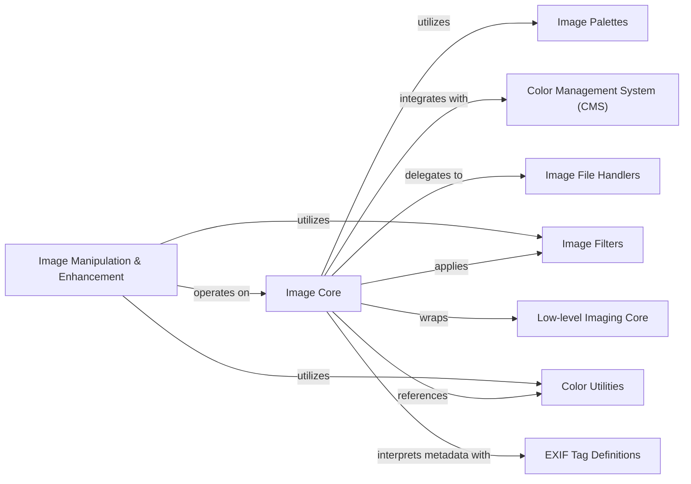

## Component Details

This graph provides an overview of the core components within the Pillow library, focusing on image manipulation, enhancement, and underlying functionalities. It illustrates how various modules interact to provide a comprehensive set of tools for image processing, including drawing, graphics, text rendering, color management, and file handling. The central `Image Core` component acts as the primary interface, leveraging other components for specialized tasks such as palette management, color space transformations, filtering, and low-level pixel operations. The `Image Manipulation & Enhancement` component specifically focuses on advanced drawing, text, and image processing algorithms, building upon the core image object and utilizing various utility and filter components.

### Image Core
This component represents the central `Image` object in Pillow, providing fundamental image manipulation functionalities such as conversion between modes, quantization, copying, cropping, filtering, pasting, and retrieving image properties like bands, bounding box, colors, and pixel data. It acts as the primary interface for most image processing operations.

**Related Classes/Methods**:

- `PIL.Image.Image` (full file reference)
- `PIL.Image.convert` (full file reference)
- `PIL.Image.quantize` (full file reference)
- `PIL.Image.copy` (full file reference)
- `PIL.Image.crop` (full file reference)
- `PIL.Image.filter` (full file reference)
- `PIL.Image.paste` (full file reference)
- `PIL.Image.alpha_composite` (full file reference)
- `PIL.Image.point` (full file reference)
- `PIL.Image.putalpha` (full file reference)
- `PIL.Image.getbands` (full file reference)
- `PIL.Image.getbbox` (full file reference)
- `PIL.Image.getcolors` (full file reference)
- `PIL.Image.getdata` (full file reference)
- `PIL.Image.getextrema` (full file reference)
- `PIL.Image.getxmp` (full file reference)
- `PIL.Image.getexif` (full file reference)
- `PIL.Image.getim` (full file reference)
- `PIL.Image.getpalette` (full file reference)
- `PIL.Image.has_transparency_data` (full file reference)
- `PIL.Image.apply_transparency` (full file reference)
- `PIL.Image.getpixel` (full file reference)
- `PIL.Image.getprojection` (full file reference)
- `PIL.Image.histogram` (full file reference)
- `PIL.Image.entropy` (full file reference)

### Image Palettes
This component is responsible for managing and applying color palettes to images, particularly for 'P' mode images. It provides functionalities to create, retrieve, and manipulate color palettes, which are crucial for indexed color images.

**Related Classes/Methods**:

- <a href="https://github.com/python-pillow/Pillow/blob/master/src/PIL/ImagePalette.py#L31-L205" target="_blank" rel="noopener noreferrer">`PIL.ImagePalette.ImagePalette` (31:205)</a>
- `PIL.Image.convert` (full file reference)
- `PIL.Image.quantize` (full file reference)
- `PIL.Image.getpalette` (full file reference)
- `PIL.Image.apply_transparency` (full file reference)

### Color Management System (CMS)
This component handles color profile transformations, allowing images to be converted between different color spaces (e.g., sRGB to LAB). It utilizes color profiles to ensure accurate color representation across various devices and workflows.

**Related Classes/Methods**:

- `PIL.ImageCms.createProfile` (full file reference)
- `PIL.ImageCms.buildTransform` (full file reference)
- `PIL.ImageCms.apply` (full file reference)
- `PIL.Image.convert` (full file reference)

### Image Filters
This component provides a collection of predefined image filters that can be applied to images to achieve various visual effects, such as blurring, sharpening, and edge detection. It defines the interface for filter kernels and their application.

**Related Classes/Methods**:

- <a href="https://github.com/python-pillow/Pillow/blob/master/src/PIL/ImageFilter.py#L31-L34" target="_blank" rel="noopener noreferrer">`PIL.ImageFilter.Filter` (31:34)</a>
- <a href="https://github.com/python-pillow/Pillow/blob/master/src/PIL/ImageFilter.py#L37-L38" target="_blank" rel="noopener noreferrer">`PIL.ImageFilter.MultibandFilter` (37:38)</a>
- `PIL.Image.filter` (full file reference)

### Color Utilities
This component offers utility functions for parsing and converting color strings into pixel values. It simplifies the process of specifying colors in various formats for image manipulation operations.

**Related Classes/Methods**:

- <a href="https://github.com/python-pillow/Pillow/blob/master/src/PIL/ImageColor.py#L129-L165" target="_blank" rel="noopener noreferrer">`PIL.ImageColor.getcolor` (129:165)</a>
- `PIL.Image.paste` (full file reference)

### Image File Handlers
This component serves as the base for handling various image file formats. It provides the foundational structure and methods for reading, writing, and managing image data from different file types.

**Related Classes/Methods**:

- <a href="https://github.com/python-pillow/Pillow/blob/master/src/PIL/ImageFile.py#L113-L446" target="_blank" rel="noopener noreferrer">`PIL.ImageFile.ImageFile` (113:446)</a>
- `PIL.Image.get_child_images` (full file reference)

### Low-level Imaging Core
This component represents the underlying C-level imaging library that performs the actual pixel-level operations and image processing tasks. It provides high-performance primitives for image manipulation, which are wrapped by the higher-level Python `Image` object.

**Related Classes/Methods**:

- `PIL._imaging.ImagingCore` (full file reference)
- `PIL.Image.im` (full file reference)
- `PIL.Image.convert_matrix` (full file reference)
- `PIL.Image.convert_transparent` (full file reference)
- `PIL.Image.quantize` (full file reference)
- `PIL.Image.copy` (full file reference)
- `PIL.Image.crop` (full file reference)
- `PIL.Image.filter` (full file reference)
- `PIL.Image.getband` (full file reference)
- `PIL.Image.getbbox` (full file reference)
- `PIL.Image.getcolors` (full file reference)
- `PIL.Image.getdata` (full file reference)
- `PIL.Image.getextrema` (full file reference)
- `PIL.Image.getim` (full file reference)
- `PIL.Image.getpalette` (full file reference)
- `PIL.Image.getpixel` (full file reference)
- `PIL.Image.getprojection` (full file reference)
- `PIL.Image.histogram` (full file reference)
- `PIL.Image.entropy` (full file reference)
- `PIL.Image.paste` (full file reference)
- `PIL.Image.point` (full file reference)
- `PIL.Image.putalpha` (full file reference)
- `PIL.Image.putband` (full file reference)
- `PIL.Image.fillband` (full file reference)
- `PIL.Image.putpalettealphas` (full file reference)
- `PIL.Image.putpalettealpha` (full file reference)

### EXIF Tag Definitions
This component provides definitions and utilities for handling EXIF (Exchangeable image file format) metadata embedded in image files. It allows for the extraction and interpretation of various image-related information such as camera settings, date, and orientation.

**Related Classes/Methods**:

- `PIL.ExifTags.Base.Orientation` (full file reference)
- `PIL.Image.getexif` (full file reference)

### Image Manipulation & Enhancement
This component provides a comprehensive set of tools for drawing shapes, rendering graphics and text, and applying various image processing algorithms. It encompasses functionalities for applying predefined and custom filters, adjusting image colors and channels, performing morphological transformations, and handling different font types for text rendering.

**Related Classes/Methods**:

- <a href="https://github.com/python-pillow/Pillow/blob/master/src/PIL/ImageDraw.py#L30-L100" target="_blank" rel="noopener noreferrer">`Pillow.src.PIL.ImageDraw.ImageDraw` (30:100)</a>
- <a href="https://github.com/python-pillow/Pillow/blob/master/src/PIL/ImageDraw.py#L103-L110" target="_blank" rel="noopener noreferrer">`Pillow.src.PIL.ImageDraw.Draw` (103:110)</a>
- <a href="https://github.com/python-pillow/Pillow/blob/master/src/PIL/ImageDraw.py#L113-L150" target="_blank" rel="noopener noreferrer">`Pillow.src.PIL.ImageDraw.floodfill` (113:150)</a>
- <a href="https://github.com/python-pillow/Pillow/blob/master/src/PIL/ImageDraw.py#L153-L250" target="_blank" rel="noopener noreferrer">`Pillow.src.PIL.ImageDraw._compute_regular_polygon_vertices` (153:250)</a>
- <a href="https://github.com/python-pillow/Pillow/blob/master/src/PIL/ImageDraw.py#L253-L260" target="_blank" rel="noopener noreferrer">`Pillow.src.PIL.ImageDraw._color_diff` (253:260)</a>
- <a href="https://github.com/python-pillow/Pillow/blob/master/src/PIL/ImageDraw2.py#L33-L38" target="_blank" rel="noopener noreferrer">`Pillow.src.PIL.ImageDraw2.Pen` (33:38)</a>
- <a href="https://github.com/python-pillow/Pillow/blob/master/src/PIL/ImageDraw2.py#L41-L45" target="_blank" rel="noopener noreferrer">`Pillow.src.PIL.ImageDraw2.Brush` (41:45)</a>
- <a href="https://github.com/python-pillow/Pillow/blob/master/src/PIL/ImageDraw2.py#L48-L56" target="_blank" rel="noopener noreferrer">`Pillow.src.PIL.ImageDraw2.Font` (48:56)</a>
- <a href="https://github.com/python-pillow/Pillow/blob/master/src/PIL/ImageDraw2.py#L59-L243" target="_blank" rel="noopener noreferrer">`Pillow.src.PIL.ImageDraw2.Draw` (59:243)</a>
- <a href="https://github.com/python-pillow/Pillow/blob/master/src/PIL/ImageFont.py#L30-L100" target="_blank" rel="noopener noreferrer">`Pillow.src.PIL.ImageFont.ImageFont` (30:100)</a>
- <a href="https://github.com/python-pillow/Pillow/blob/master/src/PIL/ImageFont.py#L30-L40" target="_blank" rel="noopener noreferrer">`Pillow.src.PIL.ImageFont.FreeTypeFont` (30:40)</a>
- <a href="https://github.com/python-pillow/Pillow/blob/master/src/PIL/ImageFont.py#L43-L50" target="_blank" rel="noopener noreferrer">`Pillow.src.PIL.ImageFont.TransposedFont` (43:50)</a>
- <a href="https://github.com/python-pillow/Pillow/blob/master/src/PIL/ImageFont.py#L53-L60" target="_blank" rel="noopener noreferrer">`Pillow.src.PIL.ImageFont.load` (53:60)</a>
- <a href="https://github.com/python-pillow/Pillow/blob/master/src/PIL/ImageFont.py#L63-L70" target="_blank" rel="noopener noreferrer">`Pillow.src.PIL.ImageFont.truetype` (63:70)</a>
- <a href="https://github.com/python-pillow/Pillow/blob/master/src/PIL/ImageFont.py#L73-L80" target="_blank" rel="noopener noreferrer">`Pillow.src.PIL.ImageFont.load_path` (73:80)</a>
- <a href="https://github.com/python-pillow/Pillow/blob/master/src/PIL/ImageFont.py#L83-L90" target="_blank" rel="noopener noreferrer">`Pillow.src.PIL.ImageFont.load_default_imagefont` (83:90)</a>
- <a href="https://github.com/python-pillow/Pillow/blob/master/src/PIL/ImageFont.py#L93-L100" target="_blank" rel="noopener noreferrer">`Pillow.src.PIL.ImageFont.load_default` (93:100)</a>
- <a href="https://github.com/python-pillow/Pillow/blob/master/src/PIL/FontFile.py#L36-L134" target="_blank" rel="noopener noreferrer">`Pillow.src.PIL.FontFile.FontFile` (36:134)</a>
- <a href="https://github.com/python-pillow/Pillow/blob/master/src/PIL/FontFile.py#L26-L33" target="_blank" rel="noopener noreferrer">`Pillow.src.PIL.FontFile.puti16` (26:33)</a>
- <a href="https://github.com/python-pillow/Pillow/blob/master/src/PIL/PcfFontFile.py#L57-L254" target="_blank" rel="noopener noreferrer">`Pillow.src.PIL.PcfFontFile.PcfFontFile` (57:254)</a>
- <a href="https://github.com/python-pillow/Pillow/blob/master/src/PIL/BdfFontFile.py#L92-L122" target="_blank" rel="noopener noreferrer">`Pillow.src.PIL.BdfFontFile.BdfFontFile` (92:122)</a>
- <a href="https://github.com/python-pillow/Pillow/blob/master/src/PIL/ImageOps.py#L30-L100" target="_blank" rel="noopener noreferrer">`Pillow.src.PIL.ImageOps` (30:100)</a>
- <a href="https://github.com/python-pillow/Pillow/blob/master/src/PIL/ImageChops.py#L30-L100" target="_blank" rel="noopener noreferrer">`Pillow.src.PIL.ImageChops` (30:100)</a>
- <a href="https://github.com/python-pillow/Pillow/blob/master/src/PIL/ImageFilter.py#L30-L100" target="_blank" rel="noopener noreferrer">`Pillow.src.PIL.ImageFilter` (30:100)</a>
- <a href="https://github.com/python-pillow/Pillow/blob/master/src/PIL/ImageEnhance.py#L30-L100" target="_blank" rel="noopener noreferrer">`Pillow.src.PIL.ImageEnhance` (30:100)</a>
- <a href="https://github.com/python-pillow/Pillow/blob/master/src/PIL/ImageMorph.py#L30-L100" target="_blank" rel="noopener noreferrer">`Pillow.src.PIL.ImageMorph` (30:100)</a>

### [FAQ](https://github.com/CodeBoarding/GeneratedOnBoardings/tree/main?tab=readme-ov-file#faq)