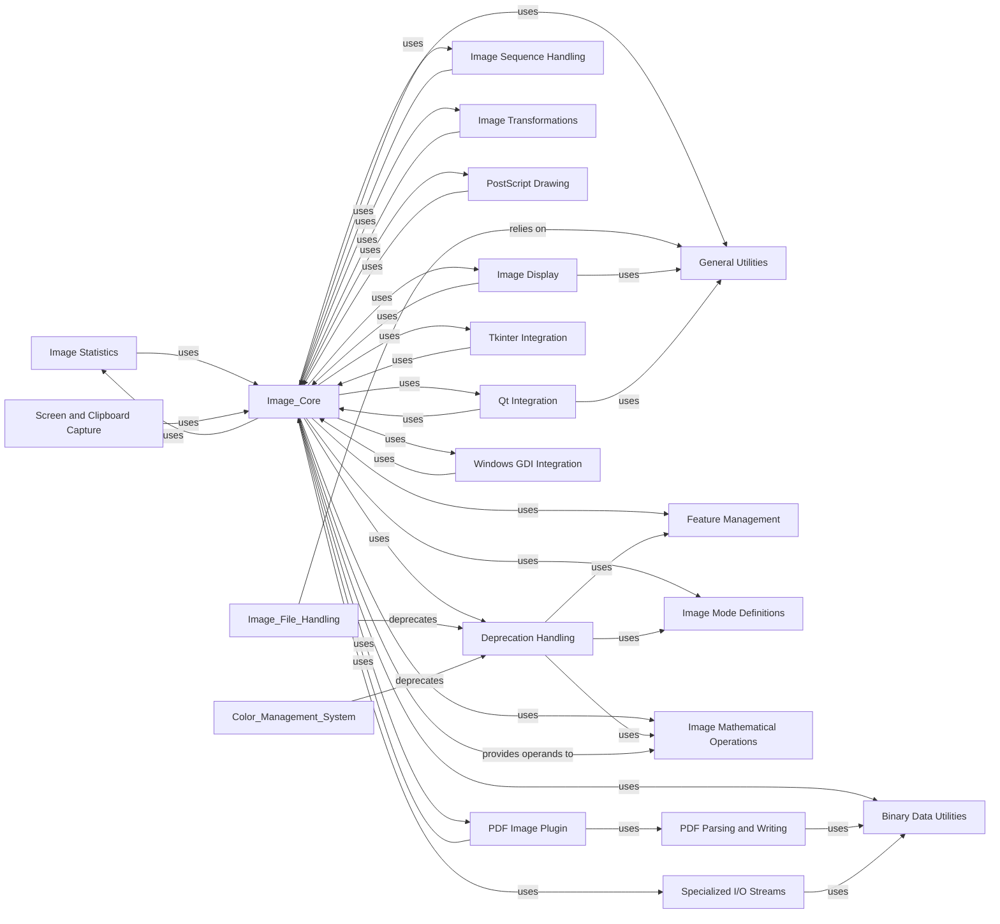

## Component Details

This component provides foundational, low-level utilities and integration points for Pillow. It includes binary data handling, general helper functions, deprecation warnings, feature detection, image mode definitions, image statistics, handling image sequences, screen/clipboard capture, mathematical operations on images, image transformations, specialized I/O stream wrappers, and integration with GUI toolkits (Tkinter, Qt, Windows GDI) and PDF documents.

### Binary Data Utilities
This low-level utility component provides functions for converting between bytes and various integer types (16-bit, 32-bit, signed/unsigned, little-endian/big-endian). It is crucial for parsing and constructing image file headers and data blocks across different image formats.

**Related Classes/Methods**:

- <a href="https://github.com/python-pillow/Pillow/blob/master/src/PIL/_binary.py#L30-L100" target="_blank" rel="noopener noreferrer">`PIL._binary` (30:100)</a>
- <a href="https://github.com/python-pillow/Pillow/blob/master/src/PIL/_binary.py#L99-L100" target="_blank" rel="noopener noreferrer">`PIL._binary.o16le` (99:100)</a>
- <a href="https://github.com/python-pillow/Pillow/blob/master/src/PIL/_binary.py#L25-L26" target="_blank" rel="noopener noreferrer">`PIL._binary.o8` (25:26)</a>
- <a href="https://github.com/python-pillow/Pillow/blob/master/src/PIL/_binary.py#L103-L104" target="_blank" rel="noopener noreferrer">`PIL._binary.o32le` (103:104)</a>
- <a href="https://github.com/python-pillow/Pillow/blob/master/src/PIL/_binary.py#L30-L37" target="_blank" rel="noopener noreferrer">`PIL._binary.i16le` (30:37)</a>
- <a href="https://github.com/python-pillow/Pillow/blob/master/src/PIL/_binary.py#L60-L67" target="_blank" rel="noopener noreferrer">`PIL._binary.i32le` (60:67)</a>
- <a href="https://github.com/python-pillow/Pillow/blob/master/src/PIL/_binary.py#L90-L91" target="_blank" rel="noopener noreferrer">`PIL._binary.i16be` (90:91)</a>
- <a href="https://github.com/python-pillow/Pillow/blob/master/src/PIL/_binary.py#L94-L95" target="_blank" rel="noopener noreferrer">`PIL._binary.i32be` (94:95)</a>
- <a href="https://github.com/python-pillow/Pillow/blob/master/src/PIL/_binary.py#L50-L57" target="_blank" rel="noopener noreferrer">`PIL._binary.si16be` (50:57)</a>
- <a href="https://github.com/python-pillow/Pillow/blob/master/src/PIL/_binary.py#L80-L87" target="_blank" rel="noopener noreferrer">`PIL._binary.si32be` (80:87)</a>
- <a href="https://github.com/python-pillow/Pillow/blob/master/src/PIL/_binary.py#L21-L22" target="_blank" rel="noopener noreferrer">`PIL._binary.i8` (21:22)</a>

### General Utilities
This component contains miscellaneous utility functions that are used across different parts of the Pillow library, such as checking if an object is a file path or handling deferred errors.

**Related Classes/Methods**:

- <a href="https://github.com/python-pillow/Pillow/blob/master/src/PIL/_util.py#L30-L100" target="_blank" rel="noopener noreferrer">`PIL._util` (30:100)</a>
- <a href="https://github.com/python-pillow/Pillow/blob/master/src/PIL/_util.py#L9-L10" target="_blank" rel="noopener noreferrer">`PIL._util.is_path` (9:10)</a>
- <a href="https://github.com/python-pillow/Pillow/blob/master/src/PIL/_util.py#L13-L26" target="_blank" rel="noopener noreferrer">`PIL._util.DeferredError` (13:26)</a>
- <a href="https://github.com/python-pillow/Pillow/blob/master/src/PIL/_util.py#L21-L26" target="_blank" rel="noopener noreferrer">`PIL._util.DeferredError.new` (21:26)</a>

### Deprecation Handling
This utility component is responsible for issuing deprecation warnings. It helps developers identify and update their code when using features that are planned for removal or change in future Pillow versions.

**Related Classes/Methods**:

- <a href="https://github.com/python-pillow/Pillow/blob/master/src/PIL/_deprecate.py#L30-L100" target="_blank" rel="noopener noreferrer">`PIL._deprecate` (30:100)</a>
- <a href="https://github.com/python-pillow/Pillow/blob/master/src/PIL/_deprecate.py#L8-L71" target="_blank" rel="noopener noreferrer">`PIL._deprecate.deprecate` (8:71)</a>

### Feature Management
This component provides a mechanism to check for the availability and version of various optional modules, codecs, and features that Pillow can utilize (e.g., FreeType, LittleCMS, WebP, JPEG, Zlib). It helps in determining the capabilities of the Pillow installation.

**Related Classes/Methods**:

- <a href="https://github.com/python-pillow/Pillow/blob/master/src/PIL/features.py#L30-L100" target="_blank" rel="noopener noreferrer">`PIL.features` (30:100)</a>
- <a href="https://github.com/python-pillow/Pillow/blob/master/src/PIL/features.py#L200-L215" target="_blank" rel="noopener noreferrer">`PIL.features.check` (200:215)</a>
- <a href="https://github.com/python-pillow/Pillow/blob/master/src/PIL/features.py#L48-L60" target="_blank" rel="noopener noreferrer">`PIL.features.version_module` (48:60)</a>
- <a href="https://github.com/python-pillow/Pillow/blob/master/src/PIL/features.py#L63-L67" target="_blank" rel="noopener noreferrer">`PIL.features.get_supported_modules` (63:67)</a>
- <a href="https://github.com/python-pillow/Pillow/blob/master/src/PIL/features.py#L78-L92" target="_blank" rel="noopener noreferrer">`PIL.features.check_codec` (78:92)</a>
- <a href="https://github.com/python-pillow/Pillow/blob/master/src/PIL/features.py#L95-L113" target="_blank" rel="noopener noreferrer">`PIL.features.version_codec` (95:113)</a>
- <a href="https://github.com/python-pillow/Pillow/blob/master/src/PIL/features.py#L116-L120" target="_blank" rel="noopener noreferrer">`PIL.features.get_supported_codecs` (116:120)</a>
- <a href="https://github.com/python-pillow/Pillow/blob/master/src/PIL/features.py#L138-L163" target="_blank" rel="noopener noreferrer">`PIL.features.check_feature` (138:163)</a>
- <a href="https://github.com/python-pillow/Pillow/blob/master/src/PIL/features.py#L166-L180" target="_blank" rel="noopener noreferrer">`PIL.features.version_feature` (166:180)</a>
- <a href="https://github.com/python-pillow/Pillow/blob/master/src/PIL/features.py#L183-L197" target="_blank" rel="noopener noreferrer">`PIL.features.get_supported_features` (183:197)</a>
- <a href="https://github.com/python-pillow/Pillow/blob/master/src/PIL/features.py#L218-L231" target="_blank" rel="noopener noreferrer">`PIL.features.version` (218:231)</a>
- <a href="https://github.com/python-pillow/Pillow/blob/master/src/PIL/features.py#L234-L242" target="_blank" rel="noopener noreferrer">`PIL.features.get_supported` (234:242)</a>
- <a href="https://github.com/python-pillow/Pillow/blob/master/src/PIL/features.py#L245-L361" target="_blank" rel="noopener noreferrer">`PIL.features.pilinfo` (245:361)</a>

### Image Mode Definitions
This component defines and manages the various image modes supported by Pillow, such as '1', 'L', 'RGB', 'RGBA', 'CMYK', etc. It provides functionalities to convert between modes and retrieve mode-specific information.

**Related Classes/Methods**:

- <a href="https://github.com/python-pillow/Pillow/blob/master/src/PIL/ImageMode.py#L30-L100" target="_blank" rel="noopener noreferrer">`PIL.ImageMode` (30:100)</a>

### Image Statistics
This component provides tools for calculating statistics from image data, such as histograms, minimum/maximum pixel values, and average pixel values.

**Related Classes/Methods**:

- <a href="https://github.com/python-pillow/Pillow/blob/master/src/PIL/ImageStat.py#L30-L100" target="_blank" rel="noopener noreferrer">`PIL.ImageStat` (30:100)</a>

### Image Sequence Handling
This component provides utilities for iterating and working with image sequences, such as multi-frame GIF or TIFF files.

**Related Classes/Methods**:

- <a href="https://github.com/python-pillow/Pillow/blob/master/src/PIL/ImageSequence.py#L30-L100" target="_blank" rel="noopener noreferrer">`PIL.ImageSequence` (30:100)</a>

### Screen and Clipboard Capture
This component provides functionality to capture images directly from the screen or the clipboard, primarily for Windows and macOS environments.

**Related Classes/Methods**:

- <a href="https://github.com/python-pillow/Pillow/blob/master/src/PIL/ImageGrab.py#L30-L100" target="_blank" rel="noopener noreferrer">`PIL.ImageGrab` (30:100)</a>

### Image Mathematical Operations
This component provides a way to perform mathematical operations directly on image pixel data, supporting various arithmetic, bitwise, and logical operations. It offers lambda_eval and unsafe_eval for evaluating expressions.

**Related Classes/Methods**:

- <a href="https://github.com/python-pillow/Pillow/blob/master/src/PIL/ImageMath.py#L30-L100" target="_blank" rel="noopener noreferrer">`PIL.ImageMath` (30:100)</a>
- <a href="https://github.com/python-pillow/Pillow/blob/master/src/PIL/ImageMath.py#L51-L94" target="_blank" rel="noopener noreferrer">`PIL.ImageMath._Operand:apply` (51:94)</a>
- <a href="https://github.com/python-pillow/Pillow/blob/master/src/PIL/ImageMath.py#L101-L102" target="_blank" rel="noopener noreferrer">`PIL.ImageMath._Operand:__abs__` (101:102)</a>
- <a href="https://github.com/python-pillow/Pillow/blob/master/src/PIL/ImageMath.py#L111-L112" target="_blank" rel="noopener noreferrer">`PIL.ImageMath._Operand:__add__` (111:112)</a>
- <a href="https://github.com/python-pillow/Pillow/blob/master/src/PIL/ImageMath.py#L123-L124" target="_blank" rel="noopener noreferrer">`PIL.ImageMath._Operand:__mul__` (123:124)</a>
- <a href="https://github.com/python-pillow/Pillow/blob/master/src/PIL/ImageMath.py#L129-L130" target="_blank" rel="noopener noreferrer">`PIL.ImageMath._Operand:__truediv__` (129:130)</a>
- <a href="https://github.com/python-pillow/Pillow/blob/master/src/PIL/ImageMath.py#L135-L136" target="_blank" rel="noopener noreferrer">`PIL.ImageMath._Operand:__mod__` (135:136)</a>
- <a href="https://github.com/python-pillow/Pillow/blob/master/src/PIL/ImageMath.py#L141-L142" target="_blank" rel="noopener noreferrer">`PIL.ImageMath._Operand:__pow__` (141:142)</a>
- <a href="https://github.com/python-pillow/Pillow/blob/master/src/PIL/ImageMath.py#L148-L149" target="_blank" rel="noopener noreferrer">`PIL.ImageMath._Operand:__invert__` (148:149)</a>
- <a href="https://github.com/python-pillow/Pillow/blob/master/src/PIL/ImageMath.py#L151-L152" target="_blank" rel="noopener noreferrer">`PIL.ImageMath._Operand:__and__` (151:152)</a>
- <a href="https://github.com/python-pillow/Pillow/blob/master/src/PIL/ImageMath.py#L157-L158" target="_blank" rel="noopener noreferrer">`PIL.ImageMath._Operand:__or__` (157:158)</a>
- <a href="https://github.com/python-pillow/Pillow/blob/master/src/PIL/ImageMath.py#L163-L164" target="_blank" rel="noopener noreferrer">`PIL.ImageMath._Operand:__xor__` (163:164)</a>
- <a href="https://github.com/python-pillow/Pillow/blob/master/src/PIL/ImageMath.py#L169-L170" target="_blank" rel="noopener noreferrer">`PIL.ImageMath._Operand:__lshift__` (169:170)</a>
- <a href="https://github.com/python-pillow/Pillow/blob/master/src/PIL/ImageMath.py#L172-L173" target="_blank" rel="noopener noreferrer">`PIL.ImageMath._Operand:__rshift__` (172:173)</a>
- <a href="https://github.com/python-pillow/Pillow/blob/master/src/PIL/ImageMath.py#L236-L275" target="_blank" rel="noopener noreferrer">`PIL.ImageMath:lambda_eval` (236:275)</a>
- <a href="https://github.com/python-pillow/Pillow/blob/master/src/PIL/ImageMath.py#L278-L339" target="_blank" rel="noopener noreferrer">`PIL.ImageMath:unsafe_eval` (278:339)</a>
- <a href="https://github.com/python-pillow/Pillow/blob/master/src/PIL/ImageMath.py#L342-L368" target="_blank" rel="noopener noreferrer">`PIL.ImageMath:eval` (342:368)</a>

### Image Transformations
This component defines various image transformation classes and methods, including affine transformations, perspective transformations, and mesh transformations, which can be applied to images.

**Related Classes/Methods**:

- <a href="https://github.com/python-pillow/Pillow/blob/master/src/PIL/ImageTransform.py#L30-L100" target="_blank" rel="noopener noreferrer">`PIL.ImageTransform` (30:100)</a>

### Specialized I/O Streams
This component provides specialized I/O stream wrappers, such as `ContainerIO` for reading data from a container file and `TarIO` for reading data from a tar archive, enabling Pillow to handle images embedded within these formats.

**Related Classes/Methods**:

- <a href="https://github.com/python-pillow/Pillow/blob/master/src/PIL/ContainerIO.py#L23-L173" target="_blank" rel="noopener noreferrer">`PIL.ContainerIO` (23:173)</a>
- <a href="https://github.com/python-pillow/Pillow/blob/master/src/PIL/TarIO.py#L23-L61" target="_blank" rel="noopener noreferrer">`PIL.TarIO` (23:61)</a>

### PostScript Drawing
This component provides basic functionalities for drawing PostScript images, including methods for generating PostScript commands for lines, rectangles, and other shapes.

**Related Classes/Methods**:

- <a href="https://github.com/python-pillow/Pillow/blob/master/src/PIL/PSDraw.py#L31-L142" target="_blank" rel="noopener noreferrer">`PIL.PSDraw` (31:142)</a>

### PDF Image Plugin
This component handles the saving and loading of images within PDF documents, providing functionalities to integrate Pillow's image capabilities with PDF files.

**Related Classes/Methods**:

- <a href="https://github.com/python-pillow/Pillow/blob/master/src/PIL/PdfImagePlugin.py#L30-L100" target="_blank" rel="noopener noreferrer">`PIL.PdfImagePlugin` (30:100)</a>
- <a href="https://github.com/python-pillow/Pillow/blob/master/src/PIL/PdfImagePlugin.py#L43-L44" target="_blank" rel="noopener noreferrer">`PIL.PdfImagePlugin._save_all` (43:44)</a>
- <a href="https://github.com/python-pillow/Pillow/blob/master/src/PIL/PdfImagePlugin.py#L51-L181" target="_blank" rel="noopener noreferrer">`PIL.PdfImagePlugin._write_image` (51:181)</a>
- <a href="https://github.com/python-pillow/Pillow/blob/master/src/PIL/PdfImagePlugin.py#L184-L299" target="_blank" rel="noopener noreferrer">`PIL.PdfImagePlugin._save` (184:299)</a>

### PDF Parsing and Writing
This component is dedicated to handling PDF file structures. it includes classes for representing PDF objects (dictionaries, arrays, names, streams, indirect references) and a parser for reading and writing PDF documents, including cross-reference tables and object streams.

**Related Classes/Methods**:

- <a href="https://github.com/python-pillow/Pillow/blob/master/src/PIL/PdfParser.py#L30-L100" target="_blank" rel="noopener noreferrer">`PIL.PdfParser` (30:100)</a>
- <a href="https://github.com/python-pillow/Pillow/blob/master/src/PIL/PdfParser.py#L30-L40" target="_blank" rel="noopener noreferrer">`PIL.PdfParser.IndirectReference` (30:40)</a>
- <a href="https://github.com/python-pillow/Pillow/blob/master/src/PIL/PdfParser.py#L43-L50" target="_blank" rel="noopener noreferrer">`PIL.PdfParser.XrefTable` (43:50)</a>
- <a href="https://github.com/python-pillow/Pillow/blob/master/src/PIL/PdfParser.py#L53-L60" target="_blank" rel="noopener noreferrer">`PIL.PdfParser.PdfName` (53:60)</a>
- <a href="https://github.com/python-pillow/Pillow/blob/master/src/PIL/PdfParser.py#L63-L70" target="_blank" rel="noopener noreferrer">`PIL.PdfParser.PdfArray` (63:70)</a>
- <a href="https://github.com/python-pillow/Pillow/blob/master/src/PIL/PdfParser.py#L73-L80" target="_blank" rel="noopener noreferrer">`PIL.PdfParser.PdfDict` (73:80)</a>
- <a href="https://github.com/python-pillow/Pillow/blob/master/src/PIL/PdfParser.py#L83-L90" target="_blank" rel="noopener noreferrer">`PIL.PdfParser.PdfParser` (83:90)</a>
- <a href="https://github.com/python-pillow/Pillow/blob/master/src/PIL/PdfParser.py#L93-L100" target="_blank" rel="noopener noreferrer">`PIL.PdfParser.pdf_repr` (93:100)</a>
- <a href="https://github.com/python-pillow/Pillow/blob/master/src/PIL/PdfParser.py#L103-L110" target="_blank" rel="noopener noreferrer">`PIL.PdfParser.check_format_condition` (103:110)</a>
- <a href="https://github.com/python-pillow/Pillow/blob/master/src/PIL/PdfParser.py#L113-L120" target="_blank" rel="noopener noreferrer">`PIL.PdfParser.encode_text` (113:120)</a>
- <a href="https://github.com/python-pillow/Pillow/blob/master/src/PIL/PdfParser.py#L123-L130" target="_blank" rel="noopener noreferrer">`PIL.PdfParser.decode_text` (123:130)</a>
- <a href="https://github.com/python-pillow/Pillow/blob/master/src/PIL/PdfParser.py#L133-L140" target="_blank" rel="noopener noreferrer">`PIL.PdfParser.PdfStream` (133:140)</a>
- <a href="https://github.com/python-pillow/Pillow/blob/master/src/PIL/PdfParser.py#L143-L150" target="_blank" rel="noopener noreferrer">`PIL.PdfParser.IndirectObjectDef` (143:150)</a>
- `PIL.PdfParser.PdfBinary` (full file reference)
- `PIL.PdfParser.PdfParser.write_obj` (full file reference)
- `PIL.PdfParser.PdfParser.write_catalog` (full file reference)
- `PIL.PdfParser.PdfParser.write_page` (full file reference)
- `PIL.PdfParser.PdfParser.write_xref_and_trailer` (full file reference)
- `PIL.PdfParser.PdfParser.next_object_id` (full file reference)

### Image Display
This component provides mechanisms for displaying images using various backend viewers, including platform-specific viewers for Windows and Unix-like systems.

**Related Classes/Methods**:

- <a href="https://github.com/python-pillow/Pillow/blob/master/src/PIL/ImageShow.py#L30-L100" target="_blank" rel="noopener noreferrer">`PIL.ImageShow` (30:100)</a>
- <a href="https://github.com/python-pillow/Pillow/blob/master/src/PIL/ImageShow.py#L66-L121" target="_blank" rel="noopener noreferrer">`PIL.ImageShow.Viewer` (66:121)</a>
- <a href="https://github.com/python-pillow/Pillow/blob/master/src/PIL/ImageShow.py#L127-L151" target="_blank" rel="noopener noreferrer">`PIL.ImageShow.WindowsViewer` (127:151)</a>
- <a href="https://github.com/python-pillow/Pillow/blob/master/src/PIL/ImageShow.py#L195-L205" target="_blank" rel="noopener noreferrer">`PIL.ImageShow.UnixViewer` (195:205)</a>

### Tkinter Integration
This component provides classes and methods to integrate Pillow images with the Tkinter GUI toolkit, allowing images to be displayed and manipulated within Tkinter applications.

**Related Classes/Methods**:

- <a href="https://github.com/python-pillow/Pillow/blob/master/src/PIL/ImageTk.py#L30-L100" target="_blank" rel="noopener noreferrer">`PIL.ImageTk` (30:100)</a>
- <a href="https://github.com/python-pillow/Pillow/blob/master/src/PIL/ImageTk.py#L73-L188" target="_blank" rel="noopener noreferrer">`PIL.ImageTk.PhotoImage` (73:188)</a>
- <a href="https://github.com/python-pillow/Pillow/blob/master/src/PIL/ImageTk.py#L195-L257" target="_blank" rel="noopener noreferrer">`PIL.ImageTk.BitmapImage` (195:257)</a>

### Qt Integration
This component provides functionalities to convert Pillow images into Qt-compatible image formats, enabling their use within Qt-based applications.

**Related Classes/Methods**:

- <a href="https://github.com/python-pillow/Pillow/blob/master/src/PIL/ImageQt.py#L30-L100" target="_blank" rel="noopener noreferrer">`PIL.ImageQt` (30:100)</a>
- <a href="https://github.com/python-pillow/Pillow/blob/master/src/PIL/ImageQt.py#L30-L40" target="_blank" rel="noopener noreferrer">`PIL.ImageQt.ImageQt` (30:40)</a>
- <a href="https://github.com/python-pillow/Pillow/blob/master/src/PIL/ImageQt.py#L67-L71" target="_blank" rel="noopener noreferrer">`PIL.ImageQt.rgb` (67:71)</a>
- <a href="https://github.com/python-pillow/Pillow/blob/master/src/PIL/ImageQt.py#L107-L130" target="_blank" rel="noopener noreferrer">`PIL.ImageQt.align8to32` (107:130)</a>

### Windows GDI Integration
This component provides classes and methods for integrating Pillow with the Windows GDI (Graphics Device Interface), allowing for image display and manipulation within Windows applications.

**Related Classes/Methods**:

- <a href="https://github.com/python-pillow/Pillow/blob/master/src/PIL/ImageWin.py#L30-L100" target="_blank" rel="noopener noreferrer">`PIL.ImageWin` (30:100)</a>
- <a href="https://github.com/python-pillow/Pillow/blob/master/src/PIL/ImageWin.py#L52-L201" target="_blank" rel="noopener noreferrer">`PIL.ImageWin.Dib` (52:201)</a>
- <a href="https://github.com/python-pillow/Pillow/blob/master/src/PIL/ImageWin.py#L236-L247" target="_blank" rel="noopener noreferrer">`PIL.ImageWin.ImageWindow` (236:247)</a>
- <a href="https://github.com/python-pillow/Pillow/blob/master/src/PIL/ImageWin.py#L24-L35" target="_blank" rel="noopener noreferrer">`PIL.ImageWin.HDC` (24:35)</a>
- <a href="https://github.com/python-pillow/Pillow/blob/master/src/PIL/ImageWin.py#L38-L49" target="_blank" rel="noopener noreferrer">`PIL.ImageWin.HWND` (38:49)</a>

### [FAQ](https://github.com/CodeBoarding/GeneratedOnBoardings/tree/main?tab=readme-ov-file#faq)