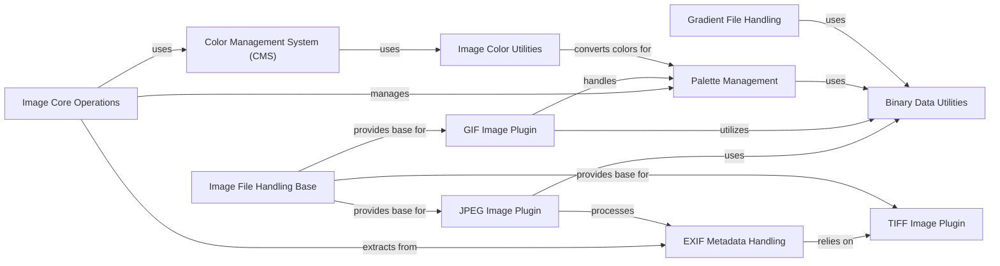

## Component Details

The "Metadata & Color Management" subsystem in Pillow focuses on handling image metadata and color representation. It encompasses functionalities for managing color profiles (ICC, CMS) through `PIL.ImageCms`, parsing and manipulating EXIF data via `PIL.Image.Exif` and `PIL.TiffTags`, and converting between different color spaces using `PIL.ImageColor`. Additionally, it manages image palettes and gradients through `PIL.ImagePalette`, `PIL.PaletteFile`, `PIL.GimpPaletteFile`, and `PIL.GimpGradientFile`. The core image operations in `PIL.Image.Image` integrate these functionalities, allowing for mode conversions, palette application, and EXIF data retrieval. Various image file plugins like `PIL.TiffImagePlugin`, `PIL.JpegImagePlugin`, and `PIL.GifImagePlugin` leverage these components for format-specific metadata and color handling, often relying on low-level `PIL._binary` utilities for data parsing.

### Color Management System (CMS)
This component, primarily encapsulated by `PIL.ImageCms`, provides functionalities for handling ICC color profiles and performing color transformations. It allows for creating, opening, and querying color profiles, as well as building and applying color transformations to images. It interacts with core image operations for color space conversions and relies on the `_imagingcms` backend.

**Related Classes/Methods**:

- <a href="https://github.com/python-pillow/Pillow/blob/master/src/PIL/ImageCms.py#L30-L100" target="_blank" rel="noopener noreferrer">`Pillow.src.PIL.ImageCms` (30:100)</a>

### Image Core Operations
This component represents the fundamental image manipulation capabilities provided by `PIL.Image.Image`. It includes methods for converting image modes, managing palettes, and retrieving EXIF data. It serves as a central hub for various image processing tasks, interacting with other components for specialized functionalities.

**Related Classes/Methods**:

- `Pillow.src.PIL.Image` (full file reference)

### Palette Management
This component, centered around `PIL.ImagePalette`, is responsible for creating, manipulating, and applying color palettes to images. It provides utilities for generating different types of palettes (e.g., negative, random, sepia) and converting palette data to bytes. It is crucial for indexed color images and interacts with palette file formats.

**Related Classes/Methods**:

- <a href="https://github.com/python-pillow/Pillow/blob/master/src/PIL/ImagePalette.py#L31-L205" target="_blank" rel="noopener noreferrer">`Pillow.src.PIL.ImagePalette` (31:205)</a>
- <a href="https://github.com/python-pillow/Pillow/blob/master/src/PIL/PaletteFile.py#L22-L54" target="_blank" rel="noopener noreferrer">`Pillow.src.PIL.PaletteFile` (22:54)</a>
- <a href="https://github.com/python-pillow/Pillow/blob/master/src/PIL/GimpPaletteFile.py#L23-L72" target="_blank" rel="noopener noreferrer">`Pillow.src.PIL.GimpPaletteFile` (23:72)</a>

### EXIF Metadata Handling
This component, primarily `PIL.Image.Exif`, focuses on reading, writing, and managing EXIF (Exchangeable Image File Format) metadata embedded in image files. It interacts closely with TIFF structures to parse and serialize EXIF tags, providing methods to load EXIF data from files and convert it to bytes. It also utilizes `TiffTags` for tag definitions.

**Related Classes/Methods**:

- <a href="https://github.com/python-pillow/Pillow/blob/master/src/PIL/Image.py#L30-L100" target="_blank" rel="noopener noreferrer">`Pillow.src.PIL.Image.Exif` (30:100)</a>
- <a href="https://github.com/python-pillow/Pillow/blob/master/src/PIL/TiffTags.py#L30-L100" target="_blank" rel="noopener noreferrer">`Pillow.src.PIL.TiffTags` (30:100)</a>

### TIFF Image Plugin
This component, represented by `PIL.TiffImagePlugin`, handles the specifics of reading and writing TIFF image files, including the complex Image File Directory (IFD) structure and rational number types. It is fundamental for managing metadata like EXIF, which often uses TIFF-like structures.

**Related Classes/Methods**:

- `Pillow.src.PIL.TiffImagePlugin` (full file reference)

### JPEG Image Plugin
This component, `PIL.JpegImagePlugin`, provides the specific logic for opening, reading, and saving JPEG image files. It handles JPEG-specific metadata extraction, including DPI and MPF (Multi-Picture Format) data, and integrates with the core image and EXIF components.

**Related Classes/Methods**:

- `Pillow.src.PIL.JpegImagePlugin` (full file reference)

### GIF Image Plugin
This component, `PIL.GifImagePlugin`, manages the reading and writing of GIF image files, including handling animated GIFs with multiple frames, transparency, and palette optimization. It interacts with the palette management and image file handling base components.

**Related Classes/Methods**:

- `Pillow.src.PIL.GifImagePlugin` (full file reference)

### Binary Data Utilities
This component, represented by `PIL._binary`, provides low-level utilities for reading and writing binary data in various formats (e.g., 8-bit, 16-bit, 32-bit integers, big-endian, little-endian). It is a foundational component used by many image plugins for parsing and constructing file headers and data blocks.

**Related Classes/Methods**:

- `Pillow.src.PIL._binary` (full file reference)

### Image Color Utilities
This component, `PIL.ImageColor`, offers utilities for converting color names and specifications into RGB tuples. It is used by various parts of Pillow, including drawing modules and palette management, to standardize color representation.

**Related Classes/Methods**:

- <a href="https://github.com/python-pillow/Pillow/blob/master/src/PIL/ImageColor.py#L30-L100" target="_blank" rel="noopener noreferrer">`Pillow.src.PIL.ImageColor` (30:100)</a>

### Image File Handling Base
This component, `PIL.ImageFile`, serves as a base class for various image file format plugins. It provides common functionalities for loading and saving image data, handling file streams, and managing image properties. Specific image plugins extend this base to implement format-specific logic.

**Related Classes/Methods**:

- <a href="https://github.com/python-pillow/Pillow/blob/master/src/PIL/ImageFile.py#L113-L446" target="_blank" rel="noopener noreferrer">`Pillow.src.PIL.ImageFile` (113:446)</a>

### Gradient File Handling
This component, `PIL.GimpGradientFile`, specifically handles the parsing and loading of GIMP gradient files. It provides functionality to interpret gradient definitions for use in image processing.

**Related Classes/Methods**:

- <a href="https://github.com/python-pillow/Pillow/blob/master/src/PIL/GimpGradientFile.py#L115-L149" target="_blank" rel="noopener noreferrer">`Pillow.src.PIL.GimpGradientFile` (115:149)</a>

### [FAQ](https://github.com/CodeBoarding/GeneratedOnBoardings/tree/main?tab=readme-ov-file#faq)