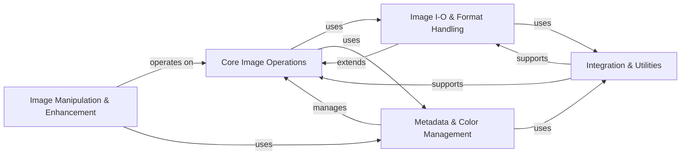

## Component Details

The Pillow library's architecture is centered around a robust `Core Image Operations` component, which provides the fundamental image object and its manipulation capabilities. This core interacts extensively with the `Image I/O & Format Handling` component for loading and saving various image file types, and relies on `Metadata & Color Management` for handling image properties and color spaces. Image modification and enhancement functionalities are encapsulated within the `Image Manipulation & Enhancement` component, which operates directly on the core image objects. Finally, the `Integration & Utilities` component provides essential low-level support, binary operations, and interfaces for GUI toolkits and PDF documents, supporting the entire library's operations.

### Core Image Operations
This component represents the fundamental image object and its core manipulation capabilities within Pillow. It handles image creation, basic transformations like resizing and cropping, pixel data access, and the overarching mechanisms for loading and saving images. It serves as the central hub for all image-related operations.

**Related Classes/Methods**:

- <a href="https://github.com/python-pillow/Pillow/blob/master/src/PIL/Image.py#L39-L2700" target="_blank" rel="noopener noreferrer">`Pillow.src.PIL.Image.Image` (39:2700)</a>
- <a href="https://github.com/python-pillow/Pillow/blob/master/src/PIL/Image.py#L2703-L2740" target="_blank" rel="noopener noreferrer">`Pillow.src.PIL.Image.new` (2703:2740)</a>
- <a href="https://github.com/python-pillow/Pillow/blob/master/src/PIL/Image.py#L2743-L2870" target="_blank" rel="noopener noreferrer">`Pillow.src.PIL.Image.open` (2743:2870)</a>
- <a href="https://github.com/python-pillow/Pillow/blob/master/src/PIL/Image.py#L2873-L2900" target="_blank" rel="noopener noreferrer">`Pillow.src.PIL.Image.frombytes` (2873:2900)</a>
- <a href="https://github.com/python-pillow/Pillow/blob/master/src/PIL/Image.py#L2903-L2929" target="_blank" rel="noopener noreferrer">`Pillow.src.PIL.Image.frombuffer` (2903:2929)</a>
- <a href="https://github.com/python-pillow/Pillow/blob/master/src/PIL/Image.py#L2932-L3000" target="_blank" rel="noopener noreferrer">`Pillow.src.PIL.Image.fromarray` (2932:3000)</a>
- <a href="https://github.com/python-pillow/Pillow/blob/master/src/PIL/Image.py#L3003-L3030" target="_blank" rel="noopener noreferrer">`Pillow.src.PIL.Image.merge` (3003:3030)</a>
- <a href="https://github.com/python-pillow/Pillow/blob/master/src/PIL/Image.py#L3033-L3040" target="_blank" rel="noopener noreferrer">`Pillow.src.PIL.Image.register_extensions` (3033:3040)</a>
- <a href="https://github.com/python-pillow/Pillow/blob/master/src/PIL/Image.py#L3043-L3044" target="_blank" rel="noopener noreferrer">`Pillow.src.PIL.Image.registered_extensions` (3043:3044)</a>
- <a href="https://github.com/python-pillow/Pillow/blob/master/src/PIL/Image.py#L3047-L3050" target="_blank" rel="noopener noreferrer">`Pillow.src.PIL.Image._show` (3047:3050)</a>
- <a href="https://github.com/python-pillow/Pillow/blob/master/src/PIL/Image.py#L3053-L3060" target="_blank" rel="noopener noreferrer">`Pillow.src.PIL.Image.effect_mandelbrot` (3053:3060)</a>
- <a href="https://github.com/python-pillow/Pillow/blob/master/src/PIL/Image.py#L3063-L3070" target="_blank" rel="noopener noreferrer">`Pillow.src.PIL.Image.effect_noise` (3063:3070)</a>
- <a href="https://github.com/python-pillow/Pillow/blob/master/src/PIL/Image.py#L3073-L3080" target="_blank" rel="noopener noreferrer">`Pillow.src.PIL.Image.linear_gradient` (3073:3080)</a>
- <a href="https://github.com/python-pillow/Pillow/blob/master/src/PIL/Image.py#L3083-L3090" target="_blank" rel="noopener noreferrer">`Pillow.src.PIL.Image.radial_gradient` (3083:3090)</a>
- <a href="https://github.com/python-pillow/Pillow/blob/master/src/PIL/Image.py#L3093-L3100" target="_blank" rel="noopener noreferrer">`Pillow.src.PIL.Image._decompression_bomb_check` (3093:3100)</a>
- <a href="https://github.com/python-pillow/Pillow/blob/master/src/PIL/Image.py#L3103-L3110" target="_blank" rel="noopener noreferrer">`Pillow.src.PIL.Image._getdecoder` (3103:3110)</a>
- <a href="https://github.com/python-pillow/Pillow/blob/master/src/PIL/Image.py#L3113-L3120" target="_blank" rel="noopener noreferrer">`Pillow.src.PIL.Image._getencoder` (3113:3120)</a>
- <a href="https://github.com/python-pillow/Pillow/blob/master/src/PIL/Image.py#L3123-L3130" target="_blank" rel="noopener noreferrer">`Pillow.src.PIL.Image._getscaleoffset` (3123:3130)</a>
- <a href="https://github.com/python-pillow/Pillow/blob/master/src/PIL/Image.py#L3133-L3140" target="_blank" rel="noopener noreferrer">`Pillow.src.PIL.Image._check_size` (3133:3140)</a>
- <a href="https://github.com/python-pillow/Pillow/blob/master/src/PIL/Image.py#L3143-L3150" target="_blank" rel="noopener noreferrer">`Pillow.src.PIL.Image._apply_env_variables` (3143:3150)</a>
- <a href="https://github.com/python-pillow/Pillow/blob/master/src/PIL/Image.py#L3153-L3160" target="_blank" rel="noopener noreferrer">`Pillow.src.PIL.Image.isImageType` (3153:3160)</a>
- <a href="https://github.com/python-pillow/Pillow/blob/master/src/PIL/Image.py#L3163-L3170" target="_blank" rel="noopener noreferrer">`Pillow.src.PIL.Image.getmodebase` (3163:3170)</a>
- <a href="https://github.com/python-pillow/Pillow/blob/master/src/PIL/Image.py#L3173-L3180" target="_blank" rel="noopener noreferrer">`Pillow.src.PIL.Image.getmodetype` (3173:3180)</a>
- <a href="https://github.com/python-pillow/Pillow/blob/master/src/PIL/Image.py#L3183-L3190" target="_blank" rel="noopener noreferrer">`Pillow.src.PIL.Image.getmodebandnames` (3183:3190)</a>
- <a href="https://github.com/python-pillow/Pillow/blob/master/src/PIL/Image.py#L3193-L3200" target="_blank" rel="noopener noreferrer">`Pillow.src.PIL.Image.getmodebands` (3193:3200)</a>
- <a href="https://github.com/python-pillow/Pillow/blob/master/src/PIL/Image.py#L3203-L3210" target="_blank" rel="noopener noreferrer">`Pillow.src.PIL.Image.preinit` (3203:3210)</a>
- <a href="https://github.com/python-pillow/Pillow/blob/master/src/PIL/Image.py#L3213-L3220" target="_blank" rel="noopener noreferrer">`Pillow.src.PIL.Image.init` (3213:3220)</a>
- <a href="https://github.com/python-pillow/Pillow/blob/master/src/PIL/Image.py#L3223-L3230" target="_blank" rel="noopener noreferrer">`Pillow.src.PIL.Image.register_open` (3223:3230)</a>
- <a href="https://github.com/python-pillow/Pillow/blob/master/src/PIL/Image.py#L3233-L3240" target="_blank" rel="noopener noreferrer">`Pillow.src.PIL.Image.register_decoder` (3233:3240)</a>
- <a href="https://github.com/python-pillow/Pillow/blob/master/src/PIL/Image.py#L3243-L3250" target="_blank" rel="noopener noreferrer">`Pillow.src.PIL.Image.register_encoder` (3243:3250)</a>
- <a href="https://github.com/python-pillow/Pillow/blob/master/src/PIL/Image.py#L3253-L3260" target="_blank" rel="noopener noreferrer">`Pillow.src.PIL.Image.alpha_composite` (3253:3260)</a>
- <a href="https://github.com/python-pillow/Pillow/blob/master/src/PIL/Image.py#L3263-L3270" target="_blank" rel="noopener noreferrer">`Pillow.src.PIL.Image.composite` (3263:3270)</a>
- <a href="https://github.com/python-pillow/Pillow/blob/master/src/PIL/Image.py#L3273-L3280" target="_blank" rel="noopener noreferrer">`Pillow.src.PIL.Image.blend` (3273:3280)</a>

### Image I-O & Format Handling
This component provides the abstract base classes and common utilities for handling image file input and output, along with specific implementations for various image formats (JPEG, PNG, TIFF, GIF, WebP, AVIF, etc.). It defines the interface for image decoders and encoders, manages safe reading/writing of file data, and handles format-specific parsing and serialization.

**Related Classes/Methods**:

- <a href="https://github.com/python-pillow/Pillow/blob/master/src/PIL/ImageFile.py#L113-L446" target="_blank" rel="noopener noreferrer">`Pillow.src.PIL.ImageFile.ImageFile` (113:446)</a>
- <a href="https://github.com/python-pillow/Pillow/blob/master/src/PIL/ImageFile.py#L812-L863" target="_blank" rel="noopener noreferrer">`Pillow.src.PIL.ImageFile.PyDecoder` (812:863)</a>
- <a href="https://github.com/python-pillow/Pillow/blob/master/src/PIL/ImageFile.py#L866-L922" target="_blank" rel="noopener noreferrer">`Pillow.src.PIL.ImageFile.PyEncoder` (866:922)</a>
- <a href="https://github.com/python-pillow/Pillow/blob/master/src/PIL/ImageFile.py#L488-L619" target="_blank" rel="noopener noreferrer">`Pillow.src.PIL.ImageFile.Parser` (488:619)</a>
- <a href="https://github.com/python-pillow/Pillow/blob/master/src/PIL/ImageFile.py#L458-L485" target="_blank" rel="noopener noreferrer">`Pillow.src.PIL.ImageFile.StubImageFile` (458:485)</a>
- <a href="https://github.com/python-pillow/Pillow/blob/master/src/PIL/ImageFile.py#L625-L650" target="_blank" rel="noopener noreferrer">`Pillow.src.PIL.ImageFile._save` (625:650)</a>
- <a href="https://github.com/python-pillow/Pillow/blob/master/src/PIL/ImageFile.py#L653-L685" target="_blank" rel="noopener noreferrer">`Pillow.src.PIL.ImageFile._encode_tile` (653:685)</a>
- <a href="https://github.com/python-pillow/Pillow/blob/master/src/PIL/ImageFile.py#L688-L720" target="_blank" rel="noopener noreferrer">`Pillow.src.PIL.ImageFile._safe_read` (688:720)</a>
- <a href="https://github.com/python-pillow/Pillow/blob/master/src/PIL/ImageFile.py#L75-L83" target="_blank" rel="noopener noreferrer">`Pillow.src.PIL.ImageFile._get_oserror` (75:83)</a>
- <a href="https://github.com/python-pillow/Pillow/blob/master/src/PIL/ImageFile.py#L86-L93" target="_blank" rel="noopener noreferrer">`Pillow.src.PIL.ImageFile.raise_oserror` (86:93)</a>
- <a href="https://github.com/python-pillow/Pillow/blob/master/src/PIL/JpegImagePlugin.py#L30-L100" target="_blank" rel="noopener noreferrer">`Pillow.src.PIL.JpegImagePlugin` (30:100)</a>
- <a href="https://github.com/python-pillow/Pillow/blob/master/src/PIL/MpoImagePlugin.py#L30-L100" target="_blank" rel="noopener noreferrer">`Pillow.src.PIL.MpoImagePlugin` (30:100)</a>
- <a href="https://github.com/python-pillow/Pillow/blob/master/src/PIL/PngImagePlugin.py#L30-L100" target="_blank" rel="noopener noreferrer">`Pillow.src.PIL.PngImagePlugin` (30:100)</a>
- <a href="https://github.com/python-pillow/Pillow/blob/master/src/PIL/TiffImagePlugin.py#L30-L100" target="_blank" rel="noopener noreferrer">`Pillow.src.PIL.TiffImagePlugin` (30:100)</a>
- <a href="https://github.com/python-pillow/Pillow/blob/master/src/PIL/GifImagePlugin.py#L30-L100" target="_blank" rel="noopener noreferrer">`Pillow.src.PIL.GifImagePlugin` (30:100)</a>
- <a href="https://github.com/python-pillow/Pillow/blob/master/src/PIL/WebPImagePlugin.py#L30-L100" target="_blank" rel="noopener noreferrer">`Pillow.src.PIL.WebPImagePlugin` (30:100)</a>
- <a href="https://github.com/python-pillow/Pillow/blob/master/src/PIL/AvifImagePlugin.py#L30-L100" target="_blank" rel="noopener noreferrer">`Pillow.src.PIL.AvifImagePlugin` (30:100)</a>
- <a href="https://github.com/python-pillow/Pillow/blob/master/src/PIL/IcoImagePlugin.py#L30-L100" target="_blank" rel="noopener noreferrer">`Pillow.src.PIL.IcoImagePlugin` (30:100)</a>
- <a href="https://github.com/python-pillow/Pillow/blob/master/src/PIL/PsdImagePlugin.py#L30-L100" target="_blank" rel="noopener noreferrer">`Pillow.src.PIL.PsdImagePlugin` (30:100)</a>
- <a href="https://github.com/python-pillow/Pillow/blob/master/src/PIL/EpsImagePlugin.py#L30-L100" target="_blank" rel="noopener noreferrer">`Pillow.src.PIL.EpsImagePlugin` (30:100)</a>
- <a href="https://github.com/python-pillow/Pillow/blob/master/src/PIL/XpmImagePlugin.py#L30-L100" target="_blank" rel="noopener noreferrer">`Pillow.src.PIL.XpmImagePlugin` (30:100)</a>
- <a href="https://github.com/python-pillow/Pillow/blob/master/src/PIL/TgaImagePlugin.py#L30-L100" target="_blank" rel="noopener noreferrer">`Pillow.src.PIL.TgaImagePlugin` (30:100)</a>
- <a href="https://github.com/python-pillow/Pillow/blob/master/src/PIL/PpmImagePlugin.py#L30-L100" target="_blank" rel="noopener noreferrer">`Pillow.src.PIL.PpmImagePlugin` (30:100)</a>
- <a href="https://github.com/python-pillow/Pillow/blob/master/src/PIL/DcxImagePlugin.py#L30-L100" target="_blank" rel="noopener noreferrer">`Pillow.src.PIL.DcxImagePlugin` (30:100)</a>
- <a href="https://github.com/python-pillow/Pillow/blob/master/src/PIL/FliImagePlugin.py#L30-L100" target="_blank" rel="noopener noreferrer">`Pillow.src.PIL.FliImagePlugin` (30:100)</a>
- <a href="https://github.com/python-pillow/Pillow/blob/master/src/PIL/SunImagePlugin.py#L30-L100" target="_blank" rel="noopener noreferrer">`Pillow.src.PIL.SunImagePlugin` (30:100)</a>
- <a href="https://github.com/python-pillow/Pillow/blob/master/src/PIL/MpegImagePlugin.py#L30-L100" target="_blank" rel="noopener noreferrer">`Pillow.src.PIL.MpegImagePlugin` (30:100)</a>
- <a href="https://github.com/python-pillow/Pillow/blob/master/src/PIL/PixarImagePlugin.py#L30-L100" target="_blank" rel="noopener noreferrer">`Pillow.src.PIL.PixarImagePlugin` (30:100)</a>
- <a href="https://github.com/python-pillow/Pillow/blob/master/src/PIL/GdImageFile.py#L38-L81" target="_blank" rel="noopener noreferrer">`Pillow.src.PIL.GdImageFile` (38:81)</a>
- <a href="https://github.com/python-pillow/Pillow/blob/master/src/PIL/WalImageFile.py#L34-L61" target="_blank" rel="noopener noreferrer">`Pillow.src.PIL.WalImageFile` (34:61)</a>
- <a href="https://github.com/python-pillow/Pillow/blob/master/src/PIL/IcnsImagePlugin.py#L30-L100" target="_blank" rel="noopener noreferrer">`Pillow.src.PIL.IcnsImagePlugin` (30:100)</a>
- <a href="https://github.com/python-pillow/Pillow/blob/master/src/PIL/Jpeg2KImagePlugin.py#L30-L100" target="_blank" rel="noopener noreferrer">`Pillow.src.PIL.Jpeg2KImagePlugin` (30:100)</a>
- <a href="https://github.com/python-pillow/Pillow/blob/master/src/PIL/MspImagePlugin.py#L30-L100" target="_blank" rel="noopener noreferrer">`Pillow.src.PIL.MspImagePlugin` (30:100)</a>
- <a href="https://github.com/python-pillow/Pillow/blob/master/src/PIL/FitsImagePlugin.py#L30-L100" target="_blank" rel="noopener noreferrer">`Pillow.src.PIL.FitsImagePlugin` (30:100)</a>
- <a href="https://github.com/python-pillow/Pillow/blob/master/src/PIL/XbmImagePlugin.py#L30-L100" target="_blank" rel="noopener noreferrer">`Pillow.src.PIL.XbmImagePlugin` (30:100)</a>
- <a href="https://github.com/python-pillow/Pillow/blob/master/src/PIL/DdsImagePlugin.py#L30-L100" target="_blank" rel="noopener noreferrer">`Pillow.src.PIL.DdsImagePlugin` (30:100)</a>
- <a href="https://github.com/python-pillow/Pillow/blob/master/src/PIL/GbrImagePlugin.py#L30-L100" target="_blank" rel="noopener noreferrer">`Pillow.src.PIL.GbrImagePlugin` (30:100)</a>
- <a href="https://github.com/python-pillow/Pillow/blob/master/src/PIL/MicImagePlugin.py#L30-L100" target="_blank" rel="noopener noreferrer">`Pillow.src.PIL.MicImagePlugin` (30:100)</a>
- <a href="https://github.com/python-pillow/Pillow/blob/master/src/PIL/ImImagePlugin.py#L30-L100" target="_blank" rel="noopener noreferrer">`Pillow.src.PIL.ImImagePlugin` (30:100)</a>
- <a href="https://github.com/python-pillow/Pillow/blob/master/src/PIL/PcxImagePlugin.py#L30-L100" target="_blank" rel="noopener noreferrer">`Pillow.src.PIL.PcxImagePlugin` (30:100)</a>
- <a href="https://github.com/python-pillow/Pillow/blob/master/src/PIL/PalmImagePlugin.py#L30-L100" target="_blank" rel="noopener noreferrer">`Pillow.src.PIL.PalmImagePlugin` (30:100)</a>
- <a href="https://github.com/python-pillow/Pillow/blob/master/src/PIL/XVThumbImagePlugin.py#L30-L100" target="_blank" rel="noopener noreferrer">`Pillow.src.PIL.XVThumbImagePlugin` (30:100)</a>
- <a href="https://github.com/python-pillow/Pillow/blob/master/src/PIL/McIdasImagePlugin.py#L30-L100" target="_blank" rel="noopener noreferrer">`Pillow.src.PIL.McIdasImagePlugin` (30:100)</a>
- <a href="https://github.com/python-pillow/Pillow/blob/master/src/PIL/Hdf5StubImagePlugin.py#L30-L100" target="_blank" rel="noopener noreferrer">`Pillow.src.PIL.Hdf5StubImagePlugin` (30:100)</a>
- <a href="https://github.com/python-pillow/Pillow/blob/master/src/PIL/BufrStubImagePlugin.py#L30-L100" target="_blank" rel="noopener noreferrer">`Pillow.src.PIL.BufrStubImagePlugin` (30:100)</a>
- <a href="https://github.com/python-pillow/Pillow/blob/master/src/PIL/WmfImagePlugin.py#L30-L100" target="_blank" rel="noopener noreferrer">`Pillow.src.PIL.WmfImagePlugin` (30:100)</a>
- <a href="https://github.com/python-pillow/Pillow/blob/master/src/PIL/SpiderImagePlugin.py#L30-L100" target="_blank" rel="noopener noreferrer">`Pillow.src.PIL.SpiderImagePlugin` (30:100)</a>
- <a href="https://github.com/python-pillow/Pillow/blob/master/src/PIL/FpxImagePlugin.py#L30-L100" target="_blank" rel="noopener noreferrer">`Pillow.src.PIL.FpxImagePlugin` (30:100)</a>
- <a href="https://github.com/python-pillow/Pillow/blob/master/src/PIL/ImtImagePlugin.py#L30-L100" target="_blank" rel="noopener noreferrer">`Pillow.src.PIL.ImtImagePlugin` (30:100)</a>
- <a href="https://github.com/python-pillow/Pillow/blob/master/src/PIL/QoiImagePlugin.py#L30-L100" target="_blank" rel="noopener noreferrer">`Pillow.src.PIL.QoiImagePlugin` (30:100)</a>
- <a href="https://github.com/python-pillow/Pillow/blob/master/src/PIL/BmpImagePlugin.py#L30-L100" target="_blank" rel="noopener noreferrer">`Pillow.src.PIL.BmpImagePlugin` (30:100)</a>

### Image Manipulation & Enhancement
This component provides a comprehensive set of tools for drawing, graphics, text rendering, and advanced image processing algorithms. It includes functionalities for applying filters, color adjustments, channel operations, morphological transformations, and rendering shapes and text onto images.

**Related Classes/Methods**:

- <a href="https://github.com/python-pillow/Pillow/blob/master/src/PIL/ImageDraw.py#L30-L100" target="_blank" rel="noopener noreferrer">`Pillow.src.PIL.ImageDraw.ImageDraw` (30:100)</a>
- <a href="https://github.com/python-pillow/Pillow/blob/master/src/PIL/ImageDraw.py#L103-L110" target="_blank" rel="noopener noreferrer">`Pillow.src.PIL.ImageDraw.Draw` (103:110)</a>
- <a href="https://github.com/python-pillow/Pillow/blob/master/src/PIL/ImageDraw.py#L113-L150" target="_blank" rel="noopener noreferrer">`Pillow.src.PIL.ImageDraw.floodfill` (113:150)</a>
- <a href="https://github.com/python-pillow/Pillow/blob/master/src/PIL/ImageDraw.py#L153-L250" target="_blank" rel="noopener noreferrer">`Pillow.src.PIL.ImageDraw._compute_regular_polygon_vertices` (153:250)</a>
- <a href="https://github.com/python-pillow/Pillow/blob/master/src/PIL/ImageDraw.py#L253-L260" target="_blank" rel="noopener noreferrer">`Pillow.src.PIL.ImageDraw._color_diff` (253:260)</a>
- <a href="https://github.com/python-pillow/Pillow/blob/master/src/PIL/ImageDraw2.py#L33-L38" target="_blank" rel="noopener noreferrer">`Pillow.src.PIL.ImageDraw2.Pen` (33:38)</a>
- <a href="https://github.com/python-pillow/Pillow/blob/master/src/PIL/ImageDraw2.py#L41-L45" target="_blank" rel="noopener noreferrer">`Pillow.src.PIL.ImageDraw2.Brush` (41:45)</a>
- <a href="https://github.com/python-pillow/Pillow/blob/master/src/PIL/ImageDraw2.py#L48-L56" target="_blank" rel="noopener noreferrer">`Pillow.src.PIL.ImageDraw2.Font` (48:56)</a>
- <a href="https://github.com/python-pillow/Pillow/blob/master/src/PIL/ImageDraw2.py#L59-L243" target="_blank" rel="noopener noreferrer">`Pillow.src.PIL.ImageDraw2.Draw` (59:243)</a>
- <a href="https://github.com/python-pillow/Pillow/blob/master/src/PIL/ImageFont.py#L30-L100" target="_blank" rel="noopener noreferrer">`Pillow.src.PIL.ImageFont.ImageFont` (30:100)</a>
- <a href="https://github.com/python-pillow/Pillow/blob/master/src/PIL/ImageFont.py#L30-L40" target="_blank" rel="noopener noreferrer">`Pillow.src.PIL.ImageFont.FreeTypeFont` (30:40)</a>
- <a href="https://github.com/python-pillow/Pillow/blob/master/src/PIL/ImageFont.py#L43-L50" target="_blank" rel="noopener noreferrer">`Pillow.src.PIL.ImageFont.TransposedFont` (43:50)</a>
- <a href="https://github.com/python-pillow/Pillow/blob/master/src/PIL/ImageFont.py#L53-L60" target="_blank" rel="noopener noreferrer">`Pillow.src.PIL.ImageFont.load` (53:60)</a>
- <a href="https://github.com/python-pillow/Pillow/blob/master/src/PIL/ImageFont.py#L63-L70" target="_blank" rel="noopener noreferrer">`Pillow.src.PIL.ImageFont.truetype` (63:70)</a>
- <a href="https://github.com/python-pillow/Pillow/blob/master/src/PIL/ImageFont.py#L73-L80" target="_blank" rel="noopener noreferrer">`Pillow.src.PIL.ImageFont.load_path` (73:80)</a>
- <a href="https://github.com/python-pillow/Pillow/blob/master/src/PIL/ImageFont.py#L83-L90" target="_blank" rel="noopener noreferrer">`Pillow.src.PIL.ImageFont.load_default_imagefont` (83:90)</a>
- <a href="https://github.com/python-pillow/Pillow/blob/master/src/PIL/ImageFont.py#L93-L100" target="_blank" rel="noopener noreferrer">`Pillow.src.PIL.ImageFont.load_default` (93:100)</a>
- <a href="https://github.com/python-pillow/Pillow/blob/master/src/PIL/FontFile.py#L36-L134" target="_blank" rel="noopener noreferrer">`Pillow.src.PIL.FontFile.FontFile` (36:134)</a>
- <a href="https://github.com/python-pillow/Pillow/blob/master/src/PIL/FontFile.py#L26-L33" target="_blank" rel="noopener noreferrer">`Pillow.src.PIL.FontFile.puti16` (26:33)</a>
- <a href="https://github.com/python-pillow/Pillow/blob/master/src/PIL/PcfFontFile.py#L57-L254" target="_blank" rel="noopener noreferrer">`Pillow.src.PIL.PcfFontFile.PcfFontFile` (57:254)</a>
- <a href="https://github.com/python-pillow/Pillow/blob/master/src/PIL/BdfFontFile.py#L92-L122" target="_blank" rel="noopener noreferrer">`Pillow.src.PIL.BdfFontFile.BdfFontFile` (92:122)</a>
- <a href="https://github.com/python-pillow/Pillow/blob/master/src/PIL/ImageOps.py#L30-L100" target="_blank" rel="noopener noreferrer">`Pillow.src.PIL.ImageOps` (30:100)</a>
- <a href="https://github.com/python-pillow/Pillow/blob/master/src/PIL/ImageChops.py#L30-L100" target="_blank" rel="noopener noreferrer">`Pillow.src.PIL.ImageChops` (30:100)</a>
- <a href="https://github.com/python-pillow/Pillow/blob/master/src/PIL/ImageFilter.py#L30-L100" target="_blank" rel="noopener noreferrer">`Pillow.src.PIL.ImageFilter` (30:100)</a>
- <a href="https://github.com/python-pillow/Pillow/blob/master/src/PIL/ImageEnhance.py#L30-L100" target="_blank" rel="noopener noreferrer">`Pillow.src.PIL.ImageEnhance` (30:100)</a>
- <a href="https://github.com/python-pillow/Pillow/blob/master/src/PIL/ImageMorph.py#L30-L100" target="_blank" rel="noopener noreferrer">`Pillow.src.PIL.ImageMorph` (30:100)</a>

### Metadata & Color Management
This component handles various aspects of image metadata and color representation. It includes functionalities for managing color profiles (ICC, CMS), parsing and manipulating EXIF data, handling TIFF tags, converting between different color spaces, and managing image palettes and gradients.

**Related Classes/Methods**:

- <a href="https://github.com/python-pillow/Pillow/blob/master/src/PIL/ImageCms.py#L30-L100" target="_blank" rel="noopener noreferrer">`Pillow.src.PIL.ImageCms` (30:100)</a>
- <a href="https://github.com/python-pillow/Pillow/blob/master/src/PIL/Image.py#L30-L100" target="_blank" rel="noopener noreferrer">`Pillow.src.PIL.Image.Exif` (30:100)</a>
- <a href="https://github.com/python-pillow/Pillow/blob/master/src/PIL/TiffTags.py#L30-L100" target="_blank" rel="noopener noreferrer">`Pillow.src.PIL.TiffTags` (30:100)</a>
- <a href="https://github.com/python-pillow/Pillow/blob/master/src/PIL/ImageColor.py#L30-L100" target="_blank" rel="noopener noreferrer">`Pillow.src.PIL.ImageColor` (30:100)</a>
- <a href="https://github.com/python-pillow/Pillow/blob/master/src/PIL/ImagePalette.py#L31-L205" target="_blank" rel="noopener noreferrer">`Pillow.src.PIL.ImagePalette` (31:205)</a>
- <a href="https://github.com/python-pillow/Pillow/blob/master/src/PIL/PaletteFile.py#L22-L54" target="_blank" rel="noopener noreferrer">`Pillow.src.PIL.PaletteFile` (22:54)</a>
- <a href="https://github.com/python-pillow/Pillow/blob/master/src/PIL/GimpPaletteFile.py#L23-L72" target="_blank" rel="noopener noreferrer">`Pillow.src.PIL.GimpPaletteFile` (23:72)</a>
- <a href="https://github.com/python-pillow/Pillow/blob/master/src/PIL/GimpGradientFile.py#L115-L149" target="_blank" rel="noopener noreferrer">`Pillow.src.PIL.GimpGradientFile` (115:149)</a>

### Integration & Utilities
This component provides foundational, low-level utilities and integration points for Pillow. It includes binary data handling, general helper functions, deprecation warnings, feature detection, image mode definitions, image statistics, handling image sequences, screen/clipboard capture, mathematical operations on images, image transformations, specialized I/O stream wrappers, and integration with GUI toolkits (Tkinter, Qt, Windows GDI) and PDF documents.

**Related Classes/Methods**:

- <a href="https://github.com/python-pillow/Pillow/blob/master/src/PIL/_binary.py#L30-L100" target="_blank" rel="noopener noreferrer">`Pillow.src.PIL._binary` (30:100)</a>
- <a href="https://github.com/python-pillow/Pillow/blob/master/src/PIL/_util.py#L30-L100" target="_blank" rel="noopener noreferrer">`Pillow.src.PIL._util` (30:100)</a>
- <a href="https://github.com/python-pillow/Pillow/blob/master/src/PIL/_deprecate.py#L30-L100" target="_blank" rel="noopener noreferrer">`Pillow.src.PIL._deprecate` (30:100)</a>
- <a href="https://github.com/python-pillow/Pillow/blob/master/src/PIL/features.py#L30-L100" target="_blank" rel="noopener noreferrer">`Pillow.src.PIL.features` (30:100)</a>
- <a href="https://github.com/python-pillow/Pillow/blob/master/src/PIL/ImageMode.py#L30-L100" target="_blank" rel="noopener noreferrer">`Pillow.src.PIL.ImageMode` (30:100)</a>
- <a href="https://github.com/python-pillow/Pillow/blob/master/src/PIL/ImageStat.py#L30-L100" target="_blank" rel="noopener noreferrer">`Pillow.src.PIL.ImageStat` (30:100)</a>
- <a href="https://github.com/python-pillow/Pillow/blob/master/src/PIL/ImageSequence.py#L30-L100" target="_blank" rel="noopener noreferrer">`Pillow.src.PIL.ImageSequence` (30:100)</a>
- <a href="https://github.com/python-pillow/Pillow/blob/master/src/PIL/ImageGrab.py#L30-L100" target="_blank" rel="noopener noreferrer">`Pillow.src.PIL.ImageGrab` (30:100)</a>
- <a href="https://github.com/python-pillow/Pillow/blob/master/src/PIL/ImageMath.py#L30-L100" target="_blank" rel="noopener noreferrer">`Pillow.src.PIL.ImageMath` (30:100)</a>
- <a href="https://github.com/python-pillow/Pillow/blob/master/src/PIL/ImageTransform.py#L30-L100" target="_blank" rel="noopener noreferrer">`Pillow.src.PIL.ImageTransform` (30:100)</a>
- <a href="https://github.com/python-pillow/Pillow/blob/master/src/PIL/ContainerIO.py#L23-L173" target="_blank" rel="noopener noreferrer">`Pillow.src.PIL.ContainerIO` (23:173)</a>
- <a href="https://github.com/python-pillow/Pillow/blob/master/src/PIL/TarIO.py#L23-L61" target="_blank" rel="noopener noreferrer">`Pillow.src.PIL.TarIO` (23:61)</a>
- <a href="https://github.com/python-pillow/Pillow/blob/master/src/PIL/PSDraw.py#L31-L142" target="_blank" rel="noopener noreferrer">`Pillow.src.PIL.PSDraw` (31:142)</a>
- <a href="https://github.com/python-pillow/Pillow/blob/master/src/PIL/PdfImagePlugin.py#L30-L100" target="_blank" rel="noopener noreferrer">`Pillow.src.PIL.PdfImagePlugin` (30:100)</a>
- <a href="https://github.com/python-pillow/Pillow/blob/master/src/PIL/PdfImagePlugin.py#L43-L44" target="_blank" rel="noopener noreferrer">`Pillow.src.PIL.PdfImagePlugin._save_all` (43:44)</a>
- <a href="https://github.com/python-pillow/Pillow/blob/master/src/PIL/PdfImagePlugin.py#L51-L181" target="_blank" rel="noopener noreferrer">`Pillow.src.PIL.PdfImagePlugin._write_image` (51:181)</a>
- <a href="https://github.com/python-pillow/Pillow/blob/master/src/PIL/PdfImagePlugin.py#L184-L299" target="_blank" rel="noopener noreferrer">`Pillow.src.PIL.PdfImagePlugin._save` (184:299)</a>
- <a href="https://github.com/python-pillow/Pillow/blob/master/src/PIL/PdfParser.py#L30-L100" target="_blank" rel="noopener noreferrer">`Pillow.src.PIL.PdfParser` (30:100)</a>
- <a href="https://github.com/python-pillow/Pillow/blob/master/src/PIL/PdfParser.py#L30-L40" target="_blank" rel="noopener noreferrer">`Pillow.src.PIL.PdfParser.IndirectReference` (30:40)</a>
- <a href="https://github.com/python-pillow/Pillow/blob/master/src/PIL/PdfParser.py#L43-L50" target="_blank" rel="noopener noreferrer">`Pillow.src.PIL.PdfParser.XrefTable` (43:50)</a>
- <a href="https://github.com/python-pillow/Pillow/blob/master/src/PIL/PdfParser.py#L53-L60" target="_blank" rel="noopener noreferrer">`Pillow.src.PIL.PdfParser.PdfName` (53:60)</a>
- <a href="https://github.com/python-pillow/Pillow/blob/master/src/PIL/PdfParser.py#L63-L70" target="_blank" rel="noopener noreferrer">`Pillow.src.PIL.PdfParser.PdfArray` (63:70)</a>
- <a href="https://github.com/python-pillow/Pillow/blob/master/src/PIL/PdfParser.py#L73-L80" target="_blank" rel="noopener noreferrer">`Pillow.src.PIL.PdfParser.PdfDict` (73:80)</a>
- <a href="https://github.com/python-pillow/Pillow/blob/master/src/PIL/PdfParser.py#L83-L90" target="_blank" rel="noopener noreferrer">`Pillow.src.PIL.PdfParser.PdfParser` (83:90)</a>
- <a href="https://github.com/python-pillow/Pillow/blob/master/src/PIL/PdfParser.py#L93-L100" target="_blank" rel="noopener noreferrer">`Pillow.src.PIL.PdfParser.pdf_repr` (93:100)</a>
- <a href="https://github.com/python-pillow/Pillow/blob/master/src/PIL/PdfParser.py#L103-L110" target="_blank" rel="noopener noreferrer">`Pillow.src.PIL.PdfParser.check_format_condition` (103:110)</a>
- <a href="https://github.com/python-pillow/Pillow/blob/master/src/PIL/PdfParser.py#L113-L120" target="_blank" rel="noopener noreferrer">`Pillow.src.PIL.PdfParser.encode_text` (113:120)</a>
- <a href="https://github.com/python-pillow/Pillow/blob/master/src/PIL/PdfParser.py#L123-L130" target="_blank" rel="noopener noreferrer">`Pillow.src.PIL.PdfParser.decode_text` (123:130)</a>
- <a href="https://github.com/python-pillow/Pillow/blob/master/src/PIL/PdfParser.py#L133-L140" target="_blank" rel="noopener noreferrer">`Pillow.src.PIL.PdfParser.PdfStream` (133:140)</a>
- <a href="https://github.com/python-pillow/Pillow/blob/master/src/PIL/PdfParser.py#L143-L150" target="_blank" rel="noopener noreferrer">`Pillow.src.PIL.PdfParser.IndirectObjectDef` (143:150)</a>
- <a href="https://github.com/python-pillow/Pillow/blob/master/src/PIL/ImageShow.py#L30-L100" target="_blank" rel="noopener noreferrer">`Pillow.src.PIL.ImageShow` (30:100)</a>
- <a href="https://github.com/python-pillow/Pillow/blob/master/src/PIL/ImageShow.py#L66-L121" target="_blank" rel="noopener noreferrer">`Pillow.src.PIL.ImageShow.Viewer` (66:121)</a>
- <a href="https://github.com/python-pillow/Pillow/blob/master/src/PIL/ImageShow.py#L127-L151" target="_blank" rel="noopener noreferrer">`Pillow.src.PIL.ImageShow.WindowsViewer` (127:151)</a>
- <a href="https://github.com/python-pillow/Pillow/blob/master/src/PIL/ImageShow.py#L195-L205" target="_blank" rel="noopener noreferrer">`Pillow.src.PIL.ImageShow.UnixViewer` (195:205)</a>
- <a href="https://github.com/python-pillow/Pillow/blob/master/src/PIL/ImageTk.py#L30-L100" target="_blank" rel="noopener noreferrer">`Pillow.src.PIL.ImageTk` (30:100)</a>
- <a href="https://github.com/python-pillow/Pillow/blob/master/src/PIL/ImageTk.py#L73-L188" target="_blank" rel="noopener noreferrer">`Pillow.src.PIL.ImageTk.PhotoImage` (73:188)</a>
- <a href="https://github.com/python-pillow/Pillow/blob/master/src/PIL/ImageTk.py#L195-L257" target="_blank" rel="noopener noreferrer">`Pillow.src.PIL.ImageTk.BitmapImage` (195:257)</a>
- <a href="https://github.com/python-pillow/Pillow/blob/master/src/PIL/ImageQt.py#L30-L100" target="_blank" rel="noopener noreferrer">`Pillow.src.PIL.ImageQt` (30:100)</a>
- <a href="https://github.com/python-pillow/Pillow/blob/master/src/PIL/ImageQt.py#L30-L40" target="_blank" rel="noopener noreferrer">`Pillow.src.PIL.ImageQt.ImageQt` (30:40)</a>
- <a href="https://github.com/python-pillow/Pillow/blob/master/src/PIL/ImageQt.py#L67-L71" target="_blank" rel="noopener noreferrer">`Pillow.src.PIL.ImageQt.rgb` (67:71)</a>
- <a href="https://github.com/python-pillow/Pillow/blob/master/src/PIL/ImageQt.py#L107-L130" target="_blank" rel="noopener noreferrer">`Pillow.src.PIL.ImageQt.align8to32` (107:130)</a>
- <a href="https://github.com/python-pillow/Pillow/blob/master/src/PIL/ImageWin.py#L30-L100" target="_blank" rel="noopener noreferrer">`Pillow.src.PIL.ImageWin` (30:100)</a>
- <a href="https://github.com/python-pillow/Pillow/blob/master/src/PIL/ImageWin.py#L52-L201" target="_blank" rel="noopener noreferrer">`Pillow.src.PIL.ImageWin.Dib` (52:201)</a>
- <a href="https://github.com/python-pillow/Pillow/blob/master/src/PIL/ImageWin.py#L236-L247" target="_blank" rel="noopener noreferrer">`Pillow.src.PIL.ImageWin.ImageWindow` (236:247)</a>
- <a href="https://github.com/python-pillow/Pillow/blob/master/src/PIL/ImageWin.py#L24-L35" target="_blank" rel="noopener noreferrer">`Pillow.src.PIL.ImageWin.HDC` (24:35)</a>
- <a href="https://github.com/python-pillow/Pillow/blob/master/src/PIL/ImageWin.py#L38-L49" target="_blank" rel="noopener noreferrer">`Pillow.src.PIL.ImageWin.HWND` (38:49)</a>

### [FAQ](https://github.com/CodeBoarding/GeneratedOnBoardings/tree/main?tab=readme-ov-file#faq)