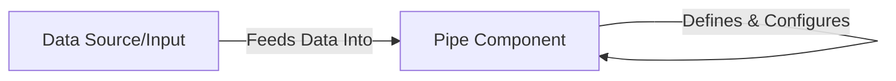

## Details

The `Pipe` library is designed to facilitate functional composition and data transformation through a fluent API. At its core, the `Pipe Component` acts as the central processing unit, encapsulating the logic for defining, chaining, and executing data transformations. Data enters the system via the `Data Source/Input`, which represents any initial data fed into the `Pipe` component's primary input interfaces (`__call__` or `__ror__` methods). The `Pipe Component` then processes this input, applying a series of defined transformations, and can pass the transformed data to subsequent `Pipe` instances, forming a pipeline. This architecture promotes a clear data flow, where data is progressively transformed as it moves through the chained `Pipe` components.

### Pipe Component
The central processing unit of the `Pipe` library, responsible for defining, constructing, chaining, executing, and managing individual data transformation stages. It encapsulates the core logic for wrapping functions, handling pipeline execution, and managing instance binding.

**Related Classes/Methods**:

- <a href="https://github.com/JulienPalard/Pipe/blob/main/pipe.py#L46-L50" target="_blank" rel="noopener noreferrer">`Pipe.__init__`:46-50</a>
- <a href="https://github.com/JulienPalard/Pipe/blob/main/pipe.py#L70-L77" target="_blank" rel="noopener noreferrer">`Pipe.__call__`:70-77</a>
- <a href="https://github.com/JulienPalard/Pipe/blob/main/pipe.py#L52-L68" target="_blank" rel="noopener noreferrer">`Pipe.__ror__`:52-68</a>
- <a href="https://github.com/JulienPalard/Pipe/blob/main/pipe.py#L86-L91" target="_blank" rel="noopener noreferrer">`Pipe.__get__`:86-91</a>

### Data Source/Input
Represents the initial data that is fed into the `Pipe` pipeline. This data is processed by the `Pipe` component through its primary input interfaces.

**Related Classes/Methods**:

- <a href="https://github.com/JulienPalard/Pipe/blob/main/pipe.py#L70-L77" target="_blank" rel="noopener noreferrer">`Pipe.__call__`:70-77</a>
- <a href="https://github.com/JulienPalard/Pipe/blob/main/pipe.py#L52-L68" target="_blank" rel="noopener noreferrer">`Pipe.__ror__`:52-68</a>

### [FAQ](https://github.com/CodeBoarding/GeneratedOnBoardings/tree/main?tab=readme-ov-file#faq)